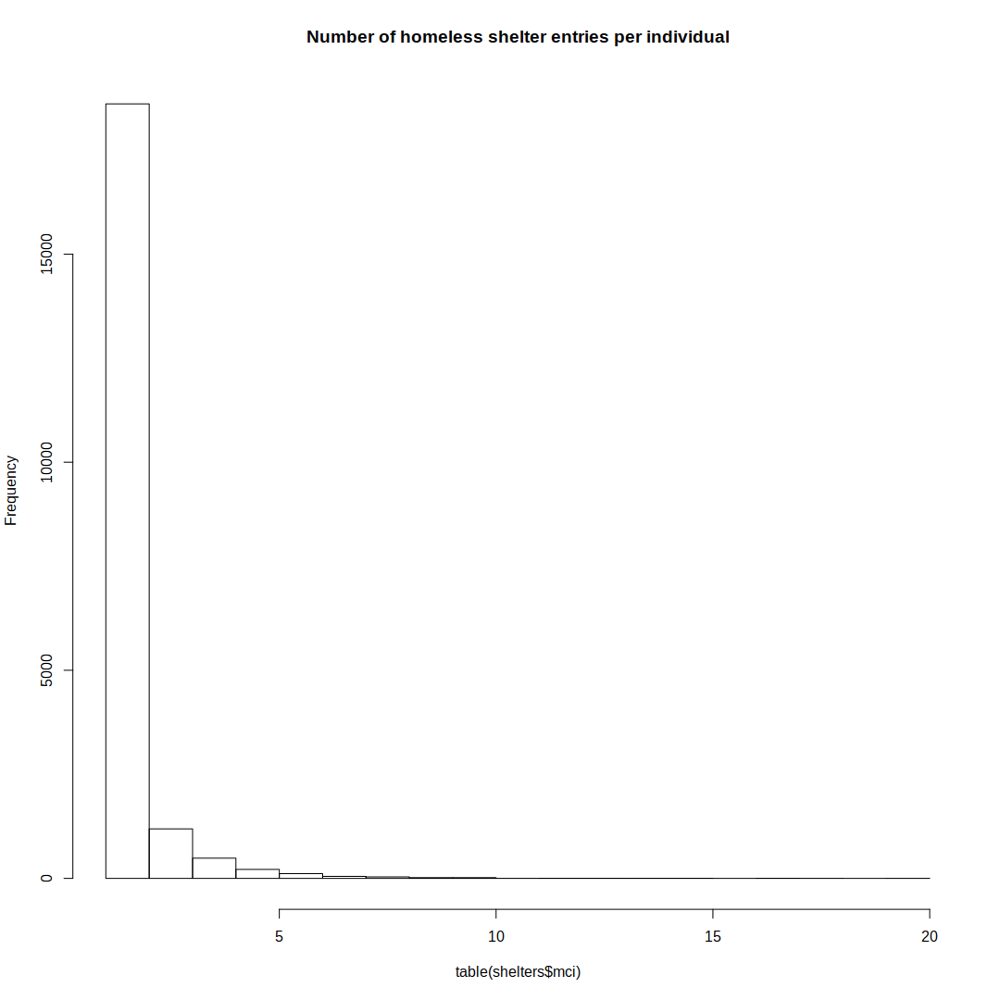
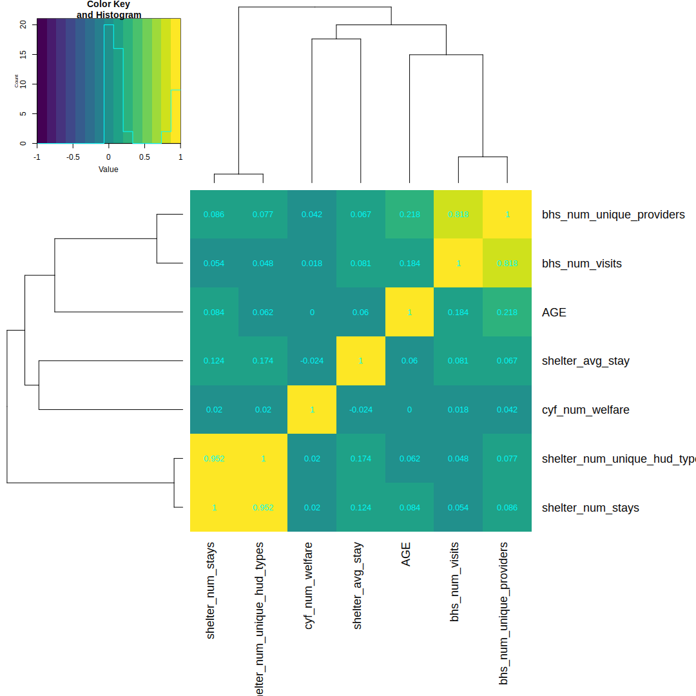
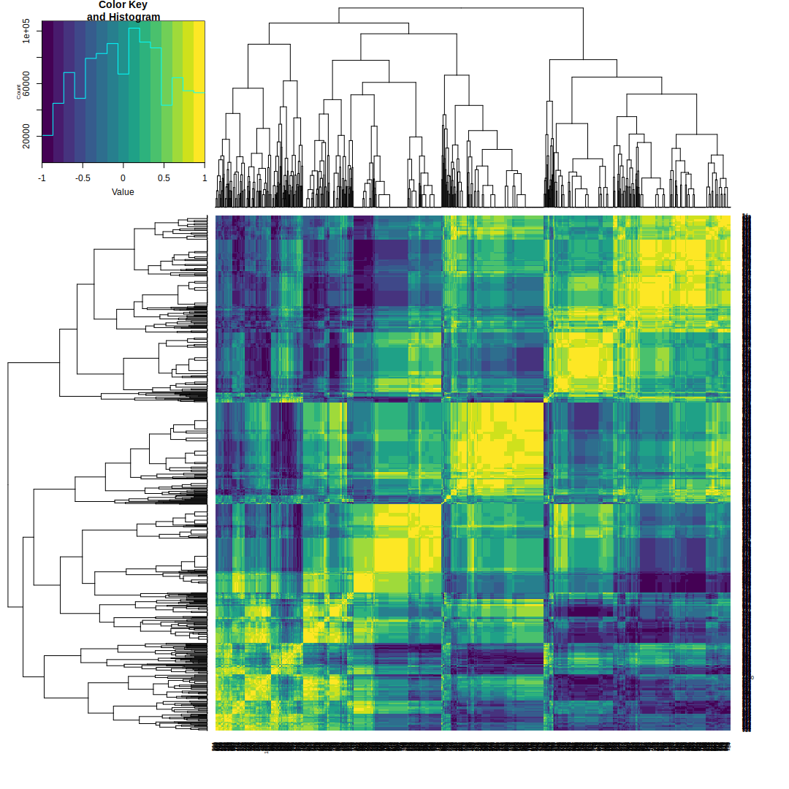
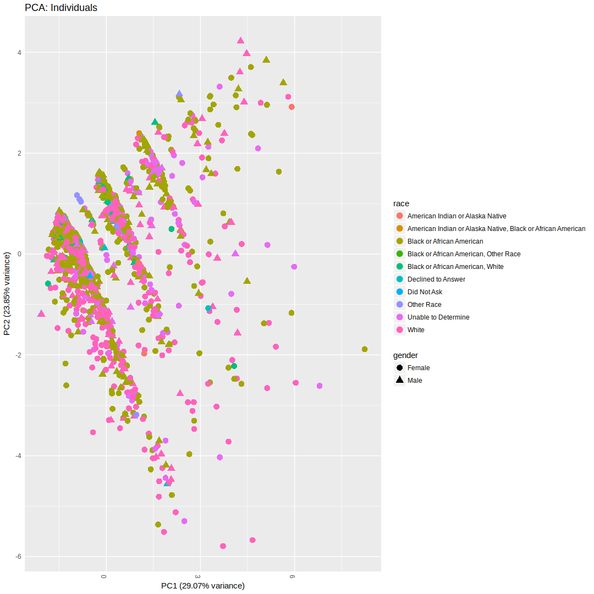

-   [Introduction](#introduction)
    -   [Overview](#overview)
    -   [Data](#data)
-   [Data Preparation](#data-preparation)
    -   [Load data](#load-data)
    -   [Summary of data overlap](#summary-of-data-overlap)
    -   [Data overview](#data-overview)
    -   [Preview of data for a single individual](#preview-of-data-for-a-single-individual)
-   [Results](#results)
    -   [BHS, CYF, and Shelters](#bhs-cyf-and-shelters)
    -   [Shelters, CYF](#shelters-cyf)
    -   [BHS, CYF](#bhs-cyf)
-   [System Info](#system-info)

Introduction
============

Overview
--------

From the project brief, the main goal for the project is to:

> Demonstrate the benefits of using an Integrated Data System for Child, Youth, and Family (CYF) services by describing the populations of children and youth who have received services from the Behavioral Health and Homelessness programs. Produce population profiles of users of each service and users of both services and make relevant comparisons to the general population of children and youth. Describe the groups of individuals who reappear between and within the same services.

Data
----

Datasets currently being used in this analysis:

-   Behavioral Health Services.csv
-   CYF Active 2010 to 2016-11-09.csv
-   HomelessShelters.csv

Other datasets and tables available:

-   Allegheny County Aggregate Data.xlsx
-   IDS Variables.xlsx
-   PGHSNAP - Neighborhoods\_ All Raw Data.xlsx
-   rp\_placements\_clean.csv

Note: some of the files ending with "(1).csv" have been renamed to ".csv".

Data Preparation
================

Load data
---------

``` r
library('readr')
library('dplyr')
library('ggplot2')
library('gplots')
library('knitr')
library('venneuler')
library('viridis')
library('GGally')

set.seed(1)

opts_chunk$set(fig.width=1080/96,
               fig.height=1080/96,
               dpi=96)
options(digits=4)
options(stringsAsFactors=FALSE)
options(knitr.duplicate.label='allow')

# version
analysis_version <- 'v1.2'
```

``` r
# Homeless shelters
shelters <- read_csv('data/raw/HomelessShelters.csv.gz', progress=FALSE) %>%
    rename(mci=MCI_ID_OR_HMIS_CLIENT_ID)
```

    ## Parsed with column specification:
    ## cols(
    ##   MCI_ID_OR_HMIS_CLIENT_ID = col_integer(),
    ##   FIRST_INVOLVEMENT_IN_EPISODE = col_integer(),
    ##   LAST_INVOLVEMENT_IN_EPISODE = col_integer(),
    ##   PROJ_INVOLVEMENT_EPISODE_START = col_character(),
    ##   PROJ_INVOLVEMENT_EPISODE_END = col_character(),
    ##   DURATION_OF_STAY = col_integer(),
    ##   HUD_PROJECT_TYPE = col_character()
    ## )

``` r
# Remove shelter entries with MCI identifier < 10 digits
# (See note in original xls file)
shelters <- shelters[nchar(shelters$mci) == 10,]

# Behavioral Health Services
bhs <- read_csv('data/raw/Behavioral Health Services.csv.gz', progress=FALSE) %>%
    rename(mci=MCI_UNIQ_ID)
```

    ## Parsed with column specification:
    ## cols(
    ##   CL_ID = col_integer(),
    ##   SERVICE_RENDERED_ROW_ID = col_integer(),
    ##   SVC_START_DT = col_character(),
    ##   SVC_END_DT = col_character(),
    ##   MCI_UNIQ_ID = col_integer(),
    ##   PAYER = col_character(),
    ##   DHS_OFFICE = col_character(),
    ##   SERVICE_NAME = col_character(),
    ##   SERVICE_CODE = col_character(),
    ##   COUNTY_COST_CENTER = col_character(),
    ##   PRVDR_NAME = col_character(),
    ##   CNTY_TOT = col_double(),
    ##   TOT_UNITS = col_integer(),
    ##   SUBMT_DT = col_character(),
    ##   SERVICE_SEQ = col_integer(),
    ##   CYF_ACTIVE_AT_SERVICE = col_integer(),
    ##   CYF_PLC_AT_SERVICE = col_integer()
    ## )

    ## Warning: 5 parsing failures.
    ##    row       col               expected actual
    ## 212073 TOT_UNITS no trailing characters    .29
    ## 212074 TOT_UNITS no trailing characters    .29
    ## 635064 TOT_UNITS no trailing characters    .29
    ## 640524 TOT_UNITS no trailing characters    .29
    ## 690640 TOT_UNITS no trailing characters    .29

``` r
# CYF Active
cyf <- read_csv('data/raw/CYF Active 2010 to 2016-11-09.csv.gz', progress=FALSE) %>%
    rename(mci=MCI_ID)
```

    ## Parsed with column specification:
    ## cols(
    ##   CAS_ID = col_integer(),
    ##   CL_ID = col_integer(),
    ##   MCI_ID = col_integer(),
    ##   BRTH_DT = col_character(),
    ##   AGE = col_integer(),
    ##   GENDER = col_character(),
    ##   RACE = col_character(),
    ##   INVLV_STRT_DT = col_character(),
    ##   INVLV_END_DT = col_character()
    ## )

Summary of data overlap
-----------------------

``` r
# Individuals in all three datasets
common_ids <- intersect(intersect(bhs$mci, cyf$mci), shelters$mci)

# Individuals in both BHS and CYF datasets
bhs_cyf  <- intersect(bhs$mci, cyf$mci)

# Individuals in both BHS and Shelter datasets
bhs_shelters  <- intersect(bhs$mci, shelters$mci)

# Individuals in both CYF and Shelter datasets
cyf_shelters  <- intersect(cyf$mci, shelters$mci)

# Venn Diagram
bhs_ids <- unique(bhs$mci)
cyf_ids <- unique(cyf$mci)
shelt_ids <- unique(shelters$mci)

vd <- venneuler(c(bhs=length(bhs_ids), cyf=length(cyf_ids),
                  shelt=length(shelt_ids),
                  "bhs&cyf"=length(bhs_cyf),
                  "bhs&shelt"=length(bhs_shelters),
                  "cyf&shelt"=length(cyf_shelters),
                  "bhs&cyf&shelt"=length(common_ids)))
vd$labels <- c(paste0("bhs\n", length(bhs_ids)),
               paste0("cyf\n", length(cyf_ids)),
               paste0("shelt\n", length(shelt_ids)))
plot(vd)
```


``` r
# Overlap statistics
cat(sprintf('- Overlap between BHS & CYF: %d\n', length(bhs_cyf)))
```

-   Overlap between BHS & CYF: 10627

``` r
cat(sprintf('- Overlap between BHS & Shelter: %d\n', length(bhs_shelters)))
```

-   Overlap between BHS & Shelter: 1910

``` r
cat(sprintf('- Overlap between CYF & Shelter: %d\n', length(cyf_shelters)))
```

-   Overlap between CYF & Shelter: 4312

``` r
cat(sprintf('- Overlap between all three: %d\n', length(common_ids)))
```

-   Overlap between all three: 1704

Data overview
-------------

### Behavior and Health Services

``` r
dim(bhs)
```

    ## [1] 1003167      17

``` r
range(table(bhs$mci))
```

    ## [1]    1 3608

``` r
hist(table(bhs$mci), main='Number of BHS entries per individual')
```


### CYF

``` r
dim(cyf)
```

    ## [1] 66790     9

``` r
range(table(cyf$mci))
```

    ## [1]    1 6859

``` r
hist(table(cyf$mci), main='Number of homeless shelter entries per individual')
```


### Homeless shelters

``` r
dim(shelters)
```

    ## [1] 30305     7

``` r
range(table(shelters$mci))
```

    ## [1]  1 20

``` r
hist(table(shelters$mci), main='Number of homeless shelter entries per individual')
```



Preview of data for a single individual
---------------------------------------

``` r
# counts per dataset (shared across all three)
data_counts <- merge(merge(
    bhs %>% group_by(mci) %>% summarize(num_bhs=n()),
    cyf %>% group_by(mci) %>% summarize(num_cyf=n()), by='mci'),
    shelters %>% group_by(mci) %>% summarize(num_shelter=n()), by='mci')

# individuals with multiple rows in all three tables
multi_row_individuals <- data_counts[apply(data_counts, 1, min) > 1,]$mci

# random individual with multiple entries in each table
example_youth <- multi_row_individuals[1]
```

### BHS

    bhs %>% 
        filter(mci == example_youth) %>% 
        head(10) %>%
        kable

### CYF

``` r
cyf %>% 
    filter(mci == example_youth) %>% 
    kable
```

|  CAS\_ID|  CL\_ID|    mci| BRTH\_DT |  AGE| GENDER | RACE  | INVLV\_STRT\_DT | INVLV\_END\_DT |
|--------:|-------:|------:|:---------|----:|:-------|:------|:----------------|:---------------|
|    44331|  875536|  1e+09| 8/6/1995 |   21| Female | White | 9/4/2009        | NA             |
|    44295|  875536|  1e+09| 8/6/1995 |   21| Female | White | 4/7/2014        | 1/26/2015      |
|    70646|  875536|  1e+09| 8/6/1995 |   21| Female | White | 5/5/2015        | NA             |

### Shelters

``` r
shelters %>% 
    filter(mci == example_youth) %>% 
    kable
```

|    mci|  FIRST\_INVOLVEMENT\_IN\_EPISODE|  LAST\_INVOLVEMENT\_IN\_EPISODE| PROJ\_INVOLVEMENT\_EPISODE\_START | PROJ\_INVOLVEMENT\_EPISODE\_END |  DURATION\_OF\_STAY| HUD\_PROJECT\_TYPE |
|------:|--------------------------------:|-------------------------------:|:----------------------------------|:--------------------------------|-------------------:|:-------------------|
|  1e+09|                            24829|                           24829| 8/14/2015                         | 8/14/2015                       |                   1| Emergency Shelter  |
|  1e+09|                            19860|                           19860| 1/6/2015                          | 1/6/2015                        |                   1| Emergency Shelter  |

Results
=======

Below, we will explore some of the properties of intersections of two or three of the datasets.

BHS, CYF, and Shelters
----------------------

``` r
ids_to_use <- common_ids
analysis_name <- 'combined'

datasets <- c('bhs', 'cyf', 'shelters')
```

### Subset data

``` r
# Drop rows for individuals with missing data
cat(sprintf('- Dropping %d / %d rows from shelter dataset (not shared)\n', 
            sum(!shelters$mci %in% ids_to_use),
            nrow(shelters)))
```

    ## - Dropping 27549 / 30305 rows from shelter dataset (not shared)

``` r
shelters_subset <- shelters[shelters$mci %in% ids_to_use,]

cat(sprintf('- Dropping %d / %d rows from behavior dataset (not shared)\n', 
            sum(!bhs$mci %in% ids_to_use),
            nrow(bhs)))
```

    ## - Dropping 807675 / 1003167 rows from behavior dataset (not shared)

``` r
bhs_subset <- bhs[bhs$mci %in% ids_to_use,]

cat(sprintf('- Dropping %d / %d rows from CYF dataset (not shared)\n', 
            sum(!cyf$mci %in% ids_to_use),
            nrow(cyf)))
```

    ## - Dropping 64812 / 66790 rows from CYF dataset (not shared)

``` r
cyf_subset <- cyf[cyf$mci %in% ids_to_use,]
```

### Visualization

``` r
# Behavior and health services
bhs_collapsed <- bhs_subset %>%
    group_by(mci) %>%
    summarize(bhs_num_visits=n(),
              bhs_num_unique_providers=n_distinct(PRVDR_NAME))
              #county_tot=sum(CNTY_TOT),
              #total_units=sum(TOT_UNITS))

# drop INVLV and birthdate columns and keep a single row for each individual
# TODO: add duration in CYF?
cyf_collapsed <- cyf_subset %>% 
    group_by(mci) %>%
    mutate(cyf_num_welfare=n()) %>%
    select(-CAS_ID, -CL_ID, -BRTH_DT, -starts_with('INVLV'))
cyf_collapsed <- cyf_collapsed[!duplicated(cyf_collapsed$mci),]

# Shelters
#min_stay=min(DURATION_OF_STAY),
#max_stay=max(DURATION_OF_STAY),
shelters_collapsed <- shelters_subset %>%
    group_by(mci) %>%
    summarize(shelter_num_stays=n(),
              shelter_num_unique_hud_types=n_distinct(HUD_PROJECT_TYPE),
              shelter_avg_stay=median(DURATION_OF_STAY))

# Combined dataset
dataset_list <- lapply(paste0(datasets, '_collapsed'), get)
names(dataset_list) <- datasets

dat <- Reduce(function(x, y) merge(x, y, by='mci'), dataset_list)

# Drop any rows with NA's (should be small)
cat(sprintf('- Removing %d incomplete rows...\n', sum(!complete.cases(dat))))
```

    ## - Removing 1 incomplete rows...

``` r
dat <- dat[complete.cases(dat),]

# Remove entries with values outside of the expected range
if ('shelters' %in% datasets) {
    dat <- dat %>% filter(shelter_avg_stay < 5000)
}
if ('bhs' %in% datasets) {
    dat <- dat %>% filter(bhs_num_visits < 1000)
}
if ('cyf' %in% datasets) {
    dat <- dat %>% filter(AGE < 75)
}

# version of data with only numeric variables, and without the ID column
mat <- as.matrix(dat[,!colnames(dat) %in% c('mci', 'RACE', 'GENDER')])

# Normalize columns
mat <- scale(mat)
```

Variable correlation heatmap

``` r
# spearman correlation matrix
cor_mat <- cor(mat, method='spearman')
heatmap.2(cor_mat, trace='none', col=viridis, cellnote=round(cor_mat, 3), margin=c(16,16))
```



Individual correlation heatmap

``` r
# drop any constant rows
zero_var <- apply(mat, 1, var) == 0
mat <- mat[!zero_var,]
dat <- dat[!zero_var,]

# individual heatmap (subsample if > 1000)
if (nrow(mat) > 1000) {
    ind <- sample(1:nrow(mat), 1000)
    cor_mat <- cor(t(mat[ind,]), method='spearman')
} else {
    cor_mat <- cor(t(mat), method='spearman')
}
heatmap.2(cor_mat, trace='none', col=viridis)
```



PCA of individuals

``` r
prcomp_results <- prcomp(mat)
var_explained <- round(summary(prcomp_results)$importance[2,] * 100, 2)

xl <- sprintf("PC1 (%.2f%% variance)", var_explained[1])
yl <- sprintf("PC2 (%.2f%% variance)", var_explained[2])

# Dataframe for PCA plot
df <- data.frame(id=dat[,'mci'],
                 pc1=prcomp_results$x[,1], 
                 pc2=prcomp_results$x[,2],
                 gender=dat[,'GENDER'],
                 race=dat[,'RACE'])
# PCA plot
plt <- ggplot(df, aes(pc1, pc2, color=race, shape=gender)) +
    geom_point(stat="identity",size=3.5) +
    #geom_text(aes(label=id), angle=45, size=4, vjust=2) +
    xlab(xl) + ylab(yl) +
    ggtitle(sprintf("PCA: Individuals")) +
    theme(axis.ticks=element_blank(), axis.text.x=element_text(angle=-90))
plot(plt)
```



### Other visualizations

``` r
# is there a relationship between race and variables? (just considered dominant
# categories)
dat_subset <- dat %>% 
    filter(RACE %in% c('White', 'Black or African American')) %>%
    select(-mci)
ggpairs(dat_subset, mapping=aes(colour=RACE, alpha=0.4))
```

    ## `stat_bin()` using `bins = 30`. Pick better value with `binwidth`.
    ## `stat_bin()` using `bins = 30`. Pick better value with `binwidth`.
    ## `stat_bin()` using `bins = 30`. Pick better value with `binwidth`.
    ## `stat_bin()` using `bins = 30`. Pick better value with `binwidth`.
    ## `stat_bin()` using `bins = 30`. Pick better value with `binwidth`.
    ## `stat_bin()` using `bins = 30`. Pick better value with `binwidth`.
    ## `stat_bin()` using `bins = 30`. Pick better value with `binwidth`.
    ## `stat_bin()` using `bins = 30`. Pick better value with `binwidth`.
    ## `stat_bin()` using `bins = 30`. Pick better value with `binwidth`.
    ## `stat_bin()` using `bins = 30`. Pick better value with `binwidth`.
    ## `stat_bin()` using `bins = 30`. Pick better value with `binwidth`.
    ## `stat_bin()` using `bins = 30`. Pick better value with `binwidth`.
    ## `stat_bin()` using `bins = 30`. Pick better value with `binwidth`.
    ## `stat_bin()` using `bins = 30`. Pick better value with `binwidth`.


Save combined table...

``` r
write.csv(dat, file=sprintf('../data/combined/%s_%s.csv', analysis_name, analysis_version))
```

Shelters, CYF
-------------

``` r
ids_to_use <- cyf_shelters
analysis_name <- 'cyf_shelters'

datasets <- c('shelters', 'cyf')
```

### Subset data

``` r
# Drop rows for individuals with missing data
cat(sprintf('- Dropping %d / %d rows from shelter dataset (not shared)\n', 
            sum(!shelters$mci %in% ids_to_use),
            nrow(shelters)))
```

    ## - Dropping 23729 / 30305 rows from shelter dataset (not shared)

``` r
shelters_subset <- shelters[shelters$mci %in% ids_to_use,]

cat(sprintf('- Dropping %d / %d rows from behavior dataset (not shared)\n', 
            sum(!bhs$mci %in% ids_to_use),
            nrow(bhs)))
```

    ## - Dropping 807675 / 1003167 rows from behavior dataset (not shared)

``` r
bhs_subset <- bhs[bhs$mci %in% ids_to_use,]

cat(sprintf('- Dropping %d / %d rows from CYF dataset (not shared)\n', 
            sum(!cyf$mci %in% ids_to_use),
            nrow(cyf)))
```

    ## - Dropping 62043 / 66790 rows from CYF dataset (not shared)

``` r
cyf_subset <- cyf[cyf$mci %in% ids_to_use,]
```

### Visualization

``` r
# Behavior and health services
bhs_collapsed <- bhs_subset %>%
    group_by(mci) %>%
    summarize(bhs_num_visits=n(),
              bhs_num_unique_providers=n_distinct(PRVDR_NAME))
              #county_tot=sum(CNTY_TOT),
              #total_units=sum(TOT_UNITS))

# drop INVLV and birthdate columns and keep a single row for each individual
# TODO: add duration in CYF?
cyf_collapsed <- cyf_subset %>% 
    group_by(mci) %>%
    mutate(cyf_num_welfare=n()) %>%
    select(-CAS_ID, -CL_ID, -BRTH_DT, -starts_with('INVLV'))
cyf_collapsed <- cyf_collapsed[!duplicated(cyf_collapsed$mci),]

# Shelters
#min_stay=min(DURATION_OF_STAY),
#max_stay=max(DURATION_OF_STAY),
shelters_collapsed <- shelters_subset %>%
    group_by(mci) %>%
    summarize(shelter_num_stays=n(),
              shelter_num_unique_hud_types=n_distinct(HUD_PROJECT_TYPE),
              shelter_avg_stay=median(DURATION_OF_STAY))

# Combined dataset
dataset_list <- lapply(paste0(datasets, '_collapsed'), get)
names(dataset_list) <- datasets

dat <- Reduce(function(x, y) merge(x, y, by='mci'), dataset_list)

# Drop any rows with NA's (should be small)
cat(sprintf('- Removing %d incomplete rows...\n', sum(!complete.cases(dat))))
```

    ## - Removing 4 incomplete rows...

``` r
dat <- dat[complete.cases(dat),]

# Remove entries with values outside of the expected range
if ('shelters' %in% datasets) {
    dat <- dat %>% filter(shelter_avg_stay < 5000)
}
if ('bhs' %in% datasets) {
    dat <- dat %>% filter(bhs_num_visits < 1000)
}
if ('cyf' %in% datasets) {
    dat <- dat %>% filter(AGE < 75)
}

# version of data with only numeric variables, and without the ID column
mat <- as.matrix(dat[,!colnames(dat) %in% c('mci', 'RACE', 'GENDER')])

# Normalize columns
mat <- scale(mat)
```

Variable correlation heatmap

``` r
# spearman correlation matrix
cor_mat <- cor(mat, method='spearman')
heatmap.2(cor_mat, trace='none', col=viridis, cellnote=round(cor_mat, 3), margin=c(16,16))
```


Individual correlation heatmap

``` r
# drop any constant rows
zero_var <- apply(mat, 1, var) == 0
mat <- mat[!zero_var,]
dat <- dat[!zero_var,]

# individual heatmap (subsample if > 1000)
if (nrow(mat) > 1000) {
    ind <- sample(1:nrow(mat), 1000)
    cor_mat <- cor(t(mat[ind,]), method='spearman')
} else {
    cor_mat <- cor(t(mat), method='spearman')
}
heatmap.2(cor_mat, trace='none', col=viridis)
```


PCA of individuals

``` r
prcomp_results <- prcomp(mat)
var_explained <- round(summary(prcomp_results)$importance[2,] * 100, 2)

xl <- sprintf("PC1 (%.2f%% variance)", var_explained[1])
yl <- sprintf("PC2 (%.2f%% variance)", var_explained[2])

# Dataframe for PCA plot
df <- data.frame(id=dat[,'mci'],
                 pc1=prcomp_results$x[,1], 
                 pc2=prcomp_results$x[,2],
                 gender=dat[,'GENDER'],
                 race=dat[,'RACE'])
# PCA plot
plt <- ggplot(df, aes(pc1, pc2, color=race, shape=gender)) +
    geom_point(stat="identity",size=3.5) +
    #geom_text(aes(label=id), angle=45, size=4, vjust=2) +
    xlab(xl) + ylab(yl) +
    ggtitle(sprintf("PCA: Individuals")) +
    theme(axis.ticks=element_blank(), axis.text.x=element_text(angle=-90))
plot(plt)
```


### Other visualizations

``` r
# is there a relationship between race and variables? (just considered dominant
# categories)
dat_subset <- dat %>% 
    filter(RACE %in% c('White', 'Black or African American')) %>%
    select(-mci)
ggpairs(dat_subset, mapping=aes(colour=RACE, alpha=0.4))
```

    ## `stat_bin()` using `bins = 30`. Pick better value with `binwidth`.
    ## `stat_bin()` using `bins = 30`. Pick better value with `binwidth`.
    ## `stat_bin()` using `bins = 30`. Pick better value with `binwidth`.
    ## `stat_bin()` using `bins = 30`. Pick better value with `binwidth`.
    ## `stat_bin()` using `bins = 30`. Pick better value with `binwidth`.
    ## `stat_bin()` using `bins = 30`. Pick better value with `binwidth`.
    ## `stat_bin()` using `bins = 30`. Pick better value with `binwidth`.
    ## `stat_bin()` using `bins = 30`. Pick better value with `binwidth`.
    ## `stat_bin()` using `bins = 30`. Pick better value with `binwidth`.
    ## `stat_bin()` using `bins = 30`. Pick better value with `binwidth`.


Save combined table...

``` r
write.csv(dat, file=sprintf('../data/combined/%s_%s.csv', analysis_name, analysis_version))
```

BHS, CYF
--------

``` r
ids_to_use <- bhs_cyf
analysis_name <- 'bhs_cyf'

datasets <- c('bhs', 'cyf')
```

### Subset data

``` r
# Drop rows for individuals with missing data
cat(sprintf('- Dropping %d / %d rows from shelter dataset (not shared)\n', 
            sum(!shelters$mci %in% ids_to_use),
            nrow(shelters)))
```

    ## - Dropping 27549 / 30305 rows from shelter dataset (not shared)

``` r
shelters_subset <- shelters[shelters$mci %in% ids_to_use,]

cat(sprintf('- Dropping %d / %d rows from behavior dataset (not shared)\n', 
            sum(!bhs$mci %in% ids_to_use),
            nrow(bhs)))
```

    ## - Dropping 132969 / 1003167 rows from behavior dataset (not shared)

``` r
bhs_subset <- bhs[bhs$mci %in% ids_to_use,]

cat(sprintf('- Dropping %d / %d rows from CYF dataset (not shared)\n', 
            sum(!cyf$mci %in% ids_to_use),
            nrow(cyf)))
```

    ## - Dropping 54679 / 66790 rows from CYF dataset (not shared)

``` r
cyf_subset <- cyf[cyf$mci %in% ids_to_use,]
```

### Visualization

``` r
# Behavior and health services
bhs_collapsed <- bhs_subset %>%
    group_by(mci) %>%
    summarize(bhs_num_visits=n(),
              bhs_num_unique_providers=n_distinct(PRVDR_NAME))
              #county_tot=sum(CNTY_TOT),
              #total_units=sum(TOT_UNITS))

# drop INVLV and birthdate columns and keep a single row for each individual
# TODO: add duration in CYF?
cyf_collapsed <- cyf_subset %>% 
    group_by(mci) %>%
    mutate(cyf_num_welfare=n()) %>%
    select(-CAS_ID, -CL_ID, -BRTH_DT, -starts_with('INVLV'))
cyf_collapsed <- cyf_collapsed[!duplicated(cyf_collapsed$mci),]

# Shelters
#min_stay=min(DURATION_OF_STAY),
#max_stay=max(DURATION_OF_STAY),
shelters_collapsed <- shelters_subset %>%
    group_by(mci) %>%
    summarize(shelter_num_stays=n(),
              shelter_num_unique_hud_types=n_distinct(HUD_PROJECT_TYPE),
              shelter_avg_stay=median(DURATION_OF_STAY))

# Combined dataset
dataset_list <- lapply(paste0(datasets, '_collapsed'), get)
names(dataset_list) <- datasets

dat <- Reduce(function(x, y) merge(x, y, by='mci'), dataset_list)

# Drop any rows with NA's (should be small)
cat(sprintf('- Removing %d incomplete rows...\n', sum(!complete.cases(dat))))
```

    ## - Removing 80 incomplete rows...

``` r
dat <- dat[complete.cases(dat),]

# Remove entries with values outside of the expected range
if ('shelters' %in% datasets) {
    dat <- dat %>% filter(shelter_avg_stay < 5000)
}
if ('bhs' %in% datasets) {
    dat <- dat %>% filter(bhs_num_visits < 1000)
}
if ('cyf' %in% datasets) {
    dat <- dat %>% filter(AGE < 75)
}

# version of data with only numeric variables, and without the ID column
mat <- as.matrix(dat[,!colnames(dat) %in% c('mci', 'RACE', 'GENDER')])

# Normalize columns
mat <- scale(mat)
```

Variable correlation heatmap

``` r
# spearman correlation matrix
cor_mat <- cor(mat, method='spearman')
heatmap.2(cor_mat, trace='none', col=viridis, cellnote=round(cor_mat, 3), margin=c(16,16))
```


Individual correlation heatmap

``` r
# drop any constant rows
zero_var <- apply(mat, 1, var) == 0
mat <- mat[!zero_var,]
dat <- dat[!zero_var,]

# individual heatmap (subsample if > 1000)
if (nrow(mat) > 1000) {
    ind <- sample(1:nrow(mat), 1000)
    cor_mat <- cor(t(mat[ind,]), method='spearman')
} else {
    cor_mat <- cor(t(mat), method='spearman')
}
heatmap.2(cor_mat, trace='none', col=viridis)
```


PCA of individuals

``` r
prcomp_results <- prcomp(mat)
var_explained <- round(summary(prcomp_results)$importance[2,] * 100, 2)

xl <- sprintf("PC1 (%.2f%% variance)", var_explained[1])
yl <- sprintf("PC2 (%.2f%% variance)", var_explained[2])

# Dataframe for PCA plot
df <- data.frame(id=dat[,'mci'],
                 pc1=prcomp_results$x[,1], 
                 pc2=prcomp_results$x[,2],
                 gender=dat[,'GENDER'],
                 race=dat[,'RACE'])
# PCA plot
plt <- ggplot(df, aes(pc1, pc2, color=race, shape=gender)) +
    geom_point(stat="identity",size=3.5) +
    #geom_text(aes(label=id), angle=45, size=4, vjust=2) +
    xlab(xl) + ylab(yl) +
    ggtitle(sprintf("PCA: Individuals")) +
    theme(axis.ticks=element_blank(), axis.text.x=element_text(angle=-90))
plot(plt)
```


### Other visualizations

``` r
# is there a relationship between race and variables? (just considered dominant
# categories)
dat_subset <- dat %>% 
    filter(RACE %in% c('White', 'Black or African American')) %>%
    select(-mci)
ggpairs(dat_subset, mapping=aes(colour=RACE, alpha=0.4))
```

    ## `stat_bin()` using `bins = 30`. Pick better value with `binwidth`.
    ## `stat_bin()` using `bins = 30`. Pick better value with `binwidth`.
    ## `stat_bin()` using `bins = 30`. Pick better value with `binwidth`.
    ## `stat_bin()` using `bins = 30`. Pick better value with `binwidth`.
    ## `stat_bin()` using `bins = 30`. Pick better value with `binwidth`.
    ## `stat_bin()` using `bins = 30`. Pick better value with `binwidth`.
    ## `stat_bin()` using `bins = 30`. Pick better value with `binwidth`.
    ## `stat_bin()` using `bins = 30`. Pick better value with `binwidth`.


Save combined table...

``` r
write.csv(dat, file=sprintf('../data/combined/%s_%s.csv', analysis_name, analysis_version))
```

System Info
===========

``` r
sessionInfo()
```

    ## R version 3.3.2 (2016-10-31)
    ## Platform: x86_64-pc-linux-gnu (64-bit)
    ## Running under: Arch Linux
    ## 
    ## locale:
    ##  [1] LC_CTYPE=en_US.UTF-8          LC_NUMERIC=C                 
    ##  [3] LC_TIME=en_US.UTF-8           LC_COLLATE=en_US.UTF-8       
    ##  [5] LC_MONETARY=en_US.UTF-8       LC_MESSAGES=en_US.UTF-8      
    ##  [7] LC_PAPER=en_US.UTF-8          LC_NAME=en_US.UTF-8          
    ##  [9] LC_ADDRESS=en_US.UTF-8        LC_TELEPHONE=en_US.UTF-8     
    ## [11] LC_MEASUREMENT=en_US.UTF-8    LC_IDENTIFICATION=en_US.UTF-8
    ## 
    ## attached base packages:
    ## [1] stats     graphics  grDevices utils     datasets  methods   base     
    ## 
    ## other attached packages:
    ##  [1] GGally_1.3.0    viridis_0.3.4   venneuler_1.1-0 rJava_0.9-8    
    ##  [5] knitr_1.15.1    gplots_3.0.1    ggplot2_2.2.0   dplyr_0.5.0    
    ##  [9] readr_1.0.0     rmarkdown_1.2   nvimcom_0.9-25  colorout_1.1-0 
    ## 
    ## loaded via a namespace (and not attached):
    ##  [1] Rcpp_0.12.8         RColorBrewer_1.1-2  plyr_1.8.4         
    ##  [4] highr_0.6           prettyunits_1.0.2   bitops_1.0-6       
    ##  [7] tools_3.3.2         progress_1.0.2      digest_0.6.10      
    ## [10] evaluate_0.10       tibble_1.2          gtable_0.2.0       
    ## [13] DBI_0.5-1           yaml_2.1.14         gridExtra_2.2.1    
    ## [16] stringr_1.1.0       gtools_3.5.0        caTools_1.17.1     
    ## [19] rprojroot_1.1       grid_3.3.2          reshape_0.8.6      
    ## [22] R6_2.2.0            gdata_2.17.0        reshape2_1.4.2     
    ## [25] magrittr_1.5        backports_1.0.4     scales_0.4.1       
    ## [28] htmltools_0.3.5     assertthat_0.1      colorspace_1.3-1   
    ## [31] labeling_0.3        KernSmooth_2.23-15  stringi_1.1.2      
    ## [34] lazyeval_0.2.0.9000 munsell_0.4.3
