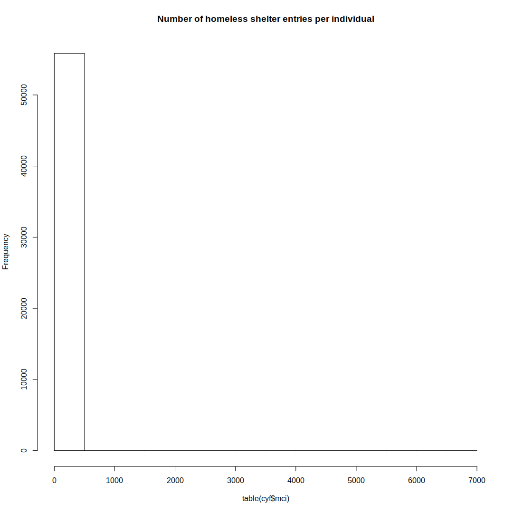

Overview
========

...

Data
----

### Allegheny County Aggregate Data.xlsx

### Behavioral Health Services.csv

### CYF Active 2010 to 2016-11-09.csv

### HomelessShelters(1).csv

### IDS Variables.xlsx

### PGHSNAP - Neighborhoods\_ All Raw Data.xlsx

### rp\_placements\_clean.csv

Note: some of the files ending with "(1).csv" have been renamed to ".csv".

Data Preparation
================

``` r
library('readr')
library('dplyr')
library('ggplot2')
library('gplots')
library('knitr')
library('venneuler')
```

``` r
# Homeless shelters
shelters <- read_csv('data/raw/HomelessShelters.csv.gz', progress=FALSE) %>%
    rename(mci=MCI_ID_OR_HMIS_CLIENT_ID)
```

    ## Parsed with column specification:
    ## cols(
    ##   MCI_ID_OR_HMIS_CLIENT_ID = col_integer(),
    ##   FIRST_INVOLVEMENT_IN_EPISODE = col_integer(),
    ##   LAST_INVOLVEMENT_IN_EPISODE = col_integer(),
    ##   PROJ_INVOLVEMENT_EPISODE_START = col_character(),
    ##   PROJ_INVOLVEMENT_EPISODE_END = col_character(),
    ##   DURATION_OF_STAY = col_integer(),
    ##   HUD_PROJECT_TYPE = col_character()
    ## )

``` r
# Behavioral Health Services
bhs <- read_csv('data/raw/Behavioral Health Services.csv.gz', progress=FALSE) %>%
    rename(mci=MCI_UNIQ_ID)
```

    ## Parsed with column specification:
    ## cols(
    ##   CL_ID = col_integer(),
    ##   SERVICE_RENDERED_ROW_ID = col_integer(),
    ##   SVC_START_DT = col_character(),
    ##   SVC_END_DT = col_character(),
    ##   MCI_UNIQ_ID = col_integer(),
    ##   PAYER = col_character(),
    ##   DHS_OFFICE = col_character(),
    ##   SERVICE_NAME = col_character(),
    ##   SERVICE_CODE = col_character(),
    ##   COUNTY_COST_CENTER = col_character(),
    ##   PRVDR_NAME = col_character(),
    ##   CNTY_TOT = col_double(),
    ##   TOT_UNITS = col_integer(),
    ##   SUBMT_DT = col_character(),
    ##   SERVICE_SEQ = col_integer(),
    ##   CYF_ACTIVE_AT_SERVICE = col_integer(),
    ##   CYF_PLC_AT_SERVICE = col_integer()
    ## )

    ## Warning: 5 parsing failures.
    ##    row       col               expected actual
    ## 212073 TOT_UNITS no trailing characters    .29
    ## 212074 TOT_UNITS no trailing characters    .29
    ## 635064 TOT_UNITS no trailing characters    .29
    ## 640524 TOT_UNITS no trailing characters    .29
    ## 690640 TOT_UNITS no trailing characters    .29

``` r
# CYF Active
cyf <- read_csv('data/raw/CYF Active 2010 to 2016-11-09.csv.gz', progress=FALSE) %>%
    rename(mci=MCI_ID)
```

    ## Parsed with column specification:
    ## cols(
    ##   CAS_ID = col_integer(),
    ##   CL_ID = col_integer(),
    ##   MCI_ID = col_integer(),
    ##   BRTH_DT = col_character(),
    ##   AGE = col_integer(),
    ##   GENDER = col_character(),
    ##   RACE = col_character(),
    ##   INVLV_STRT_DT = col_character(),
    ##   INVLV_END_DT = col_character()
    ## )

``` r
# Individuals in all three datasets
common_ids <- intersect(intersect(bhs$mci, cyf$mci), shelters$mci)

# Venn Diagram
bhs_ids <- unique(bhs$mci)
cyf_ids <- unique(cyf$mci)
shelt_ids <- unique(shelters$mci)

vd <- venneuler(c(bhs=length(bhs_ids), cyf=length(cyf_ids),
                  shelt=length(shelt_ids),
                  "bhs&cyf"=length(intersect(bhs_ids, cyf_ids)),
                  "bhs&shelt"=length(intersect(bhs_ids, shelt_ids)),
                  "cyf&shelt"=length(intersect(cyf_ids, shelt_ids)),
                  "bhs&cyf&shelt"=length(intersect(bhs_ids, intersect(cyf_ids, shelt_ids)))))
vd$labels <- c(paste0("bhs\n", length(bhs_ids)),
               paste0("cyf\n", length(cyf_ids)),
               paste0("shelt\n", length(shelt_ids)))
plot(vd)
```


``` r
# Overlap statistics
cat(sprintf('- Overlap between BHS & CYF: %d\n', length(intersect(bhs_ids, cyf_ids))))
```

-   Overlap between BHS & CYF: 10627

``` r
cat(sprintf('- Overlap between BHS & Shelter: %d\n', length(intersect(bhs_ids, shelt_ids))))
```

-   Overlap between BHS & Shelter: 1910

``` r
cat(sprintf('- Overlap between CYF & Shelter: %d\n', length(intersect(cyf_ids, shelt_ids))))
```

-   Overlap between CYF & Shelter: 4312

``` r
cat(sprintf('- Overlap between all three: %d\n', length(intersect(bhs_ids, intersect(cyf_ids, shelt_ids)))))
```

-   Overlap between all three: 1704

``` r
# Drop rows for individuals with missing data
cat(sprintf('- Dropping %d / %d rows from shelter dataset (not shared)\n', 
            sum(!shelters$mci %in% common_ids),
            nrow(shelters)))
```

-   Dropping 27606 / 30362 rows from shelter dataset (not shared)

``` r
shelters <- shelters[shelters$mci %in% common_ids,]

cat(sprintf('- Dropping %d / %d rows from behavior dataset (not shared)\n', 
            sum(!bhs$mci %in% common_ids),
            nrow(bhs)))
```

-   Dropping 807675 / 1003167 rows from behavior dataset (not shared)

``` r
bhs <- bhs[bhs$mci %in% common_ids,]

cat(sprintf('- Dropping %d / %d rows from CYF dataset (not shared)\n', 
            sum(!cyf$mci %in% common_ids),
            nrow(cyf)))
```

-   Dropping 64812 / 66790 rows from CYF dataset (not shared)

``` r
cyf <- cyf[cyf$mci %in% common_ids,]
# Placements
#placements <- read_csv('data/raw/rp_placements_clean.csv', row_names=FALSE)
```

Exploratory Data Analaysis
==========================

### Behavior and Health Services

#### Overview

``` r
dim(bhs)
```

    ## [1] 195492     17

``` r
range(table(bhs$mci))
```

    ## [1]    1 2045

``` r
hist(table(bhs$mci), main='Number of BHS entries per individual')
```


``` r
kable(head(bhs))
```

|  CL\_ID|  SERVICE\_RENDERED\_ROW\_ID| SVC\_START\_DT  | SVC\_END\_DT    |         mci| PAYER | DHS\_OFFICE | SERVICE\_NAME                                  | SERVICE\_CODE | COUNTY\_COST\_CENTER              | PRVDR\_NAME                       |  CNTY\_TOT|  TOT\_UNITS| SUBMT\_DT       |  SERVICE\_SEQ|  CYF\_ACTIVE\_AT\_SERVICE|  CYF\_PLC\_AT\_SERVICE|
|-------:|---------------------------:|:----------------|:----------------|-----------:|:------|:------------|:-----------------------------------------------|:--------------|:----------------------------------|:----------------------------------|----------:|-----------:|:----------------|-------------:|-------------------------:|----------------------:|
|  845961|                   954299218| 6/24/2015 0:00  | 6/24/2015 0:00  |  1000000422| CCBH  | MH          | Walk-in Crisis                                 | H2011         | Mental Health Crisis Intervention | WESTERN PSYCHIATRIC INST & CLINIC |         48|           3| 7/10/2015 0:00  |             1|                         1|                      0|
|  964739|                   806722941| 11/2/2013 0:00  | 11/2/2013 0:00  |  1000000587| CCBH  | MH          | MH-Outpatient Practitioner-Initial Intake Eval | H0004HN       | Does Not Apply                    | MALAZICH LORI A.                  |         22|           1| 11/15/2013 0:00 |             1|                         1|                      1|
|  964739|                   806852525| 11/9/2013 0:00  | 11/9/2013 0:00  |  1000000587| CCBH  | MH          | MH-Outpatient Practitioner Individual Therapy  | H0004HB       | Does Not Apply                    | MALAZICH LORI A.                  |         96|           4| 11/22/2013 0:00 |             2|                         1|                      1|
|  964739|                   806909719| 11/11/2013 0:00 | 11/11/2013 0:00 |  1000000587| CCBH  | MH          | Blended Mental Health Case Management          | T1017U7       | Does Not Apply                    | MERCY BEHAVORIAL HEALTH           |        360|          13| 1/24/2014 0:00  |             3|                         1|                      1|
|  964739|                   806883073| 11/16/2013 0:00 | 11/16/2013 0:00 |  1000000587| CCBH  | MH          | MH-Outpatient Practitioner Individual Therapy  | H0004HB       | Does Not Apply                    | MALAZICH LORI A.                  |         96|           4| 11/22/2013 0:00 |             4|                         1|                      1|
|  964739|                   806797079| 11/20/2013 0:00 | 11/20/2013 0:00 |  1000000587| CCBH  | MH          | Blended Mental Health Case Management          | T1017U7       | Does Not Apply                    | MERCY BEHAVORIAL HEALTH           |        416|          15| 1/24/2014 0:00  |             5|                         1|                      1|

#### Single Individual

``` r
example_youth <- bhs$mci[1] 
bhs %>% 
    filter(mci == example_youth) %>% 
    kable
```

|  CL\_ID|  SERVICE\_RENDERED\_ROW\_ID| SVC\_START\_DT | SVC\_END\_DT   |    mci| PAYER | DHS\_OFFICE | SERVICE\_NAME  | SERVICE\_CODE | COUNTY\_COST\_CENTER              | PRVDR\_NAME                       |  CNTY\_TOT|  TOT\_UNITS| SUBMT\_DT      |  SERVICE\_SEQ|  CYF\_ACTIVE\_AT\_SERVICE|  CYF\_PLC\_AT\_SERVICE|
|-------:|---------------------------:|:---------------|:---------------|------:|:------|:------------|:---------------|:--------------|:----------------------------------|:----------------------------------|----------:|-----------:|:---------------|-------------:|-------------------------:|----------------------:|
|  845961|                   954299218| 6/24/2015 0:00 | 6/24/2015 0:00 |  1e+09| CCBH  | MH          | Walk-in Crisis | H2011         | Mental Health Crisis Intervention | WESTERN PSYCHIATRIC INST & CLINIC |         48|           3| 7/10/2015 0:00 |             1|                         1|                      0|

### Homeless shelters

``` r
dim(shelters)
```

    ## [1] 2756    7

``` r
range(table(shelters$mci))
```

    ## [1] 1 8

``` r
hist(table(shelters$mci), main='Number of homeless shelter entries per individual')
```


``` r
kable(head(shelters))
```

|         mci|  FIRST\_INVOLVEMENT\_IN\_EPISODE|  LAST\_INVOLVEMENT\_IN\_EPISODE| PROJ\_INVOLVEMENT\_EPISODE\_START | PROJ\_INVOLVEMENT\_EPISODE\_END |  DURATION\_OF\_STAY| HUD\_PROJECT\_TYPE  |
|-----------:|--------------------------------:|-------------------------------:|:----------------------------------|:--------------------------------|-------------------:|:--------------------|
|  1000049489|                            20863|                           20863| 2/9/2015                          | 2/9/2105                        |               32872| CYF Rental Assist   |
|  1000285813|                            36843|                           36843| 10/24/2016                        | 11/29/2016                      |                  36| Emergency Shelter   |
|  1000150680|                            37172|                           37172| 11/8/2016                         | 11/8/2016                       |                   1| Services Only (SSO) |
|  1000663946|                            37145|                           37145| 11/8/2016                         | 11/8/2016                       |                   1| CYF Rental Assist   |
|  1000000422|                            37103|                           37103| 11/7/2016                         | 11/7/2016                       |                   1| CYF Rental Assist   |
|  1000055121|                            37104|                           37104| 11/7/2016                         | 11/7/2016                       |                   1| CYF Rental Assist   |

#### Single Individual

``` r
shelters %>% 
    filter(mci == example_youth) %>% 
    kable
```

|    mci|  FIRST\_INVOLVEMENT\_IN\_EPISODE|  LAST\_INVOLVEMENT\_IN\_EPISODE| PROJ\_INVOLVEMENT\_EPISODE\_START | PROJ\_INVOLVEMENT\_EPISODE\_END |  DURATION\_OF\_STAY| HUD\_PROJECT\_TYPE  |
|------:|--------------------------------:|-------------------------------:|:----------------------------------|:--------------------------------|-------------------:|:--------------------|
|  1e+09|                            37103|                           37103| 11/7/2016                         | 11/7/2016                       |                   1| CYF Rental Assist   |
|  1e+09|                            33762|                           33762| 7/7/2016                          | 9/12/2016                       |                  67| Emergency Shelter   |
|  1e+09|                            34573|                           34573| 7/27/2016                         | 7/27/2016                       |                   1| Services Only (SSO) |
|  1e+09|                             4829|                            4829| 9/16/2013                         | 6/21/2014                       |                 278| Bridge Housing      |

### CYF

``` r
dim(cyf)
```

    ## [1] 1978    9

``` r
range(table(cyf$mci))
```

    ## [1] 1 5

``` r
hist(table(cyf$mci), main='Number of homeless shelter entries per individual')
```



``` r
kable(head(cyf))
```

|  CAS\_ID|  CL\_ID|         mci| BRTH\_DT   |  AGE| GENDER | RACE                      | INVLV\_STRT\_DT | INVLV\_END\_DT |
|--------:|-------:|-----------:|:-----------|----:|:-------|:--------------------------|:----------------|:---------------|
|    40355|  834793|  1000430388| 12/3/1970  |   45| Female | Black or African American | 1/6/1986        | NA             |
|    40415|  835594|  1000441973| 1/26/1970  |   46| Female | Declined to Answer        | 2/3/1991        | 3/18/2014      |
|    40520|  836934|  1000261419| 12/6/1993  |   22| Female | White                     | 12/24/1991      | 1/7/2015       |
|    40153|  832003|  1000133126| 12/15/1991 |   24| Female | Unable to Determine       | 3/29/1993       | NA             |
|    47691|  914252|  1000340271| 9/16/1970  |   46| Female | Black or African American | 4/26/1993       | 11/7/2013      |
|    40090|  831135|  1000340915| 10/12/1992 |   24| Male   | Black or African American | 4/29/1994       | 2/20/2013      |

#### Single Individual

``` r
cyf %>% 
    filter(mci == example_youth) %>% 
    kable
```

|  CAS\_ID|  CL\_ID|    mci| BRTH\_DT  |  AGE| GENDER | RACE                | INVLV\_STRT\_DT | INVLV\_END\_DT |
|--------:|-------:|------:|:----------|----:|:-------|:--------------------|:----------------|:---------------|
|    41282|  845961|  1e+09| 7/10/1980 |   36| Female | Unable to Determine | 9/10/2008       | NA             |

System Info
===========

``` r
sessionInfo()
```

    ## R version 3.3.2 (2016-10-31)
    ## Platform: x86_64-pc-linux-gnu (64-bit)
    ## Running under: Arch Linux
    ## 
    ## locale:
    ##  [1] LC_CTYPE=en_US.UTF-8          LC_NUMERIC=C                 
    ##  [3] LC_TIME=en_US.UTF-8           LC_COLLATE=en_US.UTF-8       
    ##  [5] LC_MONETARY=en_US.UTF-8       LC_MESSAGES=en_US.UTF-8      
    ##  [7] LC_PAPER=en_US.UTF-8          LC_NAME=en_US.UTF-8          
    ##  [9] LC_ADDRESS=en_US.UTF-8        LC_TELEPHONE=en_US.UTF-8     
    ## [11] LC_MEASUREMENT=en_US.UTF-8    LC_IDENTIFICATION=en_US.UTF-8
    ## 
    ## attached base packages:
    ## [1] stats     graphics  grDevices utils     datasets  methods   base     
    ## 
    ## other attached packages:
    ##  [1] venneuler_1.1-0 rJava_0.9-8     knitr_1.15.1    gplots_3.0.1   
    ##  [5] ggplot2_2.2.0   dplyr_0.5.0     readr_1.0.0     rmarkdown_1.2  
    ##  [9] nvimcom_0.9-25  colorout_1.1-0 
    ## 
    ## loaded via a namespace (and not attached):
    ##  [1] Rcpp_0.12.8         magrittr_1.5        munsell_0.4.3      
    ##  [4] colorspace_1.3-1    R6_2.2.0            highr_0.6          
    ##  [7] stringr_1.1.0       plyr_1.8.4          caTools_1.17.1     
    ## [10] tools_3.3.2         grid_3.3.2          gtable_0.2.0       
    ## [13] KernSmooth_2.23-15  DBI_0.5-1           gtools_3.5.0       
    ## [16] htmltools_0.3.5     yaml_2.1.14         lazyeval_0.2.0.9000
    ## [19] assertthat_0.1      rprojroot_1.1       digest_0.6.10      
    ## [22] tibble_1.2          bitops_1.0-6        evaluate_0.10      
    ## [25] gdata_2.17.0        stringi_1.1.2       scales_0.4.1       
    ## [28] backports_1.0.4
