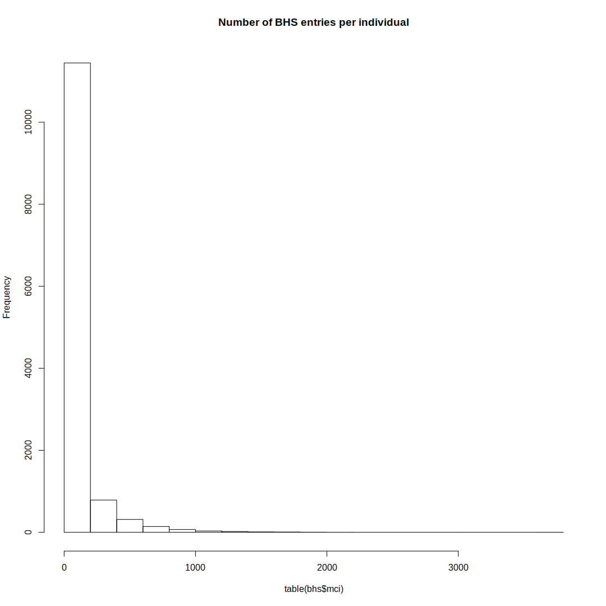

Overview
========

...

Data
----

### Allegheny County Aggregate Data.xlsx

### Behavioral Health Services.csv

### CYF Active 2010 to 2016-11-09.csv

### HomelessShelters(1).csv

### IDS Variables.xlsx

### PGHSNAP - Neighborhoods\_ All Raw Data.xlsx

### rp\_placements\_clean.csv

Note: some of the files ending with "(1).csv" have been renamed to ".csv".

Data Preparation
================

``` r
library('readr')
library('dplyr')
library('ggplot2')
library('gplots')
library('knitr')
library('venneuler')
```

``` r
# Homeless shelters
shelters <- read_csv('data/raw/HomelessShelters.csv.gz', progress=FALSE) %>%
    rename(mci=MCI_ID_OR_HMIS_CLIENT_ID)
```

    ## Parsed with column specification:
    ## cols(
    ##   MCI_ID_OR_HMIS_CLIENT_ID = col_integer(),
    ##   FIRST_INVOLVEMENT_IN_EPISODE = col_integer(),
    ##   LAST_INVOLVEMENT_IN_EPISODE = col_integer(),
    ##   PROJ_INVOLVEMENT_EPISODE_START = col_character(),
    ##   PROJ_INVOLVEMENT_EPISODE_END = col_character(),
    ##   DURATION_OF_STAY = col_integer(),
    ##   HUD_PROJECT_TYPE = col_character()
    ## )

``` r
# Behavioral Health Services
bhs <- read_csv('data/raw/Behavioral Health Services.csv.gz', progress=FALSE) %>%
    rename(mci=MCI_UNIQ_ID)
```

    ## Parsed with column specification:
    ## cols(
    ##   CL_ID = col_integer(),
    ##   SERVICE_RENDERED_ROW_ID = col_integer(),
    ##   SVC_START_DT = col_character(),
    ##   SVC_END_DT = col_character(),
    ##   MCI_UNIQ_ID = col_integer(),
    ##   PAYER = col_character(),
    ##   DHS_OFFICE = col_character(),
    ##   SERVICE_NAME = col_character(),
    ##   SERVICE_CODE = col_character(),
    ##   COUNTY_COST_CENTER = col_character(),
    ##   PRVDR_NAME = col_character(),
    ##   CNTY_TOT = col_double(),
    ##   TOT_UNITS = col_integer(),
    ##   SUBMT_DT = col_character(),
    ##   SERVICE_SEQ = col_integer(),
    ##   CYF_ACTIVE_AT_SERVICE = col_integer(),
    ##   CYF_PLC_AT_SERVICE = col_integer()
    ## )

    ## Warning: 5 parsing failures.
    ##    row       col               expected actual
    ## 212073 TOT_UNITS no trailing characters    .29
    ## 212074 TOT_UNITS no trailing characters    .29
    ## 635064 TOT_UNITS no trailing characters    .29
    ## 640524 TOT_UNITS no trailing characters    .29
    ## 690640 TOT_UNITS no trailing characters    .29

``` r
# CYF Active
cyf <- read_csv('data/raw/CYF Active 2010 to 2016-11-09.csv.gz', progress=FALSE) %>%
    rename(mci=MCI_ID)
```

    ## Parsed with column specification:
    ## cols(
    ##   CAS_ID = col_integer(),
    ##   CL_ID = col_integer(),
    ##   MCI_ID = col_integer(),
    ##   BRTH_DT = col_character(),
    ##   AGE = col_integer(),
    ##   GENDER = col_character(),
    ##   RACE = col_character(),
    ##   INVLV_STRT_DT = col_character(),
    ##   INVLV_END_DT = col_character()
    ## )

``` r
# Individuals in all three datasets
common_ids <- intersect(intersect(bhs$mci, cyf$mci), shelters$mci)

# Venn Diagram
bhs_ids <- unique(bhs$mci)
cyf_ids <- unique(cyf$mci)
shelt_ids <- unique(shelters$mci)

vd <- venneuler(c(bhs=length(bhs_ids), cyf=length(cyf_ids),
                  shelt=length(shelt_ids),
                  "bhs&cyf"=length(intersect(bhs_ids, cyf_ids)),
                  "bhs&shelt"=length(intersect(bhs_ids, shelt_ids)),
                  "cyf&shelt"=length(intersect(cyf_ids, shelt_ids)),
                  "bhs&cyf&shelt"=length(intersect(bhs_ids, intersect(cyf_ids, shelt_ids)))))
vd$labels <- c(paste0("bhs\n", length(bhs_ids)),
               paste0("cyf\n", length(cyf_ids)),
               paste0("shelt\n", length(shelt_ids)))
plot(vd)
```


``` r
# Overlap statistics
cat(sprintf('- Overlap between BHS & CYF: %d\n', length(intersect(bhs_ids, cyf_ids))))
```

-   Overlap between BHS & CYF: 10627

``` r
cat(sprintf('- Overlap between BHS & Shelter: %d\n', length(intersect(bhs_ids, shelt_ids))))
```

-   Overlap between BHS & Shelter: 1910

``` r
cat(sprintf('- Overlap between CYF & Shelter: %d\n', length(intersect(cyf_ids, shelt_ids))))
```

-   Overlap between CYF & Shelter: 4312

``` r
cat(sprintf('- Overlap between all three: %d\n', length(intersect(bhs_ids, intersect(cyf_ids, shelt_ids)))))
```

-   Overlap between all three: 1704

``` r
# Drop rows for individuals with missing data
cat(sprintf('- Dropping %d / %d rows from shelter dataset (not shared)\n', 
            sum(!shelters$mci %in% common_ids),
            nrow(shelters)))
```

-   Dropping 27606 / 30362 rows from shelter dataset (not shared)

``` r
shelters <- shelters[shelters$mci %in% common_ids,]

cat(sprintf('- Dropping %d / %d rows from behavior dataset (not shared)\n', 
            sum(!bhs$mci %in% common_ids),
            nrow(bhs)))
```

-   Dropping 807675 / 1003167 rows from behavior dataset (not shared)

``` r
bhs <- bhs[bhs$mci %in% common_ids,]

cat(sprintf('- Dropping %d / %d rows from CYF dataset (not shared)\n', 
            sum(!cyf$mci %in% common_ids),
            nrow(cyf)))
```

-   Dropping 64812 / 66790 rows from CYF dataset (not shared)

``` r
cyf <- cyf[cyf$mci %in% common_ids,]
# Placements
#placements <- read_csv('data/raw/rp_placements_clean.csv', row_names=FALSE)

# counts per dataset
data_counts <- merge(merge(
    bhs %>% group_by(mci) %>% summarize(num_bhs=n()),
    cyf %>% group_by(mci) %>% summarize(num_cyf=n()), by='mci'),
    shelters %>% group_by(mci) %>% summarize(num_shelter=n()), by='mci')

# individuals with multiple rows in all three tables
multi_row_individuals <- data_counts[apply(data_counts, 1, min) > 1,]$mci
```

Exploratory Data Analaysis
==========================

### Behavior and Health Services

#### Overview

``` r
dim(bhs)
```

    ## [1] 195492     17

``` r
range(table(bhs$mci))
```

    ## [1]    1 2045

``` r
hist(table(bhs$mci), main='Number of BHS entries per individual')
```



``` r
kable(head(bhs))
```

|  CL\_ID|  SERVICE\_RENDERED\_ROW\_ID| SVC\_START\_DT  | SVC\_END\_DT    |         mci| PAYER | DHS\_OFFICE | SERVICE\_NAME                                  | SERVICE\_CODE | COUNTY\_COST\_CENTER              | PRVDR\_NAME                       |  CNTY\_TOT|  TOT\_UNITS| SUBMT\_DT       |  SERVICE\_SEQ|  CYF\_ACTIVE\_AT\_SERVICE|  CYF\_PLC\_AT\_SERVICE|
|-------:|---------------------------:|:----------------|:----------------|-----------:|:------|:------------|:-----------------------------------------------|:--------------|:----------------------------------|:----------------------------------|----------:|-----------:|:----------------|-------------:|-------------------------:|----------------------:|
|  845961|                   954299218| 6/24/2015 0:00  | 6/24/2015 0:00  |  1000000422| CCBH  | MH          | Walk-in Crisis                                 | H2011         | Mental Health Crisis Intervention | WESTERN PSYCHIATRIC INST & CLINIC |         48|           3| 7/10/2015 0:00  |             1|                         1|                      0|
|  964739|                   806722941| 11/2/2013 0:00  | 11/2/2013 0:00  |  1000000587| CCBH  | MH          | MH-Outpatient Practitioner-Initial Intake Eval | H0004HN       | Does Not Apply                    | MALAZICH LORI A.                  |         22|           1| 11/15/2013 0:00 |             1|                         1|                      1|
|  964739|                   806852525| 11/9/2013 0:00  | 11/9/2013 0:00  |  1000000587| CCBH  | MH          | MH-Outpatient Practitioner Individual Therapy  | H0004HB       | Does Not Apply                    | MALAZICH LORI A.                  |         96|           4| 11/22/2013 0:00 |             2|                         1|                      1|
|  964739|                   806909719| 11/11/2013 0:00 | 11/11/2013 0:00 |  1000000587| CCBH  | MH          | Blended Mental Health Case Management          | T1017U7       | Does Not Apply                    | MERCY BEHAVORIAL HEALTH           |        360|          13| 1/24/2014 0:00  |             3|                         1|                      1|
|  964739|                   806883073| 11/16/2013 0:00 | 11/16/2013 0:00 |  1000000587| CCBH  | MH          | MH-Outpatient Practitioner Individual Therapy  | H0004HB       | Does Not Apply                    | MALAZICH LORI A.                  |         96|           4| 11/22/2013 0:00 |             4|                         1|                      1|
|  964739|                   806797079| 11/20/2013 0:00 | 11/20/2013 0:00 |  1000000587| CCBH  | MH          | Blended Mental Health Case Management          | T1017U7       | Does Not Apply                    | MERCY BEHAVORIAL HEALTH           |        416|          15| 1/24/2014 0:00  |             5|                         1|                      1|

#### Single Individual

``` r
# random individual with multiple entries in each table
example_youth <- multi_row_individuals[1]

bhs %>% 
    filter(mci == example_youth) %>% 
    kable
```

|  CL\_ID|  SERVICE\_RENDERED\_ROW\_ID| SVC\_START\_DT  | SVC\_END\_DT    |         mci| PAYER  | DHS\_OFFICE | SERVICE\_NAME                                                                                                                                                                                                  | SERVICE\_CODE | COUNTY\_COST\_CENTER                                                   | PRVDR\_NAME                                                          |  CNTY\_TOT|  TOT\_UNITS| SUBMT\_DT       |  SERVICE\_SEQ|  CYF\_ACTIVE\_AT\_SERVICE|  CYF\_PLC\_AT\_SERVICE|
|-------:|---------------------------:|:----------------|:----------------|-----------:|:-------|:------------|:---------------------------------------------------------------------------------------------------------------------------------------------------------------------------------------------------------------|:--------------|:-----------------------------------------------------------------------|:---------------------------------------------------------------------|----------:|-----------:|:----------------|-------------:|-------------------------:|----------------------:|
|  812755|                   612524294| 1/1/2011 0:00   | 1/31/2011 0:00  |  1000048110| CCBH   | MH          | Residential Treatment Facility - Non Accredited: Level II                                                                                                                                                      | H0019HU       | Does Not Apply                                                         | MARS HOME FOR YOUTH                                                  |    6508.14|          31| 5/18/2012 0:00  |             1|                         1|                      0|
|  875536|                   612524294| 1/1/2011 0:00   | 1/31/2011 0:00  |  1000048110| CCBH   | MH          | Residential Treatment Facility - Non Accredited: Level II                                                                                                                                                      | H0019HU       | Does Not Apply                                                         | MARS HOME FOR YOUTH                                                  |    6508.14|          31| 5/18/2012 0:00  |             1|                         1|                      0|
|  812755|                   612524295| 1/1/2011 0:00   | 1/31/2011 0:00  |  1000048110| CCBH   | MH          | Residential Treatment Facility - Non Accredited: Level II                                                                                                                                                      | H0019HU       | Does Not Apply                                                         | MARS HOME FOR YOUTH                                                  |    6198.14|          31| 2/18/2011 0:00  |             2|                         1|                      0|
|  875536|                   612524295| 1/1/2011 0:00   | 1/31/2011 0:00  |  1000048110| CCBH   | MH          | Residential Treatment Facility - Non Accredited: Level II                                                                                                                                                      | H0019HU       | Does Not Apply                                                         | MARS HOME FOR YOUTH                                                  |    6198.14|          31| 2/18/2011 0:00  |             2|                         1|                      0|
|  812755|                   612524296| 1/1/2011 0:00   | 1/31/2011 0:00  |  1000048110| CCBH   | MH          | Residential Treatment Facility - Non Accredited: Level II                                                                                                                                                      | H0019HU       | Does Not Apply                                                         | MARS HOME FOR YOUTH                                                  |   -6198.14|         -31| 5/18/2012 0:00  |             3|                         1|                      0|
|  875536|                   612524296| 1/1/2011 0:00   | 1/31/2011 0:00  |  1000048110| CCBH   | MH          | Residential Treatment Facility - Non Accredited: Level II                                                                                                                                                      | H0019HU       | Does Not Apply                                                         | MARS HOME FOR YOUTH                                                  |   -6198.14|         -31| 5/18/2012 0:00  |             3|                         1|                      0|
|  812755|                   612996993| 2/1/2011 0:00   | 2/1/2011 0:00   |  1000048110| CCBH   | MH          | Residential Treatment Facility - Non Accredited: Level II                                                                                                                                                      | H0019HU       | Does Not Apply                                                         | MARS HOME FOR YOUTH                                                  |    2799.16|          14| 3/25/2011 0:00  |             4|                         1|                      0|
|  875536|                   612996993| 2/1/2011 0:00   | 2/1/2011 0:00   |  1000048110| CCBH   | MH          | Residential Treatment Facility - Non Accredited: Level II                                                                                                                                                      | H0019HU       | Does Not Apply                                                         | MARS HOME FOR YOUTH                                                  |    2799.16|          14| 3/25/2011 0:00  |             4|                         1|                      0|
|  812755|                   612996994| 2/1/2011 0:00   | 2/1/2011 0:00   |  1000048110| CCBH   | MH          | Residential Treatment Facility - Non Accredited: Level II                                                                                                                                                      | H0019HU       | Does Not Apply                                                         | MARS HOME FOR YOUTH                                                  |    2939.16|          14| 5/18/2012 0:00  |             5|                         1|                      0|
|  875536|                   612996994| 2/1/2011 0:00   | 2/1/2011 0:00   |  1000048110| CCBH   | MH          | Residential Treatment Facility - Non Accredited: Level II                                                                                                                                                      | H0019HU       | Does Not Apply                                                         | MARS HOME FOR YOUTH                                                  |    2939.16|          14| 5/18/2012 0:00  |             5|                         1|                      0|
|  812755|                   612996995| 2/1/2011 0:00   | 2/1/2011 0:00   |  1000048110| CCBH   | MH          | Residential Treatment Facility - Non Accredited: Level II                                                                                                                                                      | H0019HU       | Does Not Apply                                                         | MARS HOME FOR YOUTH                                                  |   -2799.16|         -14| 5/18/2012 0:00  |             6|                         1|                      0|
|  875536|                   612996995| 2/1/2011 0:00   | 2/1/2011 0:00   |  1000048110| CCBH   | MH          | Residential Treatment Facility - Non Accredited: Level II                                                                                                                                                      | H0019HU       | Does Not Apply                                                         | MARS HOME FOR YOUTH                                                  |   -2799.16|         -14| 5/18/2012 0:00  |             6|                         1|                      0|
|  812755|                   612996996| 2/7/2011 0:00   | 2/7/2011 0:00   |  1000048110| CCBH   | MH          | Residential Treatment Facility - Non Accredited: Level II                                                                                                                                                      | H0019HU       | Does Not Apply                                                         | MARS HOME FOR YOUTH                                                  |    2799.16|          14| 3/25/2011 0:00  |             7|                         1|                      0|
|  875536|                   612996996| 2/7/2011 0:00   | 2/7/2011 0:00   |  1000048110| CCBH   | MH          | Residential Treatment Facility - Non Accredited: Level II                                                                                                                                                      | H0019HU       | Does Not Apply                                                         | MARS HOME FOR YOUTH                                                  |    2799.16|          14| 3/25/2011 0:00  |             7|                         1|                      0|
|  812755|                   612996997| 2/7/2011 0:00   | 2/7/2011 0:00   |  1000048110| CCBH   | MH          | Residential Treatment Facility - Non Accredited: Level II                                                                                                                                                      | H0019HU       | Does Not Apply                                                         | MARS HOME FOR YOUTH                                                  |   -2799.16|         -14| 5/18/2012 0:00  |             8|                         1|                      0|
|  875536|                   612996997| 2/7/2011 0:00   | 2/7/2011 0:00   |  1000048110| CCBH   | MH          | Residential Treatment Facility - Non Accredited: Level II                                                                                                                                                      | H0019HU       | Does Not Apply                                                         | MARS HOME FOR YOUTH                                                  |   -2799.16|         -14| 5/18/2012 0:00  |             8|                         1|                      0|
|  812755|                   612996998| 2/7/2011 0:00   | 2/7/2011 0:00   |  1000048110| CCBH   | MH          | Residential Treatment Facility - Non Accredited: Level II                                                                                                                                                      | H0019HU       | Does Not Apply                                                         | MARS HOME FOR YOUTH                                                  |    2939.16|          14| 5/18/2012 0:00  |             9|                         1|                      0|
|  875536|                   612996998| 2/7/2011 0:00   | 2/7/2011 0:00   |  1000048110| CCBH   | MH          | Residential Treatment Facility - Non Accredited: Level II                                                                                                                                                      | H0019HU       | Does Not Apply                                                         | MARS HOME FOR YOUTH                                                  |    2939.16|          14| 5/18/2012 0:00  |             9|                         1|                      0|
|  812755|                   612875897| 3/1/2011 0:00   | 3/31/2011 0:00  |  1000048110| CCBH   | MH          | Residential Treatment Facility - Non Accredited: Level II                                                                                                                                                      | H0019HU       | Does Not Apply                                                         | MARS HOME FOR YOUTH                                                  |   -6198.14|         -31| 5/18/2012 0:00  |            10|                         1|                      0|
|  875536|                   612875897| 3/1/2011 0:00   | 3/31/2011 0:00  |  1000048110| CCBH   | MH          | Residential Treatment Facility - Non Accredited: Level II                                                                                                                                                      | H0019HU       | Does Not Apply                                                         | MARS HOME FOR YOUTH                                                  |   -6198.14|         -31| 5/18/2012 0:00  |            10|                         1|                      0|
|  812755|                   612875898| 3/1/2011 0:00   | 3/31/2011 0:00  |  1000048110| CCBH   | MH          | Residential Treatment Facility - Non Accredited: Level II                                                                                                                                                      | H0019HU       | Does Not Apply                                                         | MARS HOME FOR YOUTH                                                  |    6508.14|          31| 5/18/2012 0:00  |            11|                         1|                      0|
|  875536|                   612875898| 3/1/2011 0:00   | 3/31/2011 0:00  |  1000048110| CCBH   | MH          | Residential Treatment Facility - Non Accredited: Level II                                                                                                                                                      | H0019HU       | Does Not Apply                                                         | MARS HOME FOR YOUTH                                                  |    6508.14|          31| 5/18/2012 0:00  |            11|                         1|                      0|
|  812755|                   612875899| 3/1/2011 0:00   | 3/31/2011 0:00  |  1000048110| CCBH   | MH          | Residential Treatment Facility - Non Accredited: Level II                                                                                                                                                      | H0019HU       | Does Not Apply                                                         | MARS HOME FOR YOUTH                                                  |    6198.14|          31| 4/15/2011 0:00  |            12|                         1|                      0|
|  875536|                   612875899| 3/1/2011 0:00   | 3/31/2011 0:00  |  1000048110| CCBH   | MH          | Residential Treatment Facility - Non Accredited: Level II                                                                                                                                                      | H0019HU       | Does Not Apply                                                         | MARS HOME FOR YOUTH                                                  |    6198.14|          31| 4/15/2011 0:00  |            12|                         1|                      0|
|  812755|                   613384986| 4/1/2011 0:00   | 4/6/2011 0:00   |  1000048110| CCBH   | MH          | Residential Treatment Facility - Non Accredited: Level II                                                                                                                                                      | H0019HU       | Does Not Apply                                                         | MARS HOME FOR YOUTH                                                  |    1259.64|           6| 5/18/2012 0:00  |            13|                         1|                      0|
|  875536|                   613384986| 4/1/2011 0:00   | 4/6/2011 0:00   |  1000048110| CCBH   | MH          | Residential Treatment Facility - Non Accredited: Level II                                                                                                                                                      | H0019HU       | Does Not Apply                                                         | MARS HOME FOR YOUTH                                                  |    1259.64|           6| 5/18/2012 0:00  |            13|                         1|                      0|
|  812755|                   613388161| 4/1/2011 0:00   | 4/6/2011 0:00   |  1000048110| CCBH   | MH          | Residential Treatment Facility - Non Accredited: Level II                                                                                                                                                      | H0019HU       | Does Not Apply                                                         | MARS HOME FOR YOUTH                                                  |   -1199.64|          -6| 5/18/2012 0:00  |            14|                         1|                      0|
|  875536|                   613388161| 4/1/2011 0:00   | 4/6/2011 0:00   |  1000048110| CCBH   | MH          | Residential Treatment Facility - Non Accredited: Level II                                                                                                                                                      | H0019HU       | Does Not Apply                                                         | MARS HOME FOR YOUTH                                                  |   -1199.64|          -6| 5/18/2012 0:00  |            14|                         1|                      0|
|  812755|                   613388162| 4/1/2011 0:00   | 4/6/2011 0:00   |  1000048110| CCBH   | MH          | Residential Treatment Facility - Non Accredited: Level II                                                                                                                                                      | H0019HU       | Does Not Apply                                                         | MARS HOME FOR YOUTH                                                  |    1199.64|           6| 5/20/2011 0:00  |            15|                         1|                      0|
|  875536|                   613388162| 4/1/2011 0:00   | 4/6/2011 0:00   |  1000048110| CCBH   | MH          | Residential Treatment Facility - Non Accredited: Level II                                                                                                                                                      | H0019HU       | Does Not Apply                                                         | MARS HOME FOR YOUTH                                                  |    1199.64|           6| 5/20/2011 0:00  |            15|                         1|                      0|
|  812755|                   613182453| 4/12/2011 0:00  | 4/12/2011 0:00  |  1000048110| CCBH   | MH          | First appointment by clinician other then MD (OPMH)                                                                                                                                                            | 90806U3       | Does Not Apply                                                         | GLADE RUN LUTHERAN SERVICES                                          |      90.00|           1| 6/3/2011 0:00   |            16|                         1|                      0|
|  875536|                   613182453| 4/12/2011 0:00  | 4/12/2011 0:00  |  1000048110| CCBH   | MH          | First appointment by clinician other then MD (OPMH)                                                                                                                                                            | 90806U3       | Does Not Apply                                                         | GLADE RUN LUTHERAN SERVICES                                          |      90.00|           1| 6/3/2011 0:00   |            16|                         1|                      1|
|  812755|                   613182454| 4/15/2011 0:00  | 4/15/2011 0:00  |  1000048110| CCBH   | MH          | individual Psychotherapy -- 75 - 80 minute session (OPMH)                                                                                                                                                      | 90808HE       | Does Not Apply                                                         | GLADE RUN LUTHERAN SERVICES                                          |     108.00|           1| 6/3/2011 0:00   |            17|                         1|                      0|
|  875536|                   613182454| 4/15/2011 0:00  | 4/15/2011 0:00  |  1000048110| CCBH   | MH          | individual Psychotherapy -- 75 - 80 minute session (OPMH)                                                                                                                                                      | 90808HE       | Does Not Apply                                                         | GLADE RUN LUTHERAN SERVICES                                          |     108.00|           1| 6/3/2011 0:00   |            17|                         1|                      1|
|  812755|                   613182455| 4/18/2011 0:00  | 4/18/2011 0:00  |  1000048110| CCBH   | MH          | Individual Psychotherapy -- 45 - 50 minute session (OPMH)                                                                                                                                                      | 90806HE       | Does Not Apply                                                         | GLADE RUN LUTHERAN SERVICES                                          |      72.00|           1| 6/3/2011 0:00   |            18|                         1|                      0|
|  875536|                   613182455| 4/18/2011 0:00  | 4/18/2011 0:00  |  1000048110| CCBH   | MH          | Individual Psychotherapy -- 45 - 50 minute session (OPMH)                                                                                                                                                      | 90806HE       | Does Not Apply                                                         | GLADE RUN LUTHERAN SERVICES                                          |      72.00|           1| 6/3/2011 0:00   |            18|                         1|                      1|
|  812755|                   613352358| 4/26/2011 0:00  | 4/26/2011 0:00  |  1000048110| CCBH   | MH          | Individual Psychotherapy -- 45 - 50 minute session (OPMH)                                                                                                                                                      | 90806HE       | Does Not Apply                                                         | GLADE RUN LUTHERAN SERVICES                                          |      72.00|           1| 6/10/2011 0:00  |            19|                         1|                      0|
|  875536|                   613352358| 4/26/2011 0:00  | 4/26/2011 0:00  |  1000048110| CCBH   | MH          | Individual Psychotherapy -- 45 - 50 minute session (OPMH)                                                                                                                                                      | 90806HE       | Does Not Apply                                                         | GLADE RUN LUTHERAN SERVICES                                          |      72.00|           1| 6/10/2011 0:00  |            19|                         1|                      1|
|  812755|                   613352357| 4/28/2011 0:00  | 4/28/2011 0:00  |  1000048110| CCBH   | MH          | Individual Psychotherapy -- 45 - 50 minute session (OPMH)                                                                                                                                                      | 90806HE       | Does Not Apply                                                         | GLADE RUN LUTHERAN SERVICES                                          |      72.00|           1| 6/10/2011 0:00  |            20|                         1|                      0|
|  875536|                   613352357| 4/28/2011 0:00  | 4/28/2011 0:00  |  1000048110| CCBH   | MH          | Individual Psychotherapy -- 45 - 50 minute session (OPMH)                                                                                                                                                      | 90806HE       | Does Not Apply                                                         | GLADE RUN LUTHERAN SERVICES                                          |      72.00|           1| 6/10/2011 0:00  |            20|                         1|                      1|
|  812755|                   613097301| 5/2/2011 0:00   | 5/2/2011 0:00   |  1000048110| CCBH   | MH          | Individual Psychotherapy -- 45 - 50 minute session (OPMH)                                                                                                                                                      | 90806HE       | Does Not Apply                                                         | GLADE RUN LUTHERAN SERVICES                                          |      72.00|           1| 7/8/2011 0:00   |            21|                         1|                      0|
|  875536|                   613097301| 5/2/2011 0:00   | 5/2/2011 0:00   |  1000048110| CCBH   | MH          | Individual Psychotherapy -- 45 - 50 minute session (OPMH)                                                                                                                                                      | 90806HE       | Does Not Apply                                                         | GLADE RUN LUTHERAN SERVICES                                          |      72.00|           1| 7/8/2011 0:00   |            21|                         1|                      1|
|  812755|                   613097297| 5/3/2011 0:00   | 5/3/2011 0:00   |  1000048110| CCBH   | MH          | Individual Psychotherapy -- 45 - 50 minute session (OPMH)                                                                                                                                                      | 90806HE       | Does Not Apply                                                         | GLADE RUN LUTHERAN SERVICES                                          |      72.00|           1| 7/8/2011 0:00   |            22|                         1|                      0|
|  875536|                   613097297| 5/3/2011 0:00   | 5/3/2011 0:00   |  1000048110| CCBH   | MH          | Individual Psychotherapy -- 45 - 50 minute session (OPMH)                                                                                                                                                      | 90806HE       | Does Not Apply                                                         | GLADE RUN LUTHERAN SERVICES                                          |      72.00|           1| 7/8/2011 0:00   |            22|                         1|                      1|
|  812755|                   613097298| 5/4/2011 0:00   | 5/4/2011 0:00   |  1000048110| CCBH   | MH          | Individual Psychotherapy -- 45 - 50 minute session (OPMH)                                                                                                                                                      | 90806HE       | Does Not Apply                                                         | GLADE RUN LUTHERAN SERVICES                                          |      72.00|           1| 7/8/2011 0:00   |            23|                         1|                      0|
|  875536|                   613097298| 5/4/2011 0:00   | 5/4/2011 0:00   |  1000048110| CCBH   | MH          | Individual Psychotherapy -- 45 - 50 minute session (OPMH)                                                                                                                                                      | 90806HE       | Does Not Apply                                                         | GLADE RUN LUTHERAN SERVICES                                          |      72.00|           1| 7/8/2011 0:00   |            23|                         1|                      1|
|  812755|                   613097299| 5/9/2011 0:00   | 5/9/2011 0:00   |  1000048110| CCBH   | MH          | Individual Psychotherapy -- 45 - 50 minute session (OPMH)                                                                                                                                                      | 90806HE       | Does Not Apply                                                         | GLADE RUN LUTHERAN SERVICES                                          |      72.00|           1| 7/8/2011 0:00   |            24|                         1|                      0|
|  875536|                   613097299| 5/9/2011 0:00   | 5/9/2011 0:00   |  1000048110| CCBH   | MH          | Individual Psychotherapy -- 45 - 50 minute session (OPMH)                                                                                                                                                      | 90806HE       | Does Not Apply                                                         | GLADE RUN LUTHERAN SERVICES                                          |      72.00|           1| 7/8/2011 0:00   |            24|                         1|                      1|
|  812755|                   613097296| 5/13/2011 0:00  | 5/13/2011 0:00  |  1000048110| CCBH   | MH          | Psychiatric Examination & Evaluation of Patient By MD in facility                                                                                                                                              | 90801HE       | Does Not Apply                                                         | GLADE RUN LUTHERAN SERVICES                                          |     250.00|           1| 7/8/2011 0:00   |            25|                         1|                      0|
|  875536|                   613097296| 5/13/2011 0:00  | 5/13/2011 0:00  |  1000048110| CCBH   | MH          | Psychiatric Examination & Evaluation of Patient By MD in facility                                                                                                                                              | 90801HE       | Does Not Apply                                                         | GLADE RUN LUTHERAN SERVICES                                          |     250.00|           1| 7/8/2011 0:00   |            25|                         1|                      1|
|  812755|                   613097300| 5/17/2011 0:00  | 5/17/2011 0:00  |  1000048110| CCBH   | MH          | Individual Psychotherapy -- 45 - 50 minute session (OPMH)                                                                                                                                                      | 90806HE       | Does Not Apply                                                         | GLADE RUN LUTHERAN SERVICES                                          |      72.00|           1| 7/8/2011 0:00   |            26|                         1|                      0|
|  875536|                   613097300| 5/17/2011 0:00  | 5/17/2011 0:00  |  1000048110| CCBH   | MH          | Individual Psychotherapy -- 45 - 50 minute session (OPMH)                                                                                                                                                      | 90806HE       | Does Not Apply                                                         | GLADE RUN LUTHERAN SERVICES                                          |      72.00|           1| 7/8/2011 0:00   |            26|                         1|                      1|
|  812755|                   613097302| 5/20/2011 0:00  | 5/20/2011 0:00  |  1000048110| CCBH   | MH          | Individual Psychotherapy -- 45 - 50 minute session (OPMH)                                                                                                                                                      | 90806HE       | Does Not Apply                                                         | GLADE RUN LUTHERAN SERVICES                                          |      72.00|           1| 7/8/2011 0:00   |            27|                         1|                      0|
|  875536|                   613097302| 5/20/2011 0:00  | 5/20/2011 0:00  |  1000048110| CCBH   | MH          | Individual Psychotherapy -- 45 - 50 minute session (OPMH)                                                                                                                                                      | 90806HE       | Does Not Apply                                                         | GLADE RUN LUTHERAN SERVICES                                          |      72.00|           1| 7/8/2011 0:00   |            27|                         1|                      1|
|  812755|                   613066034| 5/25/2011 0:00  | 5/25/2011 0:00  |  1000048110| CCBH   | MH          | Individual Psychotherapy -- 45 - 50 minute session (OPMH)                                                                                                                                                      | 90806HE       | Does Not Apply                                                         | GLADE RUN LUTHERAN SERVICES                                          |      72.00|           1| 7/8/2011 0:00   |            28|                         1|                      0|
|  875536|                   613066034| 5/25/2011 0:00  | 5/25/2011 0:00  |  1000048110| CCBH   | MH          | Individual Psychotherapy -- 45 - 50 minute session (OPMH)                                                                                                                                                      | 90806HE       | Does Not Apply                                                         | GLADE RUN LUTHERAN SERVICES                                          |      72.00|           1| 7/8/2011 0:00   |            28|                         1|                      1|
|  812755|                   613066032| 5/26/2011 0:00  | 5/26/2011 0:00  |  1000048110| CCBH   | MH          | Individual Psychotherapy -- 45 - 50 minute session (OPMH)                                                                                                                                                      | 90806HE       | Does Not Apply                                                         | GLADE RUN LUTHERAN SERVICES                                          |      72.00|           1| 7/8/2011 0:00   |            29|                         1|                      0|
|  875536|                   613066032| 5/26/2011 0:00  | 5/26/2011 0:00  |  1000048110| CCBH   | MH          | Individual Psychotherapy -- 45 - 50 minute session (OPMH)                                                                                                                                                      | 90806HE       | Does Not Apply                                                         | GLADE RUN LUTHERAN SERVICES                                          |      72.00|           1| 7/8/2011 0:00   |            29|                         1|                      1|
|  812755|                   613066033| 5/31/2011 0:00  | 5/31/2011 0:00  |  1000048110| CCBH   | MH          | Individual Psychotherapy -- 45 - 50 minute session (OPMH)                                                                                                                                                      | 90806HE       | Does Not Apply                                                         | GLADE RUN LUTHERAN SERVICES                                          |      72.00|           1| 7/8/2011 0:00   |            30|                         1|                      0|
|  875536|                   613066033| 5/31/2011 0:00  | 5/31/2011 0:00  |  1000048110| CCBH   | MH          | Individual Psychotherapy -- 45 - 50 minute session (OPMH)                                                                                                                                                      | 90806HE       | Does Not Apply                                                         | GLADE RUN LUTHERAN SERVICES                                          |      72.00|           1| 7/8/2011 0:00   |            30|                         1|                      1|
|  812755|                   613805302| 6/2/2011 0:00   | 6/2/2011 0:00   |  1000048110| CCBH   | MH          | Individual Psychotherapy -- 45 - 50 minute session (OPMH)                                                                                                                                                      | 90806HE       | Does Not Apply                                                         | GLADE RUN LUTHERAN SERVICES                                          |      72.00|           1| 7/22/2011 0:00  |            31|                         1|                      0|
|  875536|                   613805302| 6/2/2011 0:00   | 6/2/2011 0:00   |  1000048110| CCBH   | MH          | Individual Psychotherapy -- 45 - 50 minute session (OPMH)                                                                                                                                                      | 90806HE       | Does Not Apply                                                         | GLADE RUN LUTHERAN SERVICES                                          |      72.00|           1| 7/22/2011 0:00  |            31|                         1|                      1|
|  812755|                   613084227| 6/6/2011 0:00   | 6/20/2011 0:00  |  1000048110| CCBH   | MH          | Inpatient MH Day                                                                                                                                                                                               | 124           | Does Not Apply                                                         | CLARION PSYCHIATRIC CENTER                                           |    8913.80|          14| 7/8/2011 0:00   |            32|                         1|                      0|
|  875536|                   613084227| 6/6/2011 0:00   | 6/20/2011 0:00  |  1000048110| CCBH   | MH          | Inpatient MH Day                                                                                                                                                                                               | 124           | Does Not Apply                                                         | CLARION PSYCHIATRIC CENTER                                           |    8913.80|          14| 7/8/2011 0:00   |            32|                         1|                      1|
|  812755|                   613805301| 6/6/2011 0:00   | 6/6/2011 0:00   |  1000048110| CCBH   | MH          | individual Psychotherapy -- 75 - 80 minute session (OPMH)                                                                                                                                                      | 90808HE       | Does Not Apply                                                         | GLADE RUN LUTHERAN SERVICES                                          |     108.00|           1| 7/22/2011 0:00  |            33|                         1|                      0|
|  875536|                   613805301| 6/6/2011 0:00   | 6/6/2011 0:00   |  1000048110| CCBH   | MH          | individual Psychotherapy -- 75 - 80 minute session (OPMH)                                                                                                                                                      | 90808HE       | Does Not Apply                                                         | GLADE RUN LUTHERAN SERVICES                                          |     108.00|           1| 7/22/2011 0:00  |            33|                         1|                      1|
|  812755|                   613627087| 6/21/2011 0:00  | 6/21/2011 0:00  |  1000048110| CCBH   | MH          | individual Psychotherapy -- 75 - 80 minute session (OPMH)                                                                                                                                                      | 90808HE       | Does Not Apply                                                         | GLADE RUN LUTHERAN SERVICES                                          |     108.00|           1| 8/5/2011 0:00   |            34|                         1|                      0|
|  875536|                   613627087| 6/21/2011 0:00  | 6/21/2011 0:00  |  1000048110| CCBH   | MH          | individual Psychotherapy -- 75 - 80 minute session (OPMH)                                                                                                                                                      | 90808HE       | Does Not Apply                                                         | GLADE RUN LUTHERAN SERVICES                                          |     108.00|           1| 8/5/2011 0:00   |            34|                         1|                      1|
|  812755|                   613627084| 6/23/2011 0:00  | 6/23/2011 0:00  |  1000048110| CCBH   | MH          | Individual Psychotherapy -- 45 - 50 minute session (OPMH)                                                                                                                                                      | 90806HE       | Does Not Apply                                                         | GLADE RUN LUTHERAN SERVICES                                          |      72.00|           1| 8/5/2011 0:00   |            35|                         1|                      0|
|  875536|                   613627084| 6/23/2011 0:00  | 6/23/2011 0:00  |  1000048110| CCBH   | MH          | Individual Psychotherapy -- 45 - 50 minute session (OPMH)                                                                                                                                                      | 90806HE       | Does Not Apply                                                         | GLADE RUN LUTHERAN SERVICES                                          |      72.00|           1| 8/5/2011 0:00   |            35|                         1|                      1|
|  812755|                   613627085| 6/24/2011 0:00  | 6/24/2011 0:00  |  1000048110| CCBH   | MH          | Complex and Extensive Mdication Visit with no medication administration. This code is to be used when there are complications with a medication that require a thorough and extensive evaluation of medication | 90862U7       | Does Not Apply                                                         | GLADE RUN LUTHERAN SERVICES                                          |      80.00|           1| 8/5/2011 0:00   |            36|                         1|                      0|
|  875536|                   613627085| 6/24/2011 0:00  | 6/24/2011 0:00  |  1000048110| CCBH   | MH          | Complex and Extensive Mdication Visit with no medication administration. This code is to be used when there are complications with a medication that require a thorough and extensive evaluation of medication | 90862U7       | Does Not Apply                                                         | GLADE RUN LUTHERAN SERVICES                                          |      80.00|           1| 8/5/2011 0:00   |            36|                         1|                      1|
|  812755|                   613627086| 6/29/2011 0:00  | 6/29/2011 0:00  |  1000048110| CCBH   | MH          | Individual Psychotherapy -- 45 - 50 minute session (OPMH)                                                                                                                                                      | 90806HE       | Does Not Apply                                                         | GLADE RUN LUTHERAN SERVICES                                          |      72.00|           1| 8/5/2011 0:00   |            37|                         1|                      0|
|  875536|                   613627086| 6/29/2011 0:00  | 6/29/2011 0:00  |  1000048110| CCBH   | MH          | Individual Psychotherapy -- 45 - 50 minute session (OPMH)                                                                                                                                                      | 90806HE       | Does Not Apply                                                         | GLADE RUN LUTHERAN SERVICES                                          |      72.00|           1| 8/5/2011 0:00   |            37|                         1|                      1|
|  812755|                   613763704| 7/5/2011 0:00   | 7/5/2011 0:00   |  1000048110| CCBH   | MH          | Individual Psychotherapy -- 45 - 50 minute session (OPMH)                                                                                                                                                      | 90806HE       | Does Not Apply                                                         | GLADE RUN LUTHERAN SERVICES                                          |      72.00|           1| 8/19/2011 0:00  |            38|                         1|                      0|
|  875536|                   613763704| 7/5/2011 0:00   | 7/5/2011 0:00   |  1000048110| CCBH   | MH          | Individual Psychotherapy -- 45 - 50 minute session (OPMH)                                                                                                                                                      | 90806HE       | Does Not Apply                                                         | GLADE RUN LUTHERAN SERVICES                                          |      72.00|           1| 8/19/2011 0:00  |            38|                         1|                      1|
|  812755|                   613680111| 7/14/2011 0:00  | 7/14/2011 0:00  |  1000048110| CCBH   | MH          | Individual Psychotherapy -- 45 - 50 minute session (OPMH)                                                                                                                                                      | 90806HE       | Does Not Apply                                                         | GLADE RUN LUTHERAN SERVICES                                          |      72.00|           1| 8/26/2011 0:00  |            39|                         1|                      0|
|  875536|                   613680111| 7/14/2011 0:00  | 7/14/2011 0:00  |  1000048110| CCBH   | MH          | Individual Psychotherapy -- 45 - 50 minute session (OPMH)                                                                                                                                                      | 90806HE       | Does Not Apply                                                         | GLADE RUN LUTHERAN SERVICES                                          |      72.00|           1| 8/26/2011 0:00  |            39|                         1|                      1|
|  812755|                   613680110| 7/20/2011 0:00  | 7/20/2011 0:00  |  1000048110| CCBH   | MH          | Individual Psychotherapy -- 45 - 50 minute session (OPMH)                                                                                                                                                      | 90806HE       | Does Not Apply                                                         | GLADE RUN LUTHERAN SERVICES                                          |      72.00|           1| 8/26/2011 0:00  |            40|                         1|                      0|
|  875536|                   613680110| 7/20/2011 0:00  | 7/20/2011 0:00  |  1000048110| CCBH   | MH          | Individual Psychotherapy -- 45 - 50 minute session (OPMH)                                                                                                                                                      | 90806HE       | Does Not Apply                                                         | GLADE RUN LUTHERAN SERVICES                                          |      72.00|           1| 8/26/2011 0:00  |            40|                         1|                      1|
|  812755|                   613499626| 7/28/2011 0:00  | 8/27/2011 0:00  |  1000048110| CCBH   | MH          | Inpatient MH Day                                                                                                                                                                                               | 124           | Does Not Apply                                                         | CLARION PSYCHIATRIC CENTER                                           |   19737.70|          31| 9/16/2011 0:00  |            41|                         1|                      0|
|  875536|                   613499626| 7/28/2011 0:00  | 8/27/2011 0:00  |  1000048110| CCBH   | MH          | Inpatient MH Day                                                                                                                                                                                               | 124           | Does Not Apply                                                         | CLARION PSYCHIATRIC CENTER                                           |   19737.70|          31| 9/16/2011 0:00  |            41|                         1|                      1|
|  812755|                   613492788| 8/28/2011 0:00  | 9/2/2011 0:00   |  1000048110| CCBH   | MH          | Inpatient MH Day                                                                                                                                                                                               | 124           | Does Not Apply                                                         | CLARION PSYCHIATRIC CENTER                                           |    3183.50|           5| 9/16/2011 0:00  |            42|                         1|                      0|
|  875536|                   613492788| 8/28/2011 0:00  | 9/2/2011 0:00   |  1000048110| CCBH   | MH          | Inpatient MH Day                                                                                                                                                                                               | 124           | Does Not Apply                                                         | CLARION PSYCHIATRIC CENTER                                           |    3183.50|           5| 9/16/2011 0:00  |            42|                         1|                      0|
|  812755|                   614195099| 9/2/2011 0:00   | 9/7/2011 0:00   |  1000048110| CCBH   | MH          | RTF - JCAHO                                                                                                                                                                                                    | 159           | Does Not Apply                                                         | THE BRADLEY CENTER                                                   |   -1900.38|          -6| 6/1/2012 0:00   |            43|                         1|                      0|
|  875536|                   614195099| 9/2/2011 0:00   | 9/7/2011 0:00   |  1000048110| CCBH   | MH          | RTF - JCAHO                                                                                                                                                                                                    | 159           | Does Not Apply                                                         | THE BRADLEY CENTER                                                   |   -1900.38|          -6| 6/1/2012 0:00   |            43|                         1|                      1|
|  812755|                   614195100| 9/2/2011 0:00   | 9/7/2011 0:00   |  1000048110| CCBH   | MH          | RTF - JCAHO                                                                                                                                                                                                    | 159           | Does Not Apply                                                         | THE BRADLEY CENTER                                                   |    1995.42|           6| 6/1/2012 0:00   |            44|                         1|                      0|
|  875536|                   614195100| 9/2/2011 0:00   | 9/7/2011 0:00   |  1000048110| CCBH   | MH          | RTF - JCAHO                                                                                                                                                                                                    | 159           | Does Not Apply                                                         | THE BRADLEY CENTER                                                   |    1995.42|           6| 6/1/2012 0:00   |            44|                         1|                      1|
|  812755|                   614195101| 9/2/2011 0:00   | 9/7/2011 0:00   |  1000048110| CCBH   | MH          | RTF - JCAHO                                                                                                                                                                                                    | 159           | Does Not Apply                                                         | THE BRADLEY CENTER                                                   |    1900.38|           6| 10/7/2011 0:00  |            45|                         1|                      0|
|  875536|                   614195101| 9/2/2011 0:00   | 9/7/2011 0:00   |  1000048110| CCBH   | MH          | RTF - JCAHO                                                                                                                                                                                                    | 159           | Does Not Apply                                                         | THE BRADLEY CENTER                                                   |    1900.38|           6| 10/7/2011 0:00  |            45|                         1|                      1|
|  812755|                   614249957| 9/8/2011 0:00   | 9/14/2011 0:00  |  1000048110| CCBH   | MH          | RTF - JCAHO                                                                                                                                                                                                    | 159           | Does Not Apply                                                         | THE BRADLEY CENTER                                                   |   -2217.11|          -7| 6/1/2012 0:00   |            46|                         1|                      0|
|  875536|                   614249957| 9/8/2011 0:00   | 9/14/2011 0:00  |  1000048110| CCBH   | MH          | RTF - JCAHO                                                                                                                                                                                                    | 159           | Does Not Apply                                                         | THE BRADLEY CENTER                                                   |   -2217.11|          -7| 6/1/2012 0:00   |            46|                         1|                      1|
|  812755|                   614249958| 9/8/2011 0:00   | 9/14/2011 0:00  |  1000048110| CCBH   | MH          | RTF - JCAHO                                                                                                                                                                                                    | 159           | Does Not Apply                                                         | THE BRADLEY CENTER                                                   |    2327.99|           7| 6/1/2012 0:00   |            47|                         1|                      0|
|  875536|                   614249958| 9/8/2011 0:00   | 9/14/2011 0:00  |  1000048110| CCBH   | MH          | RTF - JCAHO                                                                                                                                                                                                    | 159           | Does Not Apply                                                         | THE BRADLEY CENTER                                                   |    2327.99|           7| 6/1/2012 0:00   |            47|                         1|                      1|
|  812755|                   614249959| 9/8/2011 0:00   | 9/14/2011 0:00  |  1000048110| CCBH   | MH          | RTF - JCAHO                                                                                                                                                                                                    | 159           | Does Not Apply                                                         | THE BRADLEY CENTER                                                   |    2217.11|           7| 11/11/2011 0:00 |            48|                         1|                      0|
|  875536|                   614249959| 9/8/2011 0:00   | 9/14/2011 0:00  |  1000048110| CCBH   | MH          | RTF - JCAHO                                                                                                                                                                                                    | 159           | Does Not Apply                                                         | THE BRADLEY CENTER                                                   |    2217.11|           7| 11/11/2011 0:00 |            48|                         1|                      1|
|  812755|                   614249909| 9/15/2011 0:00  | 9/21/2011 0:00  |  1000048110| CCBH   | MH          | RTF - JCAHO                                                                                                                                                                                                    | 159           | Does Not Apply                                                         | THE BRADLEY CENTER                                                   |   -2217.11|          -7| 6/1/2012 0:00   |            49|                         1|                      0|
|  875536|                   614249909| 9/15/2011 0:00  | 9/21/2011 0:00  |  1000048110| CCBH   | MH          | RTF - JCAHO                                                                                                                                                                                                    | 159           | Does Not Apply                                                         | THE BRADLEY CENTER                                                   |   -2217.11|          -7| 6/1/2012 0:00   |            49|                         1|                      1|
|  812755|                   614249910| 9/15/2011 0:00  | 9/21/2011 0:00  |  1000048110| CCBH   | MH          | RTF - JCAHO                                                                                                                                                                                                    | 159           | Does Not Apply                                                         | THE BRADLEY CENTER                                                   |    2327.99|           7| 6/1/2012 0:00   |            50|                         1|                      0|
|  875536|                   614249910| 9/15/2011 0:00  | 9/21/2011 0:00  |  1000048110| CCBH   | MH          | RTF - JCAHO                                                                                                                                                                                                    | 159           | Does Not Apply                                                         | THE BRADLEY CENTER                                                   |    2327.99|           7| 6/1/2012 0:00   |            50|                         1|                      1|
|  812755|                   614249911| 9/15/2011 0:00  | 9/21/2011 0:00  |  1000048110| CCBH   | MH          | RTF - JCAHO                                                                                                                                                                                                    | 159           | Does Not Apply                                                         | THE BRADLEY CENTER                                                   |    2217.11|           7| 11/11/2011 0:00 |            51|                         1|                      0|
|  875536|                   614249911| 9/15/2011 0:00  | 9/21/2011 0:00  |  1000048110| CCBH   | MH          | RTF - JCAHO                                                                                                                                                                                                    | 159           | Does Not Apply                                                         | THE BRADLEY CENTER                                                   |    2217.11|           7| 11/11/2011 0:00 |            51|                         1|                      1|
|  812755|                   614073644| 9/22/2011 0:00  | 9/28/2011 0:00  |  1000048110| CCBH   | MH          | RTF - JCAHO                                                                                                                                                                                                    | 159           | Does Not Apply                                                         | THE BRADLEY CENTER                                                   |   -2217.11|          -7| 6/1/2012 0:00   |            52|                         1|                      0|
|  875536|                   614073644| 9/22/2011 0:00  | 9/28/2011 0:00  |  1000048110| CCBH   | MH          | RTF - JCAHO                                                                                                                                                                                                    | 159           | Does Not Apply                                                         | THE BRADLEY CENTER                                                   |   -2217.11|          -7| 6/1/2012 0:00   |            52|                         1|                      1|
|  812755|                   614073645| 9/22/2011 0:00  | 9/28/2011 0:00  |  1000048110| CCBH   | MH          | RTF - JCAHO                                                                                                                                                                                                    | 159           | Does Not Apply                                                         | THE BRADLEY CENTER                                                   |    2327.99|           7| 6/1/2012 0:00   |            53|                         1|                      0|
|  875536|                   614073645| 9/22/2011 0:00  | 9/28/2011 0:00  |  1000048110| CCBH   | MH          | RTF - JCAHO                                                                                                                                                                                                    | 159           | Does Not Apply                                                         | THE BRADLEY CENTER                                                   |    2327.99|           7| 6/1/2012 0:00   |            53|                         1|                      1|
|  812755|                   614073646| 9/22/2011 0:00  | 9/28/2011 0:00  |  1000048110| CCBH   | MH          | RTF - JCAHO                                                                                                                                                                                                    | 159           | Does Not Apply                                                         | THE BRADLEY CENTER                                                   |    2217.11|           7| 10/7/2011 0:00  |            54|                         1|                      0|
|  875536|                   614073646| 9/22/2011 0:00  | 9/28/2011 0:00  |  1000048110| CCBH   | MH          | RTF - JCAHO                                                                                                                                                                                                    | 159           | Does Not Apply                                                         | THE BRADLEY CENTER                                                   |    2217.11|           7| 10/7/2011 0:00  |            54|                         1|                      1|
|  812755|                   614060940| 9/29/2011 0:00  | 9/30/2011 0:00  |  1000048110| CCBH   | MH          | RTF - JCAHO                                                                                                                                                                                                    | 159           | Does Not Apply                                                         | THE BRADLEY CENTER                                                   |     665.14|           2| 6/1/2012 0:00   |            55|                         1|                      0|
|  875536|                   614060940| 9/29/2011 0:00  | 9/30/2011 0:00  |  1000048110| CCBH   | MH          | RTF - JCAHO                                                                                                                                                                                                    | 159           | Does Not Apply                                                         | THE BRADLEY CENTER                                                   |     665.14|           2| 6/1/2012 0:00   |            55|                         1|                      1|
|  812755|                   614060941| 9/29/2011 0:00  | 9/30/2011 0:00  |  1000048110| CCBH   | MH          | RTF - JCAHO                                                                                                                                                                                                    | 159           | Does Not Apply                                                         | THE BRADLEY CENTER                                                   |     633.46|           2| 10/7/2011 0:00  |            56|                         1|                      0|
|  875536|                   614060941| 9/29/2011 0:00  | 9/30/2011 0:00  |  1000048110| CCBH   | MH          | RTF - JCAHO                                                                                                                                                                                                    | 159           | Does Not Apply                                                         | THE BRADLEY CENTER                                                   |     633.46|           2| 10/7/2011 0:00  |            56|                         1|                      1|
|  812755|                   614060942| 9/29/2011 0:00  | 9/30/2011 0:00  |  1000048110| CCBH   | MH          | RTF - JCAHO                                                                                                                                                                                                    | 159           | Does Not Apply                                                         | THE BRADLEY CENTER                                                   |    -633.46|          -2| 6/1/2012 0:00   |            57|                         1|                      0|
|  875536|                   614060942| 9/29/2011 0:00  | 9/30/2011 0:00  |  1000048110| CCBH   | MH          | RTF - JCAHO                                                                                                                                                                                                    | 159           | Does Not Apply                                                         | THE BRADLEY CENTER                                                   |    -633.46|          -2| 6/1/2012 0:00   |            57|                         1|                      1|
|  812755|                   800748912| 10/1/2011 0:00  | 10/7/2011 0:00  |  1000048110| CCBH   | MH          | RTF - JCAHO                                                                                                                                                                                                    | 159           | Does Not Apply                                                         | THE BRADLEY CENTER                                                   |    2327.99|           7| 6/1/2012 0:00   |            58|                         1|                      0|
|  875536|                   800748912| 10/1/2011 0:00  | 10/7/2011 0:00  |  1000048110| CCBH   | MH          | RTF - JCAHO                                                                                                                                                                                                    | 159           | Does Not Apply                                                         | THE BRADLEY CENTER                                                   |    2327.99|           7| 6/1/2012 0:00   |            58|                         1|                      1|
|  812755|                   800769360| 10/1/2011 0:00  | 10/7/2011 0:00  |  1000048110| CCBH   | MH          | RTF - JCAHO                                                                                                                                                                                                    | 159           | Does Not Apply                                                         | THE BRADLEY CENTER                                                   |   -2217.11|          -7| 6/1/2012 0:00   |            59|                         1|                      0|
|  875536|                   800769360| 10/1/2011 0:00  | 10/7/2011 0:00  |  1000048110| CCBH   | MH          | RTF - JCAHO                                                                                                                                                                                                    | 159           | Does Not Apply                                                         | THE BRADLEY CENTER                                                   |   -2217.11|          -7| 6/1/2012 0:00   |            59|                         1|                      1|
|  812755|                   800769361| 10/1/2011 0:00  | 10/7/2011 0:00  |  1000048110| CCBH   | MH          | RTF - JCAHO                                                                                                                                                                                                    | 159           | Does Not Apply                                                         | THE BRADLEY CENTER                                                   |    2217.11|           7| 10/14/2011 0:00 |            60|                         1|                      0|
|  875536|                   800769361| 10/1/2011 0:00  | 10/7/2011 0:00  |  1000048110| CCBH   | MH          | RTF - JCAHO                                                                                                                                                                                                    | 159           | Does Not Apply                                                         | THE BRADLEY CENTER                                                   |    2217.11|           7| 10/14/2011 0:00 |            60|                         1|                      1|
|  812755|                   800744365| 10/8/2011 0:00  | 10/14/2011 0:00 |  1000048110| CCBH   | MH          | RTF - JCAHO                                                                                                                                                                                                    | 159           | Does Not Apply                                                         | THE BRADLEY CENTER                                                   |   -2217.11|          -7| 6/1/2012 0:00   |            61|                         1|                      0|
|  875536|                   800744365| 10/8/2011 0:00  | 10/14/2011 0:00 |  1000048110| CCBH   | MH          | RTF - JCAHO                                                                                                                                                                                                    | 159           | Does Not Apply                                                         | THE BRADLEY CENTER                                                   |   -2217.11|          -7| 6/1/2012 0:00   |            61|                         1|                      1|
|  812755|                   800765713| 10/8/2011 0:00  | 10/14/2011 0:00 |  1000048110| CCBH   | MH          | RTF - JCAHO                                                                                                                                                                                                    | 159           | Does Not Apply                                                         | THE BRADLEY CENTER                                                   |    2327.99|           7| 6/1/2012 0:00   |            62|                         1|                      0|
|  875536|                   800765713| 10/8/2011 0:00  | 10/14/2011 0:00 |  1000048110| CCBH   | MH          | RTF - JCAHO                                                                                                                                                                                                    | 159           | Does Not Apply                                                         | THE BRADLEY CENTER                                                   |    2327.99|           7| 6/1/2012 0:00   |            62|                         1|                      1|
|  812755|                   800765714| 10/8/2011 0:00  | 10/14/2011 0:00 |  1000048110| CCBH   | MH          | RTF - JCAHO                                                                                                                                                                                                    | 159           | Does Not Apply                                                         | THE BRADLEY CENTER                                                   |    2217.11|           7| 10/21/2011 0:00 |            63|                         1|                      0|
|  875536|                   800765714| 10/8/2011 0:00  | 10/14/2011 0:00 |  1000048110| CCBH   | MH          | RTF - JCAHO                                                                                                                                                                                                    | 159           | Does Not Apply                                                         | THE BRADLEY CENTER                                                   |    2217.11|           7| 10/21/2011 0:00 |            63|                         1|                      1|
|  812755|                   800873601| 10/15/2011 0:00 | 10/21/2011 0:00 |  1000048110| CCBH   | MH          | RTF - JCAHO                                                                                                                                                                                                    | 159           | Does Not Apply                                                         | THE BRADLEY CENTER                                                   |    2327.99|           7| 6/1/2012 0:00   |            64|                         1|                      0|
|  875536|                   800873601| 10/15/2011 0:00 | 10/21/2011 0:00 |  1000048110| CCBH   | MH          | RTF - JCAHO                                                                                                                                                                                                    | 159           | Does Not Apply                                                         | THE BRADLEY CENTER                                                   |    2327.99|           7| 6/1/2012 0:00   |            64|                         1|                      1|
|  812755|                   800943093| 10/15/2011 0:00 | 10/21/2011 0:00 |  1000048110| CCBH   | MH          | RTF - JCAHO                                                                                                                                                                                                    | 159           | Does Not Apply                                                         | THE BRADLEY CENTER                                                   |   -2217.11|          -7| 6/1/2012 0:00   |            65|                         1|                      0|
|  875536|                   800943093| 10/15/2011 0:00 | 10/21/2011 0:00 |  1000048110| CCBH   | MH          | RTF - JCAHO                                                                                                                                                                                                    | 159           | Does Not Apply                                                         | THE BRADLEY CENTER                                                   |   -2217.11|          -7| 6/1/2012 0:00   |            65|                         1|                      1|
|  812755|                   800943094| 10/15/2011 0:00 | 10/21/2011 0:00 |  1000048110| CCBH   | MH          | RTF - JCAHO                                                                                                                                                                                                    | 159           | Does Not Apply                                                         | THE BRADLEY CENTER                                                   |    2217.11|           7| 10/28/2011 0:00 |            66|                         1|                      0|
|  875536|                   800943094| 10/15/2011 0:00 | 10/21/2011 0:00 |  1000048110| CCBH   | MH          | RTF - JCAHO                                                                                                                                                                                                    | 159           | Does Not Apply                                                         | THE BRADLEY CENTER                                                   |    2217.11|           7| 10/28/2011 0:00 |            66|                         1|                      1|
|  812755|                   800870006| 10/22/2011 0:00 | 10/31/2011 0:00 |  1000048110| CCBH   | MH          | RTF - JCAHO                                                                                                                                                                                                    | 159           | Does Not Apply                                                         | THE BRADLEY CENTER                                                   |   -3167.30|         -10| 6/1/2012 0:00   |            67|                         1|                      0|
|  875536|                   800870006| 10/22/2011 0:00 | 10/31/2011 0:00 |  1000048110| CCBH   | MH          | RTF - JCAHO                                                                                                                                                                                                    | 159           | Does Not Apply                                                         | THE BRADLEY CENTER                                                   |   -3167.30|         -10| 6/1/2012 0:00   |            67|                         1|                      1|
|  812755|                   800870007| 10/22/2011 0:00 | 10/31/2011 0:00 |  1000048110| CCBH   | MH          | RTF - JCAHO                                                                                                                                                                                                    | 159           | Does Not Apply                                                         | THE BRADLEY CENTER                                                   |    3167.30|          10| 11/11/2011 0:00 |            68|                         1|                      0|
|  875536|                   800870007| 10/22/2011 0:00 | 10/31/2011 0:00 |  1000048110| CCBH   | MH          | RTF - JCAHO                                                                                                                                                                                                    | 159           | Does Not Apply                                                         | THE BRADLEY CENTER                                                   |    3167.30|          10| 11/11/2011 0:00 |            68|                         1|                      1|
|  812755|                   800915730| 10/22/2011 0:00 | 10/31/2011 0:00 |  1000048110| CCBH   | MH          | RTF - JCAHO                                                                                                                                                                                                    | 159           | Does Not Apply                                                         | THE BRADLEY CENTER                                                   |    3325.70|          10| 6/1/2012 0:00   |            69|                         1|                      0|
|  875536|                   800915730| 10/22/2011 0:00 | 10/31/2011 0:00 |  1000048110| CCBH   | MH          | RTF - JCAHO                                                                                                                                                                                                    | 159           | Does Not Apply                                                         | THE BRADLEY CENTER                                                   |    3325.70|          10| 6/1/2012 0:00   |            69|                         1|                      1|
|  812755|                   800793556| 11/1/2011 0:00  | 11/7/2011 0:00  |  1000048110| CCBH   | MH          | RTF - JCAHO                                                                                                                                                                                                    | 159           | Does Not Apply                                                         | THE BRADLEY CENTER                                                   |   -2217.11|          -7| 6/1/2012 0:00   |            70|                         1|                      0|
|  875536|                   800793556| 11/1/2011 0:00  | 11/7/2011 0:00  |  1000048110| CCBH   | MH          | RTF - JCAHO                                                                                                                                                                                                    | 159           | Does Not Apply                                                         | THE BRADLEY CENTER                                                   |   -2217.11|          -7| 6/1/2012 0:00   |            70|                         1|                      1|
|  812755|                   800793557| 11/1/2011 0:00  | 11/7/2011 0:00  |  1000048110| CCBH   | MH          | RTF - JCAHO                                                                                                                                                                                                    | 159           | Does Not Apply                                                         | THE BRADLEY CENTER                                                   |    2217.11|           7| 11/18/2011 0:00 |            71|                         1|                      0|
|  875536|                   800793557| 11/1/2011 0:00  | 11/7/2011 0:00  |  1000048110| CCBH   | MH          | RTF - JCAHO                                                                                                                                                                                                    | 159           | Does Not Apply                                                         | THE BRADLEY CENTER                                                   |    2217.11|           7| 11/18/2011 0:00 |            71|                         1|                      1|
|  812755|                   800834038| 11/1/2011 0:00  | 11/7/2011 0:00  |  1000048110| CCBH   | MH          | RTF - JCAHO                                                                                                                                                                                                    | 159           | Does Not Apply                                                         | THE BRADLEY CENTER                                                   |    2327.99|           7| 6/1/2012 0:00   |            72|                         1|                      0|
|  875536|                   800834038| 11/1/2011 0:00  | 11/7/2011 0:00  |  1000048110| CCBH   | MH          | RTF - JCAHO                                                                                                                                                                                                    | 159           | Does Not Apply                                                         | THE BRADLEY CENTER                                                   |    2327.99|           7| 6/1/2012 0:00   |            72|                         1|                      1|
|  812755|                   800779006| 11/8/2011 0:00  | 11/10/2011 0:00 |  1000048110| CCBH   | MH          | RTF - JCAHO                                                                                                                                                                                                    | 159           | Does Not Apply                                                         | THE BRADLEY CENTER                                                   |     997.71|           3| 6/1/2012 0:00   |            73|                         1|                      0|
|  875536|                   800779006| 11/8/2011 0:00  | 11/10/2011 0:00 |  1000048110| CCBH   | MH          | RTF - JCAHO                                                                                                                                                                                                    | 159           | Does Not Apply                                                         | THE BRADLEY CENTER                                                   |     997.71|           3| 6/1/2012 0:00   |            73|                         1|                      1|
|  812755|                   800819954| 11/8/2011 0:00  | 11/10/2011 0:00 |  1000048110| CCBH   | MH          | RTF - JCAHO                                                                                                                                                                                                    | 159           | Does Not Apply                                                         | THE BRADLEY CENTER                                                   |    -950.19|          -3| 6/1/2012 0:00   |            74|                         1|                      0|
|  875536|                   800819954| 11/8/2011 0:00  | 11/10/2011 0:00 |  1000048110| CCBH   | MH          | RTF - JCAHO                                                                                                                                                                                                    | 159           | Does Not Apply                                                         | THE BRADLEY CENTER                                                   |    -950.19|          -3| 6/1/2012 0:00   |            74|                         1|                      1|
|  812755|                   800819955| 11/8/2011 0:00  | 11/10/2011 0:00 |  1000048110| CCBH   | MH          | RTF - JCAHO                                                                                                                                                                                                    | 159           | Does Not Apply                                                         | THE BRADLEY CENTER                                                   |     950.19|           3| 11/18/2011 0:00 |            75|                         1|                      0|
|  875536|                   800819955| 11/8/2011 0:00  | 11/10/2011 0:00 |  1000048110| CCBH   | MH          | RTF - JCAHO                                                                                                                                                                                                    | 159           | Does Not Apply                                                         | THE BRADLEY CENTER                                                   |     950.19|           3| 11/18/2011 0:00 |            75|                         1|                      1|
|  812755|                   800779213| 11/11/2011 0:00 | 11/11/2011 0:00 |  1000048110| CCBH   | MH          | RTF - JCAHO                                                                                                                                                                                                    | 159           | Does Not Apply                                                         | THE BRADLEY CENTER                                                   |    -316.73|          -1| 6/1/2012 0:00   |            76|                         1|                      0|
|  875536|                   800779213| 11/11/2011 0:00 | 11/11/2011 0:00 |  1000048110| CCBH   | MH          | RTF - JCAHO                                                                                                                                                                                                    | 159           | Does Not Apply                                                         | THE BRADLEY CENTER                                                   |    -316.73|          -1| 6/1/2012 0:00   |            76|                         1|                      1|
|  812755|                   800779214| 11/11/2011 0:00 | 11/11/2011 0:00 |  1000048110| CCBH   | MH          | RTF - JCAHO                                                                                                                                                                                                    | 159           | Does Not Apply                                                         | THE BRADLEY CENTER                                                   |     316.73|           1| 11/18/2011 0:00 |            77|                         1|                      0|
|  875536|                   800779214| 11/11/2011 0:00 | 11/11/2011 0:00 |  1000048110| CCBH   | MH          | RTF - JCAHO                                                                                                                                                                                                    | 159           | Does Not Apply                                                         | THE BRADLEY CENTER                                                   |     316.73|           1| 11/18/2011 0:00 |            77|                         1|                      1|
|  812755|                   800866375| 11/11/2011 0:00 | 11/11/2011 0:00 |  1000048110| CCBH   | MH          | RTF - JCAHO                                                                                                                                                                                                    | 159           | Does Not Apply                                                         | THE BRADLEY CENTER                                                   |     332.57|           1| 6/1/2012 0:00   |            78|                         1|                      0|
|  875536|                   800866375| 11/11/2011 0:00 | 11/11/2011 0:00 |  1000048110| CCBH   | MH          | RTF - JCAHO                                                                                                                                                                                                    | 159           | Does Not Apply                                                         | THE BRADLEY CENTER                                                   |     332.57|           1| 6/1/2012 0:00   |            78|                         1|                      1|
|  812755|                   800791809| 11/12/2011 0:00 | 11/14/2011 0:00 |  1000048110| CCBH   | MH          | RTF - JCAHO                                                                                                                                                                                                    | 159           | Does Not Apply                                                         | THE BRADLEY CENTER                                                   |    -950.19|          -3| 6/1/2012 0:00   |            79|                         1|                      0|
|  875536|                   800791809| 11/12/2011 0:00 | 11/14/2011 0:00 |  1000048110| CCBH   | MH          | RTF - JCAHO                                                                                                                                                                                                    | 159           | Does Not Apply                                                         | THE BRADLEY CENTER                                                   |    -950.19|          -3| 6/1/2012 0:00   |            79|                         1|                      1|
|  812755|                   800829530| 11/12/2011 0:00 | 11/14/2011 0:00 |  1000048110| CCBH   | MH          | RTF - JCAHO                                                                                                                                                                                                    | 159           | Does Not Apply                                                         | THE BRADLEY CENTER                                                   |     997.71|           3| 6/1/2012 0:00   |            80|                         1|                      0|
|  875536|                   800829530| 11/12/2011 0:00 | 11/14/2011 0:00 |  1000048110| CCBH   | MH          | RTF - JCAHO                                                                                                                                                                                                    | 159           | Does Not Apply                                                         | THE BRADLEY CENTER                                                   |     997.71|           3| 6/1/2012 0:00   |            80|                         1|                      1|
|  812755|                   800829531| 11/12/2011 0:00 | 11/14/2011 0:00 |  1000048110| CCBH   | MH          | RTF - JCAHO                                                                                                                                                                                                    | 159           | Does Not Apply                                                         | THE BRADLEY CENTER                                                   |     950.19|           3| 11/23/2011 0:00 |            81|                         1|                      0|
|  875536|                   800829531| 11/12/2011 0:00 | 11/14/2011 0:00 |  1000048110| CCBH   | MH          | RTF - JCAHO                                                                                                                                                                                                    | 159           | Does Not Apply                                                         | THE BRADLEY CENTER                                                   |     950.19|           3| 11/23/2011 0:00 |            81|                         1|                      1|
|  812755|                   800814834| 11/15/2011 0:00 | 11/17/2011 0:00 |  1000048110| CCBH   | MH          | RTF - JCAHO                                                                                                                                                                                                    | 159           | Does Not Apply                                                         | THE BRADLEY CENTER                                                   |     997.71|           3| 6/1/2012 0:00   |            82|                         1|                      0|
|  875536|                   800814834| 11/15/2011 0:00 | 11/17/2011 0:00 |  1000048110| CCBH   | MH          | RTF - JCAHO                                                                                                                                                                                                    | 159           | Does Not Apply                                                         | THE BRADLEY CENTER                                                   |     997.71|           3| 6/1/2012 0:00   |            82|                         1|                      1|
|  812755|                   800836187| 11/15/2011 0:00 | 11/17/2011 0:00 |  1000048110| CCBH   | MH          | RTF - JCAHO                                                                                                                                                                                                    | 159           | Does Not Apply                                                         | THE BRADLEY CENTER                                                   |    -950.19|          -3| 6/1/2012 0:00   |            83|                         1|                      0|
|  875536|                   800836187| 11/15/2011 0:00 | 11/17/2011 0:00 |  1000048110| CCBH   | MH          | RTF - JCAHO                                                                                                                                                                                                    | 159           | Does Not Apply                                                         | THE BRADLEY CENTER                                                   |    -950.19|          -3| 6/1/2012 0:00   |            83|                         1|                      1|
|  812755|                   800836188| 11/15/2011 0:00 | 11/17/2011 0:00 |  1000048110| CCBH   | MH          | RTF - JCAHO                                                                                                                                                                                                    | 159           | Does Not Apply                                                         | THE BRADLEY CENTER                                                   |     950.19|           3| 11/23/2011 0:00 |            84|                         1|                      0|
|  875536|                   800836188| 11/15/2011 0:00 | 11/17/2011 0:00 |  1000048110| CCBH   | MH          | RTF - JCAHO                                                                                                                                                                                                    | 159           | Does Not Apply                                                         | THE BRADLEY CENTER                                                   |     950.19|           3| 11/23/2011 0:00 |            84|                         1|                      1|
|  812755|                   800960770| 11/18/2011 0:00 | 11/23/2011 0:00 |  1000048110| CCBH   | MH          | RTF - JCAHO                                                                                                                                                                                                    | 159           | Does Not Apply                                                         | THE BRADLEY CENTER                                                   |    1995.42|           6| 6/1/2012 0:00   |            85|                         1|                      0|
|  875536|                   800960770| 11/18/2011 0:00 | 11/23/2011 0:00 |  1000048110| CCBH   | MH          | RTF - JCAHO                                                                                                                                                                                                    | 159           | Does Not Apply                                                         | THE BRADLEY CENTER                                                   |    1995.42|           6| 6/1/2012 0:00   |            85|                         1|                      1|
|  812755|                   801037258| 11/18/2011 0:00 | 11/23/2011 0:00 |  1000048110| CCBH   | MH          | RTF - JCAHO                                                                                                                                                                                                    | 159           | Does Not Apply                                                         | THE BRADLEY CENTER                                                   |    1900.38|           6| 12/2/2011 0:00  |            86|                         1|                      0|
|  875536|                   801037258| 11/18/2011 0:00 | 11/23/2011 0:00 |  1000048110| CCBH   | MH          | RTF - JCAHO                                                                                                                                                                                                    | 159           | Does Not Apply                                                         | THE BRADLEY CENTER                                                   |    1900.38|           6| 12/2/2011 0:00  |            86|                         1|                      1|
|  812755|                   801037259| 11/18/2011 0:00 | 11/23/2011 0:00 |  1000048110| CCBH   | MH          | RTF - JCAHO                                                                                                                                                                                                    | 159           | Does Not Apply                                                         | THE BRADLEY CENTER                                                   |   -1900.38|          -6| 6/1/2012 0:00   |            87|                         1|                      0|
|  875536|                   801037259| 11/18/2011 0:00 | 11/23/2011 0:00 |  1000048110| CCBH   | MH          | RTF - JCAHO                                                                                                                                                                                                    | 159           | Does Not Apply                                                         | THE BRADLEY CENTER                                                   |   -1900.38|          -6| 6/1/2012 0:00   |            87|                         1|                      1|
|  812755|                   800982760| 11/24/2011 0:00 | 11/30/2011 0:00 |  1000048110| CCBH   | MH          | RTF - JCAHO                                                                                                                                                                                                    | 159           | Does Not Apply                                                         | THE BRADLEY CENTER                                                   |    2327.99|           7| 7/6/2012 0:00   |            88|                         1|                      0|
|  875536|                   800982760| 11/24/2011 0:00 | 11/30/2011 0:00 |  1000048110| CCBH   | MH          | RTF - JCAHO                                                                                                                                                                                                    | 159           | Does Not Apply                                                         | THE BRADLEY CENTER                                                   |    2327.99|           7| 7/6/2012 0:00   |            88|                         1|                      1|
|  812755|                   801010256| 11/24/2011 0:00 | 11/30/2011 0:00 |  1000048110| CCBH   | MH          | RTF - JCAHO                                                                                                                                                                                                    | 159           | Does Not Apply                                                         | THE BRADLEY CENTER                                                   |   -2217.11|          -7| 6/1/2012 0:00   |            89|                         1|                      0|
|  875536|                   801010256| 11/24/2011 0:00 | 11/30/2011 0:00 |  1000048110| CCBH   | MH          | RTF - JCAHO                                                                                                                                                                                                    | 159           | Does Not Apply                                                         | THE BRADLEY CENTER                                                   |   -2217.11|          -7| 6/1/2012 0:00   |            89|                         1|                      1|
|  812755|                   801010257| 11/24/2011 0:00 | 11/30/2011 0:00 |  1000048110| CCBH   | MH          | RTF - JCAHO                                                                                                                                                                                                    | 159           | Does Not Apply                                                         | THE BRADLEY CENTER                                                   |    2217.11|           7| 12/9/2011 0:00  |            90|                         1|                      0|
|  875536|                   801010257| 11/24/2011 0:00 | 11/30/2011 0:00 |  1000048110| CCBH   | MH          | RTF - JCAHO                                                                                                                                                                                                    | 159           | Does Not Apply                                                         | THE BRADLEY CENTER                                                   |    2217.11|           7| 12/9/2011 0:00  |            90|                         1|                      1|
|  812755|                   801262966| 12/1/2011 0:00  | 12/7/2011 0:00  |  1000048110| CCBH   | MH          | RTF - JCAHO                                                                                                                                                                                                    | 159           | Does Not Apply                                                         | THE BRADLEY CENTER                                                   |    2327.99|           7| 12/16/2011 0:00 |            91|                         1|                      0|
|  875536|                   801262966| 12/1/2011 0:00  | 12/7/2011 0:00  |  1000048110| CCBH   | MH          | RTF - JCAHO                                                                                                                                                                                                    | 159           | Does Not Apply                                                         | THE BRADLEY CENTER                                                   |    2327.99|           7| 12/16/2011 0:00 |            91|                         1|                      1|
|  812755|                   801216474| 12/8/2011 0:00  | 12/14/2011 0:00 |  1000048110| CCBH   | MH          | RTF - JCAHO                                                                                                                                                                                                    | 159           | Does Not Apply                                                         | THE BRADLEY CENTER                                                   |    2327.99|           7| 12/23/2011 0:00 |            92|                         1|                      0|
|  875536|                   801216474| 12/8/2011 0:00  | 12/14/2011 0:00 |  1000048110| CCBH   | MH          | RTF - JCAHO                                                                                                                                                                                                    | 159           | Does Not Apply                                                         | THE BRADLEY CENTER                                                   |    2327.99|           7| 12/23/2011 0:00 |            92|                         1|                      1|
|  812755|                   801070400| 12/15/2011 0:00 | 12/21/2011 0:00 |  1000048110| CCBH   | MH          | RTF - JCAHO                                                                                                                                                                                                    | 159           | Does Not Apply                                                         | THE BRADLEY CENTER                                                   |    2327.99|           7| 12/30/2011 0:00 |            93|                         1|                      0|
|  875536|                   801070400| 12/15/2011 0:00 | 12/21/2011 0:00 |  1000048110| CCBH   | MH          | RTF - JCAHO                                                                                                                                                                                                    | 159           | Does Not Apply                                                         | THE BRADLEY CENTER                                                   |    2327.99|           7| 12/30/2011 0:00 |            93|                         1|                      1|
|  812755|                   801106041| 12/22/2011 0:00 | 12/28/2011 0:00 |  1000048110| CCBH   | MH          | RTF - JCAHO                                                                                                                                                                                                    | 159           | Does Not Apply                                                         | THE BRADLEY CENTER                                                   |    2327.99|           7| 1/6/2012 0:00   |            94|                         1|                      0|
|  875536|                   801106041| 12/22/2011 0:00 | 12/28/2011 0:00 |  1000048110| CCBH   | MH          | RTF - JCAHO                                                                                                                                                                                                    | 159           | Does Not Apply                                                         | THE BRADLEY CENTER                                                   |    2327.99|           7| 1/6/2012 0:00   |            94|                         1|                      1|
|  812755|                   801050397| 12/29/2011 0:00 | 12/31/2011 0:00 |  1000048110| CCBH   | MH          | RTF - JCAHO                                                                                                                                                                                                    | 159           | Does Not Apply                                                         | THE BRADLEY CENTER                                                   |     997.71|           3| 1/13/2012 0:00  |            95|                         1|                      0|
|  875536|                   801050397| 12/29/2011 0:00 | 12/31/2011 0:00 |  1000048110| CCBH   | MH          | RTF - JCAHO                                                                                                                                                                                                    | 159           | Does Not Apply                                                         | THE BRADLEY CENTER                                                   |     997.71|           3| 1/13/2012 0:00  |            95|                         1|                      1|
|  812755|                   734707922| 1/1/2012 0:00   | 1/5/2012 0:00   |  1000048110| CCBH   | MH          | RTF - JCAHO                                                                                                                                                                                                    | 159           | Does Not Apply                                                         | THE BRADLEY CENTER                                                   |    1662.00|           5| 1/13/2012 0:00  |            96|                         1|                      0|
|  875536|                   734707922| 1/1/2012 0:00   | 1/5/2012 0:00   |  1000048110| CCBH   | MH          | RTF - JCAHO                                                                                                                                                                                                    | 159           | Does Not Apply                                                         | THE BRADLEY CENTER                                                   |    1662.00|           5| 1/13/2012 0:00  |            96|                         1|                      1|
|  812755|                   734751502| 1/6/2012 0:00   | 1/12/2012 0:00  |  1000048110| CCBH   | MH          | RTF - JCAHO                                                                                                                                                                                                    | 159           | Does Not Apply                                                         | THE BRADLEY CENTER                                                   |    2327.00|           7| 1/20/2012 0:00  |            97|                         1|                      0|
|  875536|                   734751502| 1/6/2012 0:00   | 1/12/2012 0:00  |  1000048110| CCBH   | MH          | RTF - JCAHO                                                                                                                                                                                                    | 159           | Does Not Apply                                                         | THE BRADLEY CENTER                                                   |    2327.00|           7| 1/20/2012 0:00  |            97|                         1|                      1|
|  812755|                   734710520| 1/13/2012 0:00  | 1/19/2012 0:00  |  1000048110| CCBH   | MH          | RTF - JCAHO                                                                                                                                                                                                    | 159           | Does Not Apply                                                         | THE BRADLEY CENTER                                                   |    2327.00|           7| 1/27/2012 0:00  |            98|                         1|                      0|
|  875536|                   734710520| 1/13/2012 0:00  | 1/19/2012 0:00  |  1000048110| CCBH   | MH          | RTF - JCAHO                                                                                                                                                                                                    | 159           | Does Not Apply                                                         | THE BRADLEY CENTER                                                   |    2327.00|           7| 1/27/2012 0:00  |            98|                         1|                      1|
|  812755|                   734954551| 1/20/2012 0:00  | 1/26/2012 0:00  |  1000048110| CCBH   | MH          | RTF - JCAHO                                                                                                                                                                                                    | 159           | Does Not Apply                                                         | THE BRADLEY CENTER                                                   |    2327.00|           7| 6/29/2012 0:00  |            99|                         1|                      0|
|  875536|                   734954551| 1/20/2012 0:00  | 1/26/2012 0:00  |  1000048110| CCBH   | MH          | RTF - JCAHO                                                                                                                                                                                                    | 159           | Does Not Apply                                                         | THE BRADLEY CENTER                                                   |    2327.00|           7| 6/29/2012 0:00  |            99|                         1|                      1|
|  812755|                   735070933| 1/20/2012 0:00  | 1/26/2012 0:00  |  1000048110| CCBH   | MH          | RTF - JCAHO                                                                                                                                                                                                    | 159           | Does Not Apply                                                         | THE BRADLEY CENTER                                                   |    1662.00|           7| 4/27/2012 0:00  |           100|                         1|                      0|
|  875536|                   735070933| 1/20/2012 0:00  | 1/26/2012 0:00  |  1000048110| CCBH   | MH          | RTF - JCAHO                                                                                                                                                                                                    | 159           | Does Not Apply                                                         | THE BRADLEY CENTER                                                   |    1662.00|           7| 4/27/2012 0:00  |           100|                         1|                      1|
|  812755|                   735198813| 1/20/2012 0:00  | 1/26/2012 0:00  |  1000048110| CCBH   | MH          | RTF - JCAHO                                                                                                                                                                                                    | 159           | Does Not Apply                                                         | THE BRADLEY CENTER                                                   |   -1662.00|          -7| 6/29/2012 0:00  |           101|                         1|                      0|
|  875536|                   735198813| 1/20/2012 0:00  | 1/26/2012 0:00  |  1000048110| CCBH   | MH          | RTF - JCAHO                                                                                                                                                                                                    | 159           | Does Not Apply                                                         | THE BRADLEY CENTER                                                   |   -1662.00|          -7| 6/29/2012 0:00  |           101|                         1|                      1|
|  812755|                   734890540| 1/27/2012 0:00  | 1/31/2012 0:00  |  1000048110| CCBH   | MH          | RTF - JCAHO                                                                                                                                                                                                    | 159           | Does Not Apply                                                         | THE BRADLEY CENTER                                                   |    1662.00|           5| 2/10/2012 0:00  |           102|                         1|                      0|
|  875536|                   734890540| 1/27/2012 0:00  | 1/31/2012 0:00  |  1000048110| CCBH   | MH          | RTF - JCAHO                                                                                                                                                                                                    | 159           | Does Not Apply                                                         | THE BRADLEY CENTER                                                   |    1662.00|           5| 2/10/2012 0:00  |           102|                         1|                      1|
|  812755|                   734839502| 2/1/2012 0:00   | 2/3/2012 0:00   |  1000048110| CCBH   | MH          | RTF - JCAHO                                                                                                                                                                                                    | 159           | Does Not Apply                                                         | THE BRADLEY CENTER                                                   |     997.00|           3| 2/10/2012 0:00  |           103|                         1|                      0|
|  875536|                   734839502| 2/1/2012 0:00   | 2/3/2012 0:00   |  1000048110| CCBH   | MH          | RTF - JCAHO                                                                                                                                                                                                    | 159           | Does Not Apply                                                         | THE BRADLEY CENTER                                                   |     997.00|           3| 2/10/2012 0:00  |           103|                         1|                      1|
|  812755|                   734820613| 2/4/2012 0:00   | 2/9/2012 0:00   |  1000048110| CCBH   | MH          | RTF - JCAHO                                                                                                                                                                                                    | 159           | Does Not Apply                                                         | THE BRADLEY CENTER                                                   |    1995.00|           6| 2/17/2012 0:00  |           104|                         1|                      0|
|  875536|                   734820613| 2/4/2012 0:00   | 2/9/2012 0:00   |  1000048110| CCBH   | MH          | RTF - JCAHO                                                                                                                                                                                                    | 159           | Does Not Apply                                                         | THE BRADLEY CENTER                                                   |    1995.00|           6| 2/17/2012 0:00  |           104|                         1|                      1|
|  812755|                   734737367| 2/10/2012 0:00  | 2/16/2012 0:00  |  1000048110| CCBH   | MH          | RTF - JCAHO                                                                                                                                                                                                    | 159           | Does Not Apply                                                         | THE BRADLEY CENTER                                                   |    2327.00|           7| 2/24/2012 0:00  |           105|                         1|                      0|
|  875536|                   734737367| 2/10/2012 0:00  | 2/16/2012 0:00  |  1000048110| CCBH   | MH          | RTF - JCAHO                                                                                                                                                                                                    | 159           | Does Not Apply                                                         | THE BRADLEY CENTER                                                   |    2327.00|           7| 2/24/2012 0:00  |           105|                         1|                      1|
|  812755|                   734777667| 2/17/2012 0:00  | 2/17/2012 0:00  |  1000048110| CCBH   | MH          | RTF - JCAHO                                                                                                                                                                                                    | 159           | Does Not Apply                                                         | THE BRADLEY CENTER                                                   |     332.00|           1| 3/2/2012 0:00   |           106|                         1|                      0|
|  875536|                   734777667| 2/17/2012 0:00  | 2/17/2012 0:00  |  1000048110| CCBH   | MH          | RTF - JCAHO                                                                                                                                                                                                    | 159           | Does Not Apply                                                         | THE BRADLEY CENTER                                                   |     332.00|           1| 3/2/2012 0:00   |           106|                         1|                      1|
|  812755|                   734731707| 2/18/2012 0:00  | 2/23/2012 0:00  |  1000048110| CCBH   | MH          | RTF                                                                                                                                                                                                            | 134           | Does Not Apply                                                         | THE BRADLEY CENTER                                                   |     480.00|           6| 3/2/2012 0:00   |           107|                         1|                      0|
|  875536|                   734731707| 2/18/2012 0:00  | 2/23/2012 0:00  |  1000048110| CCBH   | MH          | RTF                                                                                                                                                                                                            | 134           | Does Not Apply                                                         | THE BRADLEY CENTER                                                   |     480.00|           6| 3/2/2012 0:00   |           107|                         1|                      1|
|  812755|                   735124363| 2/18/2012 0:00  | 3/9/2012 0:00   |  1000048110| CCBH   | MH          | Inpatient MH Day-Specialized                                                                                                                                                                                   | 144           | Does Not Apply                                                         | WESTERN PSYCHIATRIC INST & CLINIC                                    |   15049.00|          21| 3/23/2012 0:00  |           108|                         1|                      0|
|  875536|                   735124363| 2/18/2012 0:00  | 3/9/2012 0:00   |  1000048110| CCBH   | MH          | Inpatient MH Day-Specialized                                                                                                                                                                                   | 144           | Does Not Apply                                                         | WESTERN PSYCHIATRIC INST & CLINIC                                    |   15049.00|          21| 3/23/2012 0:00  |           108|                         1|                      1|
|  812755|                   735042511| 2/24/2012 0:00  | 2/29/2012 0:00  |  1000048110| CCBH   | MH          | RTF                                                                                                                                                                                                            | 134           | Does Not Apply                                                         | THE BRADLEY CENTER                                                   |     560.00|           7| 3/9/2012 0:00   |           109|                         1|                      0|
|  875536|                   735042511| 2/24/2012 0:00  | 2/29/2012 0:00  |  1000048110| CCBH   | MH          | RTF                                                                                                                                                                                                            | 134           | Does Not Apply                                                         | THE BRADLEY CENTER                                                   |     560.00|           7| 3/9/2012 0:00   |           109|                         1|                      1|
|  812755|                   735144691| 2/24/2012 0:00  | 2/29/2012 0:00  |  1000048110| CCBH   | MH          | RTF                                                                                                                                                                                                            | 134           | Does Not Apply                                                         | THE BRADLEY CENTER                                                   |    -480.00|          -6| 6/8/2012 0:00   |           110|                         1|                      0|
|  875536|                   735144691| 2/24/2012 0:00  | 2/29/2012 0:00  |  1000048110| CCBH   | MH          | RTF                                                                                                                                                                                                            | 134           | Does Not Apply                                                         | THE BRADLEY CENTER                                                   |    -480.00|          -6| 6/8/2012 0:00   |           110|                         1|                      1|
|  812755|                   735184031| 2/24/2012 0:00  | 2/29/2012 0:00  |  1000048110| CCBH   | MH          | RTF                                                                                                                                                                                                            | 134           | Does Not Apply                                                         | THE BRADLEY CENTER                                                   |     480.00|           6| 5/18/2012 0:00  |           111|                         1|                      0|
|  875536|                   735184031| 2/24/2012 0:00  | 2/29/2012 0:00  |  1000048110| CCBH   | MH          | RTF                                                                                                                                                                                                            | 134           | Does Not Apply                                                         | THE BRADLEY CENTER                                                   |     480.00|           6| 5/18/2012 0:00  |           111|                         1|                      1|
|  812755|                   735231256| 2/24/2012 0:00  | 2/29/2012 0:00  |  1000048110| CCBH   | MH          | RTF                                                                                                                                                                                                            | 134           | Does Not Apply                                                         | THE BRADLEY CENTER                                                   |    -560.00|          -7| 5/18/2012 0:00  |           112|                         1|                      0|
|  875536|                   735231256| 2/24/2012 0:00  | 2/29/2012 0:00  |  1000048110| CCBH   | MH          | RTF                                                                                                                                                                                                            | 134           | Does Not Apply                                                         | THE BRADLEY CENTER                                                   |    -560.00|          -7| 5/18/2012 0:00  |           112|                         1|                      1|
|  812755|                   735712210| 2/24/2012 0:00  | 2/28/2012 0:00  |  1000048110| CCBH   | MH          | RTF                                                                                                                                                                                                            | 134           | Does Not Apply                                                         | THE BRADLEY CENTER                                                   |     400.00|           5| 6/8/2012 0:00   |           113|                         1|                      0|
|  875536|                   735712210| 2/24/2012 0:00  | 2/28/2012 0:00  |  1000048110| CCBH   | MH          | RTF                                                                                                                                                                                                            | 134           | Does Not Apply                                                         | THE BRADLEY CENTER                                                   |     400.00|           5| 6/8/2012 0:00   |           113|                         1|                      1|
|  812755|                   735410595| 2/29/2012 0:00  | 3/1/2012 0:00   |  1000048110| CCBH   | MH          | RTF                                                                                                                                                                                                            | 134           | Does Not Apply                                                         | THE BRADLEY CENTER                                                   |     160.00|           2| 6/8/2012 0:00   |           114|                         1|                      0|
|  875536|                   735410595| 2/29/2012 0:00  | 3/1/2012 0:00   |  1000048110| CCBH   | MH          | RTF                                                                                                                                                                                                            | 134           | Does Not Apply                                                         | THE BRADLEY CENTER                                                   |     160.00|           2| 6/8/2012 0:00   |           114|                         1|                      1|
|  812755|                   735052303| 3/1/2012 0:00   | 3/1/2012 0:00   |  1000048110| CCBH   | MH          | RTF                                                                                                                                                                                                            | 134           | Does Not Apply                                                         | THE BRADLEY CENTER                                                   |     -80.00|          -1| 6/8/2012 0:00   |           115|                         1|                      0|
|  875536|                   735052303| 3/1/2012 0:00   | 3/1/2012 0:00   |  1000048110| CCBH   | MH          | RTF                                                                                                                                                                                                            | 134           | Does Not Apply                                                         | THE BRADLEY CENTER                                                   |     -80.00|          -1| 6/8/2012 0:00   |           115|                         1|                      1|
|  812755|                   735109128| 3/1/2012 0:00   | 3/1/2012 0:00   |  1000048110| CCBH   | MH          | RTF                                                                                                                                                                                                            | 134           | Does Not Apply                                                         | THE BRADLEY CENTER                                                   |      80.00|           1| 3/9/2012 0:00   |           116|                         1|                      0|
|  875536|                   735109128| 3/1/2012 0:00   | 3/1/2012 0:00   |  1000048110| CCBH   | MH          | RTF                                                                                                                                                                                                            | 134           | Does Not Apply                                                         | THE BRADLEY CENTER                                                   |      80.00|           1| 3/9/2012 0:00   |           116|                         1|                      1|
|  812755|                   735239209| 3/2/2012 0:00   | 3/3/2012 0:00   |  1000048110| CCBH   | MH          | RTF                                                                                                                                                                                                            | 134           | Does Not Apply                                                         | THE BRADLEY CENTER                                                   |     160.00|           2| 3/16/2012 0:00  |           117|                         1|                      0|
|  875536|                   735239209| 3/2/2012 0:00   | 3/3/2012 0:00   |  1000048110| CCBH   | MH          | RTF                                                                                                                                                                                                            | 134           | Does Not Apply                                                         | THE BRADLEY CENTER                                                   |     160.00|           2| 3/16/2012 0:00  |           117|                         1|                      1|
|  812755|                   734905654| 3/10/2012 0:00  | 3/15/2012 0:00  |  1000048110| CCBH   | MH          | Inpatient MH Day-Specialized                                                                                                                                                                                   | 144           | Does Not Apply                                                         | WESTERN PSYCHIATRIC INST & CLINIC                                    |    3583.00|           5| 3/30/2012 0:00  |           118|                         1|                      0|
|  875536|                   734905654| 3/10/2012 0:00  | 3/15/2012 0:00  |  1000048110| CCBH   | MH          | Inpatient MH Day-Specialized                                                                                                                                                                                   | 144           | Does Not Apply                                                         | WESTERN PSYCHIATRIC INST & CLINIC                                    |    3583.00|           5| 3/30/2012 0:00  |           118|                         1|                      1|
|  812755|                   735408681| 3/15/2012 0:00  | 3/31/2012 0:00  |  1000048110| CCBH   | MH          | RTF                                                                                                                                                                                                            | 154           | Does Not Apply                                                         | GLADE RUN LUTHERAN SERVICES                                          |    1984.00|           7| 6/1/2012 0:00   |           119|                         1|                      0|
|  875536|                   735408681| 3/15/2012 0:00  | 3/31/2012 0:00  |  1000048110| CCBH   | MH          | RTF                                                                                                                                                                                                            | 154           | Does Not Apply                                                         | GLADE RUN LUTHERAN SERVICES                                          |    1984.00|           7| 6/1/2012 0:00   |           119|                         1|                      1|
|  812755|                   735541335| 3/15/2012 0:00  | 3/31/2012 0:00  |  1000048110| CCBH   | MH          | RTF                                                                                                                                                                                                            | 154           | Does Not Apply                                                         | GLADE RUN LUTHERAN SERVICES                                          |     567.00|           2| 6/1/2012 0:00   |           120|                         1|                      0|
|  875536|                   735541335| 3/15/2012 0:00  | 3/31/2012 0:00  |  1000048110| CCBH   | MH          | RTF                                                                                                                                                                                                            | 154           | Does Not Apply                                                         | GLADE RUN LUTHERAN SERVICES                                          |     567.00|           2| 6/1/2012 0:00   |           120|                         1|                      1|
|  812755|                   735551139| 3/15/2012 0:00  | 3/31/2012 0:00  |  1000048110| CCBH   | MH          | RTF                                                                                                                                                                                                            | 154           | Does Not Apply                                                         | GLADE RUN LUTHERAN SERVICES                                          |    2268.00|           8| 6/1/2012 0:00   |           121|                         1|                      0|
|  875536|                   735551139| 3/15/2012 0:00  | 3/31/2012 0:00  |  1000048110| CCBH   | MH          | RTF                                                                                                                                                                                                            | 154           | Does Not Apply                                                         | GLADE RUN LUTHERAN SERVICES                                          |    2268.00|           8| 6/1/2012 0:00   |           121|                         1|                      1|
|  812755|                   735406369| 4/1/2012 0:00   | 4/30/2012 0:00  |  1000048110| CCBH   | MH          | RTF                                                                                                                                                                                                            | 154           | Does Not Apply                                                         | GLADE RUN LUTHERAN SERVICES                                          |    2551.00|           9| 6/1/2012 0:00   |           122|                         1|                      0|
|  875536|                   735406369| 4/1/2012 0:00   | 4/30/2012 0:00  |  1000048110| CCBH   | MH          | RTF                                                                                                                                                                                                            | 154           | Does Not Apply                                                         | GLADE RUN LUTHERAN SERVICES                                          |    2551.00|           9| 6/1/2012 0:00   |           122|                         1|                      1|
|  812755|                   735541333| 4/1/2012 0:00   | 4/30/2012 0:00  |  1000048110| CCBH   | MH          | RTF                                                                                                                                                                                                            | 154           | Does Not Apply                                                         | GLADE RUN LUTHERAN SERVICES                                          |    1984.00|           7| 6/1/2012 0:00   |           123|                         1|                      0|
|  875536|                   735541333| 4/1/2012 0:00   | 4/30/2012 0:00  |  1000048110| CCBH   | MH          | RTF                                                                                                                                                                                                            | 154           | Does Not Apply                                                         | GLADE RUN LUTHERAN SERVICES                                          |    1984.00|           7| 6/1/2012 0:00   |           123|                         1|                      1|
|  812755|                   735554035| 4/1/2012 0:00   | 4/30/2012 0:00  |  1000048110| CCBH   | MH          | RTF                                                                                                                                                                                                            | 154           | Does Not Apply                                                         | GLADE RUN LUTHERAN SERVICES                                          |    1984.00|           7| 6/1/2012 0:00   |           124|                         1|                      0|
|  875536|                   735554035| 4/1/2012 0:00   | 4/30/2012 0:00  |  1000048110| CCBH   | MH          | RTF                                                                                                                                                                                                            | 154           | Does Not Apply                                                         | GLADE RUN LUTHERAN SERVICES                                          |    1984.00|           7| 6/1/2012 0:00   |           124|                         1|                      1|
|  812755|                   735687953| 4/1/2012 0:00   | 4/30/2012 0:00  |  1000048110| CCBH   | MH          | RTF                                                                                                                                                                                                            | 154           | Does Not Apply                                                         | GLADE RUN LUTHERAN SERVICES                                          |    1984.00|           7| 6/1/2012 0:00   |           125|                         1|                      0|
|  875536|                   735687953| 4/1/2012 0:00   | 4/30/2012 0:00  |  1000048110| CCBH   | MH          | RTF                                                                                                                                                                                                            | 154           | Does Not Apply                                                         | GLADE RUN LUTHERAN SERVICES                                          |    1984.00|           7| 6/1/2012 0:00   |           125|                         1|                      1|
|  812755|                   735090523| 4/16/2012 0:00  | 4/16/2012 0:00  |  1000048110| CCBH   | DA          | First Appointment by clinician other than MD (OPDA)                                                                                                                                                            | 90806U7       | Does Not Apply                                                         | HOLY FAMILY INSTITUTE                                                |      85.00|           1| 5/25/2012 0:00  |           126|                         1|                      0|
|  875536|                   735090523| 4/16/2012 0:00  | 4/16/2012 0:00  |  1000048110| CCBH   | DA          | First Appointment by clinician other than MD (OPDA)                                                                                                                                                            | 90806U7       | Does Not Apply                                                         | HOLY FAMILY INSTITUTE                                                |      85.00|           1| 5/25/2012 0:00  |           126|                         1|                      1|
|  812755|                   735500723| 4/16/2012 0:00  | 4/16/2012 0:00  |  1000048110| CCBH   | DA          | For use by the outpatient/ambulatory team while the member is inpatient. For the purpose of engagement and support of the outpatient treatment. No more than 2 visits per hospitalization.                     | 90806HF       | Does Not Apply                                                         | HOLY FAMILY INSTITUTE                                                |      72.00|           1| 5/25/2012 0:00  |           127|                         1|                      0|
|  875536|                   735500723| 4/16/2012 0:00  | 4/16/2012 0:00  |  1000048110| CCBH   | DA          | For use by the outpatient/ambulatory team while the member is inpatient. For the purpose of engagement and support of the outpatient treatment. No more than 2 visits per hospitalization.                     | 90806HF       | Does Not Apply                                                         | HOLY FAMILY INSTITUTE                                                |      72.00|           1| 5/25/2012 0:00  |           127|                         1|                      1|
|  812755|                   735299785| 4/24/2012 0:00  | 4/24/2012 0:00  |  1000048110| CCBH   | DA          | Individual Psychotherapy - 75 - 80 minute session (OPDA)                                                                                                                                                     | 90808HF       | Does Not Apply                                                         | HOLY FAMILY INSTITUTE                                                |     108.00|           1| 5/18/2012 0:00  |           128|                         1|                      0|
|  875536|                   735299785| 4/24/2012 0:00  | 4/24/2012 0:00  |  1000048110| CCBH   | DA          | Individual Psychotherapy - 75 - 80 minute session (OPDA)                                                                                                                                                     | 90808HF       | Does Not Apply                                                         | HOLY FAMILY INSTITUTE                                                |     108.00|           1| 5/18/2012 0:00  |           128|                         1|                      1|
|  812755|                   735151126| 4/27/2012 0:00  | 4/27/2012 0:00  |  1000048110| CCBH   | DA          | Individual Psychotherapy - 75 - 80 minute session (OPDA)                                                                                                                                                     | 90808HF       | Does Not Apply                                                         | HOLY FAMILY INSTITUTE                                                |     108.00|           1| 5/18/2012 0:00  |           129|                         1|                      0|
|  875536|                   735151126| 4/27/2012 0:00  | 4/27/2012 0:00  |  1000048110| CCBH   | DA          | Individual Psychotherapy - 75 - 80 minute session (OPDA)                                                                                                                                                     | 90808HF       | Does Not Apply                                                         | HOLY FAMILY INSTITUTE                                                |     108.00|           1| 5/18/2012 0:00  |           129|                         1|                      1|
|  812755|                   735383045| 5/1/2012 0:00   | 5/1/2012 0:00   |  1000048110| CCBH   | DA          | Individual Psychotherapy - 75 - 80 minute session (OPDA)                                                                                                                                                     | 90808HF       | Does Not Apply                                                         | HOLY FAMILY INSTITUTE                                                |     108.00|           1| 6/29/2012 0:00  |           130|                         1|                      0|
|  875536|                   735383045| 5/1/2012 0:00   | 5/1/2012 0:00   |  1000048110| CCBH   | DA          | Individual Psychotherapy - 75 - 80 minute session (OPDA)                                                                                                                                                     | 90808HF       | Does Not Apply                                                         | HOLY FAMILY INSTITUTE                                                |     108.00|           1| 6/29/2012 0:00  |           130|                         1|                      1|
|  812755|                   735691242| 5/1/2012 0:00   | 5/5/2012 0:00   |  1000048110| CCBH   | MH          | RTF                                                                                                                                                                                                            | 154           | Does Not Apply                                                         | GLADE RUN LUTHERAN SERVICES                                          |    1417.00|           5| 6/1/2012 0:00   |           131|                         1|                      0|
|  875536|                   735691242| 5/1/2012 0:00   | 5/5/2012 0:00   |  1000048110| CCBH   | MH          | RTF                                                                                                                                                                                                            | 154           | Does Not Apply                                                         | GLADE RUN LUTHERAN SERVICES                                          |    1417.00|           5| 6/1/2012 0:00   |           131|                         1|                      1|
|  812755|                   735381600| 5/3/2012 0:00   | 5/3/2012 0:00   |  1000048110| CCBH   | DA          | Individual Psychotherapy - 75 - 80 minute session (OPDA)                                                                                                                                                     | 90808HF       | Does Not Apply                                                         | HOLY FAMILY INSTITUTE                                                |     108.00|           1| 6/29/2012 0:00  |           132|                         1|                      0|
|  875536|                   735381600| 5/3/2012 0:00   | 5/3/2012 0:00   |  1000048110| CCBH   | DA          | Individual Psychotherapy - 75 - 80 minute session (OPDA)                                                                                                                                                     | 90808HF       | Does Not Apply                                                         | HOLY FAMILY INSTITUTE                                                |     108.00|           1| 6/29/2012 0:00  |           132|                         1|                      1|
|  812755|                   735503855| 5/6/2012 0:00   | 5/12/2012 0:00  |  1000048110| CCBH   | MH          | RTF                                                                                                                                                                                                            | 154           | Does Not Apply                                                         | GLADE RUN LUTHERAN SERVICES                                          |    1984.00|           7| 6/1/2012 0:00   |           133|                         1|                      0|
|  875536|                   735503855| 5/6/2012 0:00   | 5/12/2012 0:00  |  1000048110| CCBH   | MH          | RTF                                                                                                                                                                                                            | 154           | Does Not Apply                                                         | GLADE RUN LUTHERAN SERVICES                                          |    1984.00|           7| 6/1/2012 0:00   |           133|                         1|                      1|
|  812755|                   735517735| 5/9/2012 0:00   | 5/9/2012 0:00   |  1000048110| CCBH   | DA          | Individual Psychotherapy - 75 - 80 minute session (OPDA)                                                                                                                                                     | 90808HF       | Does Not Apply                                                         | HOLY FAMILY INSTITUTE                                                |     108.00|           1| 6/29/2012 0:00  |           134|                         1|                      0|
|  875536|                   735517735| 5/9/2012 0:00   | 5/9/2012 0:00   |  1000048110| CCBH   | DA          | Individual Psychotherapy - 75 - 80 minute session (OPDA)                                                                                                                                                     | 90808HF       | Does Not Apply                                                         | HOLY FAMILY INSTITUTE                                                |     108.00|           1| 6/29/2012 0:00  |           134|                         1|                      1|
|  812755|                   735559031| 5/13/2012 0:00  | 5/19/2012 0:00  |  1000048110| CCBH   | MH          | RTF                                                                                                                                                                                                            | 154           | Does Not Apply                                                         | GLADE RUN LUTHERAN SERVICES                                          |    1984.00|           7| 6/8/2012 0:00   |           135|                         1|                      0|
|  875536|                   735559031| 5/13/2012 0:00  | 5/19/2012 0:00  |  1000048110| CCBH   | MH          | RTF                                                                                                                                                                                                            | 154           | Does Not Apply                                                         | GLADE RUN LUTHERAN SERVICES                                          |    1984.00|           7| 6/8/2012 0:00   |           135|                         1|                      1|
|  812755|                   735568113| 5/15/2012 0:00  | 5/15/2012 0:00  |  1000048110| CCBH   | DA          | Individual Psychotherapy - 75 - 80 minute session (OPDA)                                                                                                                                                     | 90808HF       | Does Not Apply                                                         | HOLY FAMILY INSTITUTE                                                |     108.00|           1| 7/13/2012 0:00  |           136|                         1|                      0|
|  875536|                   735568113| 5/15/2012 0:00  | 5/15/2012 0:00  |  1000048110| CCBH   | DA          | Individual Psychotherapy - 75 - 80 minute session (OPDA)                                                                                                                                                     | 90808HF       | Does Not Apply                                                         | HOLY FAMILY INSTITUTE                                                |     108.00|           1| 7/13/2012 0:00  |           136|                         1|                      1|
|  812755|                   735479684| 5/17/2012 0:00  | 5/17/2012 0:00  |  1000048110| CCBH   | DA          | Individual Psychotherapy - 75 - 80 minute session (OPDA)                                                                                                                                                     | 90808HF       | Does Not Apply                                                         | HOLY FAMILY INSTITUTE                                                |     108.00|           1| 7/13/2012 0:00  |           137|                         1|                      0|
|  875536|                   735479684| 5/17/2012 0:00  | 5/17/2012 0:00  |  1000048110| CCBH   | DA          | Individual Psychotherapy - 75 - 80 minute session (OPDA)                                                                                                                                                     | 90808HF       | Does Not Apply                                                         | HOLY FAMILY INSTITUTE                                                |     108.00|           1| 7/13/2012 0:00  |           137|                         1|                      1|
|  812755|                   735329876| 5/20/2012 0:00  | 5/31/2012 0:00  |  1000048110| CCBH   | MH          | RTF                                                                                                                                                                                                            | 154           | Does Not Apply                                                         | GLADE RUN LUTHERAN SERVICES                                          |   -1134.00|          -4| 9/7/2012 0:00   |           138|                         1|                      0|
|  875536|                   735329876| 5/20/2012 0:00  | 5/31/2012 0:00  |  1000048110| CCBH   | MH          | RTF                                                                                                                                                                                                            | 154           | Does Not Apply                                                         | GLADE RUN LUTHERAN SERVICES                                          |   -1134.00|          -4| 9/7/2012 0:00   |           138|                         1|                      1|
|  812755|                   735331924| 5/20/2012 0:00  | 5/31/2012 0:00  |  1000048110| CCBH   | MH          | RTF                                                                                                                                                                                                            | 154           | Does Not Apply                                                         | GLADE RUN LUTHERAN SERVICES                                          |   -2268.00|          -8| 9/7/2012 0:00   |           139|                         1|                      0|
|  875536|                   735331924| 5/20/2012 0:00  | 5/31/2012 0:00  |  1000048110| CCBH   | MH          | RTF                                                                                                                                                                                                            | 154           | Does Not Apply                                                         | GLADE RUN LUTHERAN SERVICES                                          |   -2268.00|          -8| 9/7/2012 0:00   |           139|                         1|                      1|
|  812755|                   735377537| 5/20/2012 0:00  | 5/31/2012 0:00  |  1000048110| CCBH   | MH          | RTF                                                                                                                                                                                                            | 154           | Does Not Apply                                                         | GLADE RUN LUTHERAN SERVICES                                          |    1134.00|           4| 6/22/2012 0:00  |           140|                         1|                      0|
|  875536|                   735377537| 5/20/2012 0:00  | 5/31/2012 0:00  |  1000048110| CCBH   | MH          | RTF                                                                                                                                                                                                            | 154           | Does Not Apply                                                         | GLADE RUN LUTHERAN SERVICES                                          |    1134.00|           4| 6/22/2012 0:00  |           140|                         1|                      1|
|  812755|                   735452312| 5/20/2012 0:00  | 5/31/2012 0:00  |  1000048110| CCBH   | MH          | RTF                                                                                                                                                                                                            | 154           | Does Not Apply                                                         | GLADE RUN LUTHERAN SERVICES                                          |    2268.00|           8| 6/22/2012 0:00  |           141|                         1|                      0|
|  875536|                   735452312| 5/20/2012 0:00  | 5/31/2012 0:00  |  1000048110| CCBH   | MH          | RTF                                                                                                                                                                                                            | 154           | Does Not Apply                                                         | GLADE RUN LUTHERAN SERVICES                                          |    2268.00|           8| 6/22/2012 0:00  |           141|                         1|                      1|
|  812755|                   735521828| 5/20/2012 0:00  | 5/31/2012 0:00  |  1000048110| CCBH   | MH          | RTF                                                                                                                                                                                                            | 154           | Does Not Apply                                                         | GLADE RUN LUTHERAN SERVICES                                          |     850.00|           3| 9/7/2012 0:00   |           142|                         1|                      0|
|  875536|                   735521828| 5/20/2012 0:00  | 5/31/2012 0:00  |  1000048110| CCBH   | MH          | RTF                                                                                                                                                                                                            | 154           | Does Not Apply                                                         | GLADE RUN LUTHERAN SERVICES                                          |     850.00|           3| 9/7/2012 0:00   |           142|                         1|                      1|
|  812755|                   735524592| 5/20/2012 0:00  | 5/31/2012 0:00  |  1000048110| CCBH   | MH          | RTF                                                                                                                                                                                                            | 154           | Does Not Apply                                                         | GLADE RUN LUTHERAN SERVICES                                          |    2551.00|           9| 9/7/2012 0:00   |           143|                         1|                      0|
|  875536|                   735524592| 5/20/2012 0:00  | 5/31/2012 0:00  |  1000048110| CCBH   | MH          | RTF                                                                                                                                                                                                            | 154           | Does Not Apply                                                         | GLADE RUN LUTHERAN SERVICES                                          |    2551.00|           9| 9/7/2012 0:00   |           143|                         1|                      1|
|  812755|                   735571072| 5/22/2012 0:00  | 5/22/2012 0:00  |  1000048110| CCBH   | DA          | Individual Psychotherapy - 75 - 80 minute session (OPDA)                                                                                                                                                     | 90808HF       | Does Not Apply                                                         | HOLY FAMILY INSTITUTE                                                |     108.00|           1| 7/13/2012 0:00  |           144|                         1|                      0|
|  875536|                   735571072| 5/22/2012 0:00  | 5/22/2012 0:00  |  1000048110| CCBH   | DA          | Individual Psychotherapy - 75 - 80 minute session (OPDA)                                                                                                                                                     | 90808HF       | Does Not Apply                                                         | HOLY FAMILY INSTITUTE                                                |     108.00|           1| 7/13/2012 0:00  |           144|                         1|                      1|
|  812755|                   735347590| 5/24/2012 0:00  | 5/24/2012 0:00  |  1000048110| CCBH   | DA          | Individual Psychotherapy - 75 - 80 minute session (OPDA)                                                                                                                                                     | 90808HF       | Does Not Apply                                                         | HOLY FAMILY INSTITUTE                                                |     108.00|           1| 7/13/2012 0:00  |           145|                         1|                      0|
|  875536|                   735347590| 5/24/2012 0:00  | 5/24/2012 0:00  |  1000048110| CCBH   | DA          | Individual Psychotherapy - 75 - 80 minute session (OPDA)                                                                                                                                                     | 90808HF       | Does Not Apply                                                         | HOLY FAMILY INSTITUTE                                                |     108.00|           1| 7/13/2012 0:00  |           145|                         1|                      1|
|  812755|                   735432603| 5/29/2012 0:00  | 5/29/2012 0:00  |  1000048110| CCBH   | DA          | Individual Psychotherapy - 75 - 80 minute session (OPDA)                                                                                                                                                     | 90808HF       | Does Not Apply                                                         | HOLY FAMILY INSTITUTE                                                |     108.00|           1| 7/13/2012 0:00  |           146|                         1|                      0|
|  875536|                   735432603| 5/29/2012 0:00  | 5/29/2012 0:00  |  1000048110| CCBH   | DA          | Individual Psychotherapy - 75 - 80 minute session (OPDA)                                                                                                                                                     | 90808HF       | Does Not Apply                                                         | HOLY FAMILY INSTITUTE                                                |     108.00|           1| 7/13/2012 0:00  |           146|                         1|                      1|
|  812755|                   735482349| 5/31/2012 0:00  | 5/31/2012 0:00  |  1000048110| CCBH   | DA          | Individual Psychotherapy - 75 - 80 minute session (OPDA)                                                                                                                                                     | 90808HF       | Does Not Apply                                                         | HOLY FAMILY INSTITUTE                                                |     108.00|           1| 7/13/2012 0:00  |           147|                         1|                      0|
|  875536|                   735482349| 5/31/2012 0:00  | 5/31/2012 0:00  |  1000048110| CCBH   | DA          | Individual Psychotherapy - 75 - 80 minute session (OPDA)                                                                                                                                                     | 90808HF       | Does Not Apply                                                         | HOLY FAMILY INSTITUTE                                                |     108.00|           1| 7/13/2012 0:00  |           147|                         1|                      1|
|  812755|                   735520476| 6/1/2012 0:00   | 6/9/2012 0:00   |  1000048110| CCBH   | MH          | RTF                                                                                                                                                                                                            | 154           | Does Not Apply                                                         | GLADE RUN LUTHERAN SERVICES                                          |    2551.00|           9| 6/29/2012 0:00  |           148|                         1|                      0|
|  875536|                   735520476| 6/1/2012 0:00   | 6/9/2012 0:00   |  1000048110| CCBH   | MH          | RTF                                                                                                                                                                                                            | 154           | Does Not Apply                                                         | GLADE RUN LUTHERAN SERVICES                                          |    2551.00|           9| 6/29/2012 0:00  |           148|                         1|                      1|
|  812755|                   735337536| 6/5/2012 0:00   | 6/5/2012 0:00   |  1000048110| CCBH   | DA          | Individual Psychotherapy - 75 - 80 minute session (OPDA)                                                                                                                                                     | 90808HF       | Does Not Apply                                                         | HOLY FAMILY INSTITUTE                                                |     108.00|           1| 7/20/2012 0:00  |           149|                         1|                      0|
|  875536|                   735337536| 6/5/2012 0:00   | 6/5/2012 0:00   |  1000048110| CCBH   | DA          | Individual Psychotherapy - 75 - 80 minute session (OPDA)                                                                                                                                                     | 90808HF       | Does Not Apply                                                         | HOLY FAMILY INSTITUTE                                                |     108.00|           1| 7/20/2012 0:00  |           149|                         1|                      1|
|  812755|                   735435138| 6/10/2012 0:00  | 6/16/2012 0:00  |  1000048110| CCBH   | MH          | RTF                                                                                                                                                                                                            | 154           | Does Not Apply                                                         | GLADE RUN LUTHERAN SERVICES                                          |    1984.00|           7| 7/6/2012 0:00   |           150|                         1|                      0|
|  875536|                   735435138| 6/10/2012 0:00  | 6/16/2012 0:00  |  1000048110| CCBH   | MH          | RTF                                                                                                                                                                                                            | 154           | Does Not Apply                                                         | GLADE RUN LUTHERAN SERVICES                                          |    1984.00|           7| 7/6/2012 0:00   |           150|                         1|                      1|
|  812755|                   735561498| 6/12/2012 0:00  | 6/12/2012 0:00  |  1000048110| CCBH   | DA          | Individual Psychotherapy - 75 - 80 minute session (OPDA)                                                                                                                                                     | 90808HF       | Does Not Apply                                                         | HOLY FAMILY INSTITUTE                                                |     108.00|           1| 7/20/2012 0:00  |           151|                         1|                      0|
|  875536|                   735561498| 6/12/2012 0:00  | 6/12/2012 0:00  |  1000048110| CCBH   | DA          | Individual Psychotherapy - 75 - 80 minute session (OPDA)                                                                                                                                                     | 90808HF       | Does Not Apply                                                         | HOLY FAMILY INSTITUTE                                                |     108.00|           1| 7/20/2012 0:00  |           151|                         1|                      1|
|  812755|                   735478271| 6/14/2012 0:00  | 6/14/2012 0:00  |  1000048110| CCBH   | DA          | Individual Psychotherapy - 75 - 80 minute session (OPDA)                                                                                                                                                     | 90808HF       | Does Not Apply                                                         | HOLY FAMILY INSTITUTE                                                |     108.00|           1| 7/20/2012 0:00  |           152|                         1|                      0|
|  875536|                   735478271| 6/14/2012 0:00  | 6/14/2012 0:00  |  1000048110| CCBH   | DA          | Individual Psychotherapy - 75 - 80 minute session (OPDA)                                                                                                                                                     | 90808HF       | Does Not Apply                                                         | HOLY FAMILY INSTITUTE                                                |     108.00|           1| 7/20/2012 0:00  |           152|                         1|                      1|
|  812755|                   735327090| 6/17/2012 0:00  | 6/30/2012 0:00  |  1000048110| CCBH   | MH          | RTF                                                                                                                                                                                                            | 154           | Does Not Apply                                                         | GLADE RUN LUTHERAN SERVICES                                          |    3969.00|          14| 7/20/2012 0:00  |           153|                         1|                      0|
|  875536|                   735327090| 6/17/2012 0:00  | 6/30/2012 0:00  |  1000048110| CCBH   | MH          | RTF                                                                                                                                                                                                            | 154           | Does Not Apply                                                         | GLADE RUN LUTHERAN SERVICES                                          |    3969.00|          14| 7/20/2012 0:00  |           153|                         1|                      1|
|  812755|                   735582425| 6/21/2012 0:00  | 6/21/2012 0:00  |  1000048110| CCBH   | DA          | Individual Psychotherapy - 75 - 80 minute session (OPDA)                                                                                                                                                     | 90808HF       | Does Not Apply                                                         | HOLY FAMILY INSTITUTE                                                |     108.00|           1| 7/27/2012 0:00  |           154|                         1|                      0|
|  875536|                   735582425| 6/21/2012 0:00  | 6/21/2012 0:00  |  1000048110| CCBH   | DA          | Individual Psychotherapy - 75 - 80 minute session (OPDA)                                                                                                                                                     | 90808HF       | Does Not Apply                                                         | HOLY FAMILY INSTITUTE                                                |     108.00|           1| 7/27/2012 0:00  |           154|                         1|                      1|
|  812755|                   735425182| 6/27/2012 0:00  | 6/27/2012 0:00  |  1000048110| CCBH   | DA          | Individual Psychotherapy - 75 - 80 minute session (OPDA)                                                                                                                                                     | 90808HF       | Does Not Apply                                                         | HOLY FAMILY INSTITUTE                                                |     108.00|           1| 7/20/2012 0:00  |           155|                         1|                      0|
|  875536|                   735425182| 6/27/2012 0:00  | 6/27/2012 0:00  |  1000048110| CCBH   | DA          | Individual Psychotherapy - 75 - 80 minute session (OPDA)                                                                                                                                                     | 90808HF       | Does Not Apply                                                         | HOLY FAMILY INSTITUTE                                                |     108.00|           1| 7/20/2012 0:00  |           155|                         1|                      1|
|  812755|                   735348339| 6/29/2012 0:00  | 6/29/2012 0:00  |  1000048110| CCBH   | DA          | Individual Psychotherapy - 75 - 80 minute session (OPDA)                                                                                                                                                     | 90808HF       | Does Not Apply                                                         | HOLY FAMILY INSTITUTE                                                |     108.00|           1| 7/20/2012 0:00  |           156|                         1|                      0|
|  875536|                   735348339| 6/29/2012 0:00  | 6/29/2012 0:00  |  1000048110| CCBH   | DA          | Individual Psychotherapy - 75 - 80 minute session (OPDA)                                                                                                                                                     | 90808HF       | Does Not Apply                                                         | HOLY FAMILY INSTITUTE                                                |     108.00|           1| 7/20/2012 0:00  |           156|                         1|                      1|
|  812755|                   735709775| 7/1/2012 0:00   | 7/14/2012 0:00  |  1000048110| CCBH   | MH          | RTF                                                                                                                                                                                                            | 154           | Does Not Apply                                                         | GLADE RUN LUTHERAN SERVICES                                          |    3969.00|          14| 8/3/2012 0:00   |           157|                         1|                      0|
|  875536|                   735709775| 7/1/2012 0:00   | 7/14/2012 0:00  |  1000048110| CCBH   | MH          | RTF                                                                                                                                                                                                            | 154           | Does Not Apply                                                         | GLADE RUN LUTHERAN SERVICES                                          |    3969.00|          14| 8/3/2012 0:00   |           157|                         1|                      1|
|  812755|                   735607721| 7/3/2012 0:00   | 7/3/2012 0:00   |  1000048110| CCBH   | DA          | Individual Psychotherapy - 75 - 80 minute session (OPDA)                                                                                                                                                     | 90808HF       | Does Not Apply                                                         | HOLY FAMILY INSTITUTE                                                |     108.00|           1| 8/17/2012 0:00  |           158|                         1|                      0|
|  875536|                   735607721| 7/3/2012 0:00   | 7/3/2012 0:00   |  1000048110| CCBH   | DA          | Individual Psychotherapy - 75 - 80 minute session (OPDA)                                                                                                                                                     | 90808HF       | Does Not Apply                                                         | HOLY FAMILY INSTITUTE                                                |     108.00|           1| 8/17/2012 0:00  |           158|                         1|                      1|
|  812755|                   735798794| 7/5/2012 0:00   | 7/5/2012 0:00   |  1000048110| CCBH   | DA          | Individual Psychotherapy - 75 - 80 minute session (OPDA)                                                                                                                                                     | 90808HF       | Does Not Apply                                                         | HOLY FAMILY INSTITUTE                                                |     108.00|           1| 8/17/2012 0:00  |           159|                         1|                      0|
|  875536|                   735798794| 7/5/2012 0:00   | 7/5/2012 0:00   |  1000048110| CCBH   | DA          | Individual Psychotherapy - 75 - 80 minute session (OPDA)                                                                                                                                                     | 90808HF       | Does Not Apply                                                         | HOLY FAMILY INSTITUTE                                                |     108.00|           1| 8/17/2012 0:00  |           159|                         1|                      1|
|  812755|                   735802996| 7/10/2012 0:00  | 7/10/2012 0:00  |  1000048110| CCBH   | DA          | Individual Psychotherapy - 75 - 80 minute session (OPDA)                                                                                                                                                     | 90808HF       | Does Not Apply                                                         | HOLY FAMILY INSTITUTE                                                |     108.00|           1| 8/17/2012 0:00  |           160|                         1|                      0|
|  875536|                   735802996| 7/10/2012 0:00  | 7/10/2012 0:00  |  1000048110| CCBH   | DA          | Individual Psychotherapy - 75 - 80 minute session (OPDA)                                                                                                                                                     | 90808HF       | Does Not Apply                                                         | HOLY FAMILY INSTITUTE                                                |     108.00|           1| 8/17/2012 0:00  |           160|                         1|                      1|
|  812755|                   735741819| 7/12/2012 0:00  | 7/12/2012 0:00  |  1000048110| CCBH   | DA          | Individual Psychotherapy - 75 - 80 minute session (OPDA)                                                                                                                                                     | 90808HF       | Does Not Apply                                                         | HOLY FAMILY INSTITUTE                                                |     108.00|           1| 8/17/2012 0:00  |           161|                         1|                      0|
|  875536|                   735741819| 7/12/2012 0:00  | 7/12/2012 0:00  |  1000048110| CCBH   | DA          | Individual Psychotherapy - 75 - 80 minute session (OPDA)                                                                                                                                                     | 90808HF       | Does Not Apply                                                         | HOLY FAMILY INSTITUTE                                                |     108.00|           1| 8/17/2012 0:00  |           161|                         1|                      1|
|  812755|                   735951979| 7/15/2012 0:00  | 7/31/2012 0:00  |  1000048110| CCBH   | MH          | RTF                                                                                                                                                                                                            | 154           | Does Not Apply                                                         | GLADE RUN LUTHERAN SERVICES                                          |    4819.00|          17| 8/24/2012 0:00  |           162|                         1|                      0|
|  875536|                   735951979| 7/15/2012 0:00  | 7/31/2012 0:00  |  1000048110| CCBH   | MH          | RTF                                                                                                                                                                                                            | 154           | Does Not Apply                                                         | GLADE RUN LUTHERAN SERVICES                                          |    4819.00|          17| 8/24/2012 0:00  |           162|                         1|                      1|
|  812755|                   735655797| 7/17/2012 0:00  | 7/17/2012 0:00  |  1000048110| CCBH   | DA          | Individual Psychotherapy - 75 - 80 minute session (OPDA)                                                                                                                                                     | 90808HF       | Does Not Apply                                                         | HOLY FAMILY INSTITUTE                                                |     108.00|           1| 8/17/2012 0:00  |           163|                         1|                      0|
|  875536|                   735655797| 7/17/2012 0:00  | 7/17/2012 0:00  |  1000048110| CCBH   | DA          | Individual Psychotherapy - 75 - 80 minute session (OPDA)                                                                                                                                                     | 90808HF       | Does Not Apply                                                         | HOLY FAMILY INSTITUTE                                                |     108.00|           1| 8/17/2012 0:00  |           163|                         1|                      1|
|  812755|                   735881742| 7/24/2012 0:00  | 7/24/2012 0:00  |  1000048110| CCBH   | DA          | Individual Psychotherapy - 75 - 80 minute session (OPDA)                                                                                                                                                     | 90808HF       | Does Not Apply                                                         | HOLY FAMILY INSTITUTE                                                |     108.00|           1| 8/31/2012 0:00  |           164|                         1|                      0|
|  875536|                   735881742| 7/24/2012 0:00  | 7/24/2012 0:00  |  1000048110| CCBH   | DA          | Individual Psychotherapy - 75 - 80 minute session (OPDA)                                                                                                                                                     | 90808HF       | Does Not Apply                                                         | HOLY FAMILY INSTITUTE                                                |     108.00|           1| 8/31/2012 0:00  |           164|                         1|                      1|
|  812755|                   736081587| 7/26/2012 0:00  | 7/26/2012 0:00  |  1000048110| CCBH   | DA          | Individual Psychotherapy - 75 - 80 minute session (OPDA)                                                                                                                                                     | 90808HF       | Does Not Apply                                                         | HOLY FAMILY INSTITUTE                                                |     108.00|           1| 8/31/2012 0:00  |           165|                         1|                      0|
|  875536|                   736081587| 7/26/2012 0:00  | 7/26/2012 0:00  |  1000048110| CCBH   | DA          | Individual Psychotherapy - 75 - 80 minute session (OPDA)                                                                                                                                                     | 90808HF       | Does Not Apply                                                         | HOLY FAMILY INSTITUTE                                                |     108.00|           1| 8/31/2012 0:00  |           165|                         1|                      1|
|  812755|                   736065062| 8/1/2012 0:00   | 8/10/2012 0:00  |  1000048110| CCBH   | MH          | RTF                                                                                                                                                                                                            | 154           | Does Not Apply                                                         | GLADE RUN LUTHERAN SERVICES                                          |    2835.00|          10| 8/31/2012 0:00  |           166|                         1|                      0|
|  875536|                   736065062| 8/1/2012 0:00   | 8/10/2012 0:00  |  1000048110| CCBH   | MH          | RTF                                                                                                                                                                                                            | 154           | Does Not Apply                                                         | GLADE RUN LUTHERAN SERVICES                                          |    2835.00|          10| 8/31/2012 0:00  |           166|                         1|                      1|
|  812755|                   735819894| 8/9/2012 0:00   | 8/9/2012 0:00   |  1000048110| CCBH   | DA          | Individual Psychotherapy - 75 - 80 minute session (OPDA)                                                                                                                                                     | 90808HF       | Does Not Apply                                                         | HOLY FAMILY INSTITUTE                                                |     108.00|           1| 9/21/2012 0:00  |           167|                         1|                      0|
|  875536|                   735819894| 8/9/2012 0:00   | 8/9/2012 0:00   |  1000048110| CCBH   | DA          | Individual Psychotherapy - 75 - 80 minute session (OPDA)                                                                                                                                                     | 90808HF       | Does Not Apply                                                         | HOLY FAMILY INSTITUTE                                                |     108.00|           1| 9/21/2012 0:00  |           167|                         1|                      1|
|  812755|                   735952034| 8/11/2012 0:00  | 8/17/2012 0:00  |  1000048110| CCBH   | MH          | RTF                                                                                                                                                                                                            | 154           | Does Not Apply                                                         | GLADE RUN LUTHERAN SERVICES                                          |    1984.00|           7| 8/31/2012 0:00  |           168|                         1|                      0|
|  875536|                   735952034| 8/11/2012 0:00  | 8/17/2012 0:00  |  1000048110| CCBH   | MH          | RTF                                                                                                                                                                                                            | 154           | Does Not Apply                                                         | GLADE RUN LUTHERAN SERVICES                                          |    1984.00|           7| 8/31/2012 0:00  |           168|                         1|                      1|
|  812755|                   735680852| 8/17/2012 0:00  | 8/17/2012 0:00  |  1000048110| CCBH   | DA          | For use by the outpatient/ambulatory team while the member is inpatient. For the purpose of engagement and support of the outpatient treatment. No more than 2 visits per hospitalization.                     | 90806HF       | Does Not Apply                                                         | HOLY FAMILY INSTITUTE                                                |      72.00|           1| 9/21/2012 0:00  |           169|                         1|                      0|
|  875536|                   735680852| 8/17/2012 0:00  | 8/17/2012 0:00  |  1000048110| CCBH   | DA          | For use by the outpatient/ambulatory team while the member is inpatient. For the purpose of engagement and support of the outpatient treatment. No more than 2 visits per hospitalization.                     | 90806HF       | Does Not Apply                                                         | HOLY FAMILY INSTITUTE                                                |      72.00|           1| 9/21/2012 0:00  |           169|                         1|                      1|
|  812755|                   735943298| 8/18/2012 0:00  | 8/23/2012 0:00  |  1000048110| CCBH   | MH          | RTF                                                                                                                                                                                                            | 154           | Does Not Apply                                                         | GLADE RUN LUTHERAN SERVICES                                          |    1701.00|           6| 9/7/2012 0:00   |           170|                         1|                      0|
|  875536|                   735943298| 8/18/2012 0:00  | 8/23/2012 0:00  |  1000048110| CCBH   | MH          | RTF                                                                                                                                                                                                            | 154           | Does Not Apply                                                         | GLADE RUN LUTHERAN SERVICES                                          |    1701.00|           6| 9/7/2012 0:00   |           170|                         1|                      1|
|  812755|                   736023022| 9/1/2012 0:00   | 9/1/2012 0:00   |  1000048110| CCBH   | MH          | First appointment by clinician other then MD (OPMH)                                                                                                                                                            | 90806U3       | Does Not Apply                                                         | GLADE RUN LUTHERAN SERVICES                                          |      90.00|           1| 11/2/2012 0:00  |           171|                         1|                      0|
|  875536|                   736023022| 9/1/2012 0:00   | 9/1/2012 0:00   |  1000048110| CCBH   | MH          | First appointment by clinician other then MD (OPMH)                                                                                                                                                            | 90806U3       | Does Not Apply                                                         | GLADE RUN LUTHERAN SERVICES                                          |      90.00|           1| 11/2/2012 0:00  |           171|                         1|                      1|
|  812755|                   735910803| 9/6/2012 0:00   | 9/6/2012 0:00   |  1000048110| CCBH   | MH          | Emergency Evaluation                                                                                                                                                                                           | 90806HE       | Does Not Apply                                                         | GLADE RUN LUTHERAN SERVICES                                          |      72.00|           1| 11/2/2012 0:00  |           172|                         1|                      0|
|  875536|                   735910803| 9/6/2012 0:00   | 9/6/2012 0:00   |  1000048110| CCBH   | MH          | Emergency Evaluation                                                                                                                                                                                           | 90806HE       | Does Not Apply                                                         | GLADE RUN LUTHERAN SERVICES                                          |      72.00|           1| 11/2/2012 0:00  |           172|                         1|                      1|
|  812755|                   735842655| 9/12/2012 0:00  | 9/12/2012 0:00  |  1000048110| CCBH   | MH          | Mobile Therapy Services (Face to Face)                                                                                                                                                                         | H2019         | Does Not Apply                                                         | COMMUNITY ALTERNATIVES INC.                                          |      85.00|           5| 10/12/2012 0:00 |           173|                         1|                      0|
|  875536|                   735842655| 9/12/2012 0:00  | 9/12/2012 0:00  |  1000048110| CCBH   | MH          | Mobile Therapy Services (Face to Face)                                                                                                                                                                         | H2019         | Does Not Apply                                                         | COMMUNITY ALTERNATIVES INC.                                          |      85.00|           5| 10/12/2012 0:00 |           173|                         1|                      1|
|  812755|                   736102453| 9/14/2012 0:00  | 9/14/2012 0:00  |  1000048110| CCBH   | DA          | Individual Psychotherapy - 75 - 80 minute session (OPDA)                                                                                                                                                     | 90808HF       | Does Not Apply                                                         | HOLY FAMILY INSTITUTE                                                |     108.00|           1| 10/19/2012 0:00 |           174|                         1|                      0|
|  875536|                   736102453| 9/14/2012 0:00  | 9/14/2012 0:00  |  1000048110| CCBH   | DA          | Individual Psychotherapy - 75 - 80 minute session (OPDA)                                                                                                                                                     | 90808HF       | Does Not Apply                                                         | HOLY FAMILY INSTITUTE                                                |     108.00|           1| 10/19/2012 0:00 |           174|                         1|                      1|
|  812755|                   736109641| 9/14/2012 0:00  | 9/14/2012 0:00  |  1000048110| CCBH   | MH          | Psychiatric Examination & Evaluation of Patient By MD in facility                                                                                                                                              | 90801HE       | Does Not Apply                                                         | GLADE RUN LUTHERAN SERVICES                                          |     275.00|           1| 10/26/2012 0:00 |           175|                         1|                      0|
|  875536|                   736109641| 9/14/2012 0:00  | 9/14/2012 0:00  |  1000048110| CCBH   | MH          | Psychiatric Examination & Evaluation of Patient By MD in facility                                                                                                                                              | 90801HE       | Does Not Apply                                                         | GLADE RUN LUTHERAN SERVICES                                          |     275.00|           1| 10/26/2012 0:00 |           175|                         1|                      1|
|  812755|                   735703964| 9/17/2012 0:00  | 9/17/2012 0:00  |  1000048110| CCBH   | MH          | Mobile Therapy Services (Face to Face)                                                                                                                                                                         | H2019         | Does Not Apply                                                         | COMMUNITY ALTERNATIVES INC.                                          |      68.00|           4| 10/12/2012 0:00 |           176|                         1|                      0|
|  875536|                   735703964| 9/17/2012 0:00  | 9/17/2012 0:00  |  1000048110| CCBH   | MH          | Mobile Therapy Services (Face to Face)                                                                                                                                                                         | H2019         | Does Not Apply                                                         | COMMUNITY ALTERNATIVES INC.                                          |      68.00|           4| 10/12/2012 0:00 |           176|                         1|                      1|
|  812755|                   735914789| 9/17/2012 0:00  | 9/17/2012 0:00  |  1000048110| CCBH   | MH          | Emergency Evaluation                                                                                                                                                                                           | 90806HE       | Does Not Apply                                                         | GLADE RUN LUTHERAN SERVICES                                          |      72.00|           1| 11/2/2012 0:00  |           177|                         1|                      0|
|  875536|                   735914789| 9/17/2012 0:00  | 9/17/2012 0:00  |  1000048110| CCBH   | MH          | Emergency Evaluation                                                                                                                                                                                           | 90806HE       | Does Not Apply                                                         | GLADE RUN LUTHERAN SERVICES                                          |      72.00|           1| 11/2/2012 0:00  |           177|                         1|                      1|
|  812755|                   736225390| 9/18/2012 0:00  | 9/18/2012 0:00  |  1000048110| CCBH   | MH          | Mobile Therapy Services (Face to Face)                                                                                                                                                                         | H2019         | Does Not Apply                                                         | COMMUNITY ALTERNATIVES INC.                                          |      68.00|           4| 10/12/2012 0:00 |           178|                         1|                      0|
|  875536|                   736225390| 9/18/2012 0:00  | 9/18/2012 0:00  |  1000048110| CCBH   | MH          | Mobile Therapy Services (Face to Face)                                                                                                                                                                         | H2019         | Does Not Apply                                                         | COMMUNITY ALTERNATIVES INC.                                          |      68.00|           4| 10/12/2012 0:00 |           178|                         1|                      1|
|  812755|                   736228330| 9/18/2012 0:00  | 9/18/2012 0:00  |  1000048110| CCBH   | DA          | Individual Psychotherapy - 75 - 80 minute session (OPDA)                                                                                                                                                     | 90808HF       | Does Not Apply                                                         | HOLY FAMILY INSTITUTE                                                |     108.00|           1| 10/19/2012 0:00 |           179|                         1|                      0|
|  875536|                   736228330| 9/18/2012 0:00  | 9/18/2012 0:00  |  1000048110| CCBH   | DA          | Individual Psychotherapy - 75 - 80 minute session (OPDA)                                                                                                                                                     | 90808HF       | Does Not Apply                                                         | HOLY FAMILY INSTITUTE                                                |     108.00|           1| 10/19/2012 0:00 |           179|                         1|                      1|
|  812755|                   735846016| 9/25/2012 0:00  | 9/25/2012 0:00  |  1000048110| CCBH   | DA          | Individual Psychotherapy - 75 - 80 minute session (OPDA)                                                                                                                                                     | 90808HF       | Does Not Apply                                                         | HOLY FAMILY INSTITUTE                                                |     108.00|           1| 10/19/2012 0:00 |           180|                         1|                      0|
|  875536|                   735846016| 9/25/2012 0:00  | 9/25/2012 0:00  |  1000048110| CCBH   | DA          | Individual Psychotherapy - 75 - 80 minute session (OPDA)                                                                                                                                                     | 90808HF       | Does Not Apply                                                         | HOLY FAMILY INSTITUTE                                                |     108.00|           1| 10/19/2012 0:00 |           180|                         1|                      1|
|  812755|                   735724189| 9/26/2012 0:00  | 9/26/2012 0:00  |  1000048110| CCBH   | MH          | Mobile Therapy Services (Face to Face)                                                                                                                                                                         | H2019         | Does Not Apply                                                         | COMMUNITY ALTERNATIVES INC.                                          |     136.00|           8| 10/19/2012 0:00 |           181|                         1|                      0|
|  875536|                   735724189| 9/26/2012 0:00  | 9/26/2012 0:00  |  1000048110| CCBH   | MH          | Mobile Therapy Services (Face to Face)                                                                                                                                                                         | H2019         | Does Not Apply                                                         | COMMUNITY ALTERNATIVES INC.                                          |     136.00|           8| 10/19/2012 0:00 |           181|                         1|                      1|
|  812755|                   809967370| 10/2/2012 0:00  | 10/2/2012 0:00  |  1000048110| CCBH   | DA          | Individual Psychotherapy - 75 - 80 minute session (OPDA)                                                                                                                                                       | 90808HF       | Does Not Apply                                                         | HOLY FAMILY SOCIAL SERVICES                                          |     108.00|           1| 12/7/2012 0:00  |           182|                         1|                      0|
|  875536|                   809967370| 10/2/2012 0:00  | 10/2/2012 0:00  |  1000048110| CCBH   | DA          | Individual Psychotherapy - 75 - 80 minute session (OPDA)                                                                                                                                                       | 90808HF       | Does Not Apply                                                         | HOLY FAMILY SOCIAL SERVICES                                          |     108.00|           1| 12/7/2012 0:00  |           182|                         1|                      1|
|  812755|                   810132084| 10/3/2012 0:00  | 10/3/2012 0:00  |  1000048110| CCBH   | MH          | Mobile Therapy Services (Face to Face)                                                                                                                                                                         | H2019         | Does Not Apply                                                         | COMMUNITY ALTERNATIVES INC.                                          |     136.00|           8| 10/26/2012 0:00 |           183|                         1|                      0|
|  875536|                   810132084| 10/3/2012 0:00  | 10/3/2012 0:00  |  1000048110| CCBH   | MH          | Mobile Therapy Services (Face to Face)                                                                                                                                                                         | H2019         | Does Not Apply                                                         | COMMUNITY ALTERNATIVES INC.                                          |     136.00|           8| 10/26/2012 0:00 |           183|                         1|                      1|
|  812755|                   809967369| 10/4/2012 0:00  | 10/4/2012 0:00  |  1000048110| CCBH   | DA          | Individual Psychotherapy - 75 - 80 minute session (OPDA)                                                                                                                                                       | 90808HF       | Does Not Apply                                                         | HOLY FAMILY SOCIAL SERVICES                                          |     108.00|           1| 12/7/2012 0:00  |           184|                         1|                      0|
|  875536|                   809967369| 10/4/2012 0:00  | 10/4/2012 0:00  |  1000048110| CCBH   | DA          | Individual Psychotherapy - 75 - 80 minute session (OPDA)                                                                                                                                                       | 90808HF       | Does Not Apply                                                         | HOLY FAMILY SOCIAL SERVICES                                          |     108.00|           1| 12/7/2012 0:00  |           184|                         1|                      1|
|  812755|                   810037064| 10/9/2012 0:00  | 10/9/2012 0:00  |  1000048110| CCBH   | DA          | Individual Psychotherapy - 75 - 80 minute session (OPDA)                                                                                                                                                       | 90808HF       | Does Not Apply                                                         | HOLY FAMILY SOCIAL SERVICES                                          |     108.00|           1| 12/7/2012 0:00  |           185|                         1|                      0|
|  875536|                   810037064| 10/9/2012 0:00  | 10/9/2012 0:00  |  1000048110| CCBH   | DA          | Individual Psychotherapy - 75 - 80 minute session (OPDA)                                                                                                                                                       | 90808HF       | Does Not Apply                                                         | HOLY FAMILY SOCIAL SERVICES                                          |     108.00|           1| 12/7/2012 0:00  |           185|                         1|                      1|
|  812755|                   810148508| 10/10/2012 0:00 | 10/10/2012 0:00 |  1000048110| CCBH   | MH          | Mobile Therapy Services (Face to Face)                                                                                                                                                                         | H2019         | Does Not Apply                                                         | COMMUNITY ALTERNATIVES INC.                                          |     136.00|           8| 11/2/2012 0:00  |           186|                         1|                      0|
|  875536|                   810148508| 10/10/2012 0:00 | 10/10/2012 0:00 |  1000048110| CCBH   | MH          | Mobile Therapy Services (Face to Face)                                                                                                                                                                         | H2019         | Does Not Apply                                                         | COMMUNITY ALTERNATIVES INC.                                          |     136.00|           8| 11/2/2012 0:00  |           186|                         1|                      1|
|  812755|                   809926966| 10/17/2012 0:00 | 10/17/2012 0:00 |  1000048110| CCBH   | MH          | Mobile Therapy Services (Face to Face)                                                                                                                                                                         | H2019         | Does Not Apply                                                         | COMMUNITY ALTERNATIVES INC.                                          |     136.00|           8| 11/9/2012 0:00  |           187|                         1|                      0|
|  875536|                   809926966| 10/17/2012 0:00 | 10/17/2012 0:00 |  1000048110| CCBH   | MH          | Mobile Therapy Services (Face to Face)                                                                                                                                                                         | H2019         | Does Not Apply                                                         | COMMUNITY ALTERNATIVES INC.                                          |     136.00|           8| 11/9/2012 0:00  |           187|                         1|                      1|
|  812755|                   810037063| 10/17/2012 0:00 | 10/17/2012 0:00 |  1000048110| CCBH   | DA          | Individual Psychotherapy - 75 - 80 minute session (OPDA)                                                                                                                                                       | 90808HF       | Does Not Apply                                                         | HOLY FAMILY SOCIAL SERVICES                                          |     108.00|           1| 12/7/2012 0:00  |           188|                         1|                      0|
|  875536|                   810037063| 10/17/2012 0:00 | 10/17/2012 0:00 |  1000048110| CCBH   | DA          | Individual Psychotherapy - 75 - 80 minute session (OPDA)                                                                                                                                                       | 90808HF       | Does Not Apply                                                         | HOLY FAMILY SOCIAL SERVICES                                          |     108.00|           1| 12/7/2012 0:00  |           188|                         1|                      1|
|  812755|                   809967371| 10/19/2012 0:00 | 10/19/2012 0:00 |  1000048110| CCBH   | DA          | Individual Psychotherapy - 75 - 80 minute session (OPDA)                                                                                                                                                       | 90808HF       | Does Not Apply                                                         | HOLY FAMILY SOCIAL SERVICES                                          |     108.00|           1| 12/7/2012 0:00  |           189|                         1|                      0|
|  875536|                   809967371| 10/19/2012 0:00 | 10/19/2012 0:00 |  1000048110| CCBH   | DA          | Individual Psychotherapy - 75 - 80 minute session (OPDA)                                                                                                                                                       | 90808HF       | Does Not Apply                                                         | HOLY FAMILY SOCIAL SERVICES                                          |     108.00|           1| 12/7/2012 0:00  |           189|                         1|                      1|
|  812755|                   810070627| 10/23/2012 0:00 | 10/30/2012 0:00 |  1000048110| CCBH   | MH          | Inpatient MH Day                                                                                                                                                                                               | 124           | Does Not Apply                                                         | ARMSTRONG COUNTY MEMORIAL HOSPITAL                                   |    3307.50|           7| 11/21/2012 0:00 |           190|                         1|                      0|
|  875536|                   810070627| 10/23/2012 0:00 | 10/30/2012 0:00 |  1000048110| CCBH   | MH          | Inpatient MH Day                                                                                                                                                                                               | 124           | Does Not Apply                                                         | ARMSTRONG COUNTY MEMORIAL HOSPITAL                                   |    3307.50|           7| 11/21/2012 0:00 |           190|                         1|                      1|
|  812755|                   810091631| 10/23/2012 0:00 | 10/23/2012 0:00 |  1000048110| CCBH   | DA          | Individual Psychotherapy - 75 - 80 minute session (OPDA)                                                                                                                                                       | 90808HF       | Does Not Apply                                                         | HOLY FAMILY SOCIAL SERVICES                                          |     108.00|           1| 11/30/2012 0:00 |           191|                         1|                      0|
|  875536|                   810091631| 10/23/2012 0:00 | 10/23/2012 0:00 |  1000048110| CCBH   | DA          | Individual Psychotherapy - 75 - 80 minute session (OPDA)                                                                                                                                                       | 90808HF       | Does Not Apply                                                         | HOLY FAMILY SOCIAL SERVICES                                          |     108.00|           1| 11/30/2012 0:00 |           191|                         1|                      1|
|  812755|                   810157668| 10/23/2012 0:00 | 10/23/2012 0:00 |  1000048110| CCBH   | MH          | Mobile Therapy Services (Face to Face)                                                                                                                                                                         | H2019         | Does Not Apply                                                         | COMMUNITY ALTERNATIVES INC.                                          |     136.00|           8| 11/9/2012 0:00  |           192|                         1|                      0|
|  875536|                   810157668| 10/23/2012 0:00 | 10/23/2012 0:00 |  1000048110| CCBH   | MH          | Mobile Therapy Services (Face to Face)                                                                                                                                                                         | H2019         | Does Not Apply                                                         | COMMUNITY ALTERNATIVES INC.                                          |     136.00|           8| 11/9/2012 0:00  |           192|                         1|                      1|
|  812755|                   810045288| 10/24/2012 0:00 | 10/24/2012 0:00 |  1000048110| CCBH   | MH          | Initial Hospital Care/Day for Eval & Management of Patient Problem Moderate at bedside                                                                                                                         | 99222         | Does Not Apply                                                         | WILDPRET JENNIFER L.                                                 |      92.67|           1| 11/21/2012 0:00 |           193|                         1|                      0|
|  875536|                   810045288| 10/24/2012 0:00 | 10/24/2012 0:00 |  1000048110| CCBH   | MH          | Initial Hospital Care/Day for Eval & Management of Patient Problem Moderate at bedside                                                                                                                         | 99222         | Does Not Apply                                                         | WILDPRET JENNIFER L.                                                 |      92.67|           1| 11/21/2012 0:00 |           193|                         1|                      1|
|  812755|                   810045290| 10/25/2012 0:00 | 10/25/2012 0:00 |  1000048110| CCBH   | MH          | Sub Hospital Care/Day for Evaluation & Management of patient response inadequate or minor complication at bedside                                                                                              | 99232         | Does Not Apply                                                         | WILDPRET JENNIFER L.                                                 |      46.20|           1| 11/21/2012 0:00 |           194|                         1|                      0|
|  875536|                   810045290| 10/25/2012 0:00 | 10/25/2012 0:00 |  1000048110| CCBH   | MH          | Sub Hospital Care/Day for Evaluation & Management of patient response inadequate or minor complication at bedside                                                                                              | 99232         | Does Not Apply                                                         | WILDPRET JENNIFER L.                                                 |      46.20|           1| 11/21/2012 0:00 |           194|                         1|                      1|
|  812755|                   810103898| 10/26/2012 0:00 | 10/26/2012 0:00 |  1000048110| CCBH   | MH          | Sub Hospital Care/Day for Evaluation & Management of patient response inadequate or minor complication at bedside                                                                                              | 99232         | Does Not Apply                                                         | WILDPRET JENNIFER L.                                                 |      46.20|           1| 11/21/2012 0:00 |           195|                         1|                      0|
|  875536|                   810103898| 10/26/2012 0:00 | 10/26/2012 0:00 |  1000048110| CCBH   | MH          | Sub Hospital Care/Day for Evaluation & Management of patient response inadequate or minor complication at bedside                                                                                              | 99232         | Does Not Apply                                                         | WILDPRET JENNIFER L.                                                 |      46.20|           1| 11/21/2012 0:00 |           195|                         1|                      1|
|  812755|                   810103900| 10/27/2012 0:00 | 10/27/2012 0:00 |  1000048110| CCBH   | MH          | Sub Hosp Care/Day for Eval & Mgmt of Patient Stable Recovering or Improving at bedside                                                                                                                         | 99231         | Does Not Apply                                                         | SOFFIETTI JOHN                                                       |      27.50|           1| 11/21/2012 0:00 |           196|                         1|                      0|
|  875536|                   810103900| 10/27/2012 0:00 | 10/27/2012 0:00 |  1000048110| CCBH   | MH          | Sub Hosp Care/Day for Eval & Mgmt of Patient Stable Recovering or Improving at bedside                                                                                                                         | 99231         | Does Not Apply                                                         | SOFFIETTI JOHN                                                       |      27.50|           1| 11/21/2012 0:00 |           196|                         1|                      1|
|  812755|                   810045291| 10/28/2012 0:00 | 10/28/2012 0:00 |  1000048110| CCBH   | MH          | Sub Hosp Care/Day for Eval & Mgmt of Patient Stable Recovering or Improving at bedside                                                                                                                         | 99231         | Does Not Apply                                                         | SOFFIETTI JOHN                                                       |      27.50|           1| 11/21/2012 0:00 |           197|                         1|                      0|
|  875536|                   810045291| 10/28/2012 0:00 | 10/28/2012 0:00 |  1000048110| CCBH   | MH          | Sub Hosp Care/Day for Eval & Mgmt of Patient Stable Recovering or Improving at bedside                                                                                                                         | 99231         | Does Not Apply                                                         | SOFFIETTI JOHN                                                       |      27.50|           1| 11/21/2012 0:00 |           197|                         1|                      1|
|  812755|                   810103899| 10/29/2012 0:00 | 10/29/2012 0:00 |  1000048110| CCBH   | MH          | Sub Hosp Care/Day for Eval & Mgmt of Patient Stable Recovering or Improving at bedside                                                                                                                         | 99231         | Does Not Apply                                                         | WILDPRET JENNIFER L.                                                 |      27.50|           1| 11/21/2012 0:00 |           198|                         1|                      0|
|  875536|                   810103899| 10/29/2012 0:00 | 10/29/2012 0:00 |  1000048110| CCBH   | MH          | Sub Hosp Care/Day for Eval & Mgmt of Patient Stable Recovering or Improving at bedside                                                                                                                         | 99231         | Does Not Apply                                                         | WILDPRET JENNIFER L.                                                 |      27.50|           1| 11/21/2012 0:00 |           198|                         1|                      1|
|  812755|                   810045289| 10/30/2012 0:00 | 10/30/2012 0:00 |  1000048110| CCBH   | MH          | Hospital Discharge Day management 30 minutes or less                                                                                                                                                           | 99238         | Does Not Apply                                                         | WILDPRET JENNIFER L.                                                 |      55.00|           1| 11/21/2012 0:00 |           199|                         1|                      0|
|  875536|                   810045289| 10/30/2012 0:00 | 10/30/2012 0:00 |  1000048110| CCBH   | MH          | Hospital Discharge Day management 30 minutes or less                                                                                                                                                           | 99238         | Does Not Apply                                                         | WILDPRET JENNIFER L.                                                 |      55.00|           1| 11/21/2012 0:00 |           199|                         1|                      1|
|  812755|                   810259172| 11/1/2012 0:00  | 11/1/2012 0:00  |  1000048110| CCBH   | DA          | Individual Psychotherapy - 75 - 80 minute session (OPDA)                                                                                                                                                       | 90808HF       | Does Not Apply                                                         | HOLY FAMILY SOCIAL SERVICES                                          |     108.00|           1| 12/28/2012 0:00 |           200|                         1|                      0|
|  875536|                   810259172| 11/1/2012 0:00  | 11/1/2012 0:00  |  1000048110| CCBH   | DA          | Individual Psychotherapy - 75 - 80 minute session (OPDA)                                                                                                                                                       | 90808HF       | Does Not Apply                                                         | HOLY FAMILY SOCIAL SERVICES                                          |     108.00|           1| 12/28/2012 0:00 |           200|                         1|                      1|
|  812755|                   810200676| 11/2/2012 0:00  | 11/2/2012 0:00  |  1000048110| CCBH   | MH          | Psychiatric Examination & Evaluation of Patient By MD in facility                                                                                                                                              | 90801HE       | Does Not Apply                                                         | GLADE RUN LUTHERAN SERVICES                                          |     275.00|           1| 12/28/2012 0:00 |           201|                         1|                      0|
|  875536|                   810200676| 11/2/2012 0:00  | 11/2/2012 0:00  |  1000048110| CCBH   | MH          | Psychiatric Examination & Evaluation of Patient By MD in facility                                                                                                                                              | 90801HE       | Does Not Apply                                                         | GLADE RUN LUTHERAN SERVICES                                          |     275.00|           1| 12/28/2012 0:00 |           201|                         1|                      1|
|  812755|                   810067782| 11/3/2012 0:00  | 11/3/2012 0:00  |  1000048110| CCBH   | MH          | Mobile Therapy Services (Face to Face)                                                                                                                                                                         | H2019         | Does Not Apply                                                         | COMMUNITY ALTERNATIVES INC.                                          |     136.00|           8| 11/16/2012 0:00 |           202|                         1|                      0|
|  875536|                   810067782| 11/3/2012 0:00  | 11/3/2012 0:00  |  1000048110| CCBH   | MH          | Mobile Therapy Services (Face to Face)                                                                                                                                                                         | H2019         | Does Not Apply                                                         | COMMUNITY ALTERNATIVES INC.                                          |     136.00|           8| 11/16/2012 0:00 |           202|                         1|                      1|
|  812755|                   810134411| 11/9/2012 0:00  | 11/9/2012 0:00  |  1000048110| CCBH   | MH          | Mobile Therapy Services (Face to Face)                                                                                                                                                                         | H2019         | Does Not Apply                                                         | COMMUNITY ALTERNATIVES INC.                                          |     136.00|           8| 11/30/2012 0:00 |           203|                         1|                      0|
|  875536|                   810134411| 11/9/2012 0:00  | 11/9/2012 0:00  |  1000048110| CCBH   | MH          | Mobile Therapy Services (Face to Face)                                                                                                                                                                         | H2019         | Does Not Apply                                                         | COMMUNITY ALTERNATIVES INC.                                          |     136.00|           8| 11/30/2012 0:00 |           203|                         1|                      1|
|  812755|                   809962587| 11/14/2012 0:00 | 11/14/2012 0:00 |  1000048110| CCBH   | MH          | Mobile Therapy Services (Face to Face)                                                                                                                                                                         | H2019         | Does Not Apply                                                         | COMMUNITY ALTERNATIVES INC.                                          |     136.00|           8| 11/30/2012 0:00 |           204|                         1|                      0|
|  875536|                   809962587| 11/14/2012 0:00 | 11/14/2012 0:00 |  1000048110| CCBH   | MH          | Mobile Therapy Services (Face to Face)                                                                                                                                                                         | H2019         | Does Not Apply                                                         | COMMUNITY ALTERNATIVES INC.                                          |     136.00|           8| 11/30/2012 0:00 |           204|                         1|                      1|
|  812755|                   809965776| 11/16/2012 0:00 | 11/16/2012 0:00 |  1000048110| CCBH   | DA          | Individual Psychotherapy - 75 - 80 minute session (OPDA)                                                                                                                                                       | 90808HF       | Does Not Apply                                                         | HOLY FAMILY SOCIAL SERVICES                                          |     108.00|           1| 12/7/2012 0:00  |           205|                         1|                      0|
|  875536|                   809965776| 11/16/2012 0:00 | 11/16/2012 0:00 |  1000048110| CCBH   | DA          | Individual Psychotherapy - 75 - 80 minute session (OPDA)                                                                                                                                                       | 90808HF       | Does Not Apply                                                         | HOLY FAMILY SOCIAL SERVICES                                          |     108.00|           1| 12/7/2012 0:00  |           205|                         1|                      1|
|  812755|                   810200673| 11/16/2012 0:00 | 11/16/2012 0:00 |  1000048110| CCBH   | MH          | Complex and Extensive Mdication Visit with no medication administration. This code is to be used when there are complications with a medication that require a thorough and extensive evaluation of medication | 90862U7       | Does Not Apply                                                         | GLADE RUN LUTHERAN SERVICES                                          |     157.00|           1| 12/28/2012 0:00 |           206|                         1|                      0|
|  875536|                   810200673| 11/16/2012 0:00 | 11/16/2012 0:00 |  1000048110| CCBH   | MH          | Complex and Extensive Mdication Visit with no medication administration. This code is to be used when there are complications with a medication that require a thorough and extensive evaluation of medication | 90862U7       | Does Not Apply                                                         | GLADE RUN LUTHERAN SERVICES                                          |     157.00|           1| 12/28/2012 0:00 |           206|                         1|                      1|
|  812755|                   810229060| 11/19/2012 0:00 | 11/19/2012 0:00 |  1000048110| CCBH   | DA          | Individual Psychotherapy - 75 - 80 minute session (OPDA)                                                                                                                                                       | 90808HF       | Does Not Apply                                                         | HOLY FAMILY SOCIAL SERVICES                                          |     108.00|           1| 12/28/2012 0:00 |           207|                         1|                      0|
|  875536|                   810229060| 11/19/2012 0:00 | 11/19/2012 0:00 |  1000048110| CCBH   | DA          | Individual Psychotherapy - 75 - 80 minute session (OPDA)                                                                                                                                                       | 90808HF       | Does Not Apply                                                         | HOLY FAMILY SOCIAL SERVICES                                          |     108.00|           1| 12/28/2012 0:00 |           207|                         1|                      1|
|  812755|                   809950335| 11/23/2012 0:00 | 11/23/2012 0:00 |  1000048110| CCBH   | MH          | Mobile Therapy Services (Face to Face)                                                                                                                                                                         | H2019         | Does Not Apply                                                         | COMMUNITY ALTERNATIVES INC.                                          |     136.00|           8| 12/7/2012 0:00  |           208|                         1|                      0|
|  875536|                   809950335| 11/23/2012 0:00 | 11/23/2012 0:00 |  1000048110| CCBH   | MH          | Mobile Therapy Services (Face to Face)                                                                                                                                                                         | H2019         | Does Not Apply                                                         | COMMUNITY ALTERNATIVES INC.                                          |     136.00|           8| 12/7/2012 0:00  |           208|                         1|                      1|
|  812755|                   809959916| 11/28/2012 0:00 | 11/28/2012 0:00 |  1000048110| CCBH   | MH          | Mobile Therapy Services (Face to Face)                                                                                                                                                                         | H2019         | Does Not Apply                                                         | COMMUNITY ALTERNATIVES INC.                                          |     136.00|           8| 12/14/2012 0:00 |           209|                         1|                      0|
|  875536|                   809959916| 11/28/2012 0:00 | 11/28/2012 0:00 |  1000048110| CCBH   | MH          | Mobile Therapy Services (Face to Face)                                                                                                                                                                         | H2019         | Does Not Apply                                                         | COMMUNITY ALTERNATIVES INC.                                          |     136.00|           8| 12/14/2012 0:00 |           209|                         1|                      1|
|  812755|                   810229061| 11/28/2012 0:00 | 11/28/2012 0:00 |  1000048110| CCBH   | DA          | Individual Psychotherapy - 75 - 80 minute session (OPDA)                                                                                                                                                       | 90808HF       | Does Not Apply                                                         | HOLY FAMILY SOCIAL SERVICES                                          |     108.00|           1| 12/28/2012 0:00 |           210|                         1|                      0|
|  875536|                   810229061| 11/28/2012 0:00 | 11/28/2012 0:00 |  1000048110| CCBH   | DA          | Individual Psychotherapy - 75 - 80 minute session (OPDA)                                                                                                                                                       | 90808HF       | Does Not Apply                                                         | HOLY FAMILY SOCIAL SERVICES                                          |     108.00|           1| 12/28/2012 0:00 |           210|                         1|                      1|
|  812755|                   810173606| 11/30/2012 0:00 | 11/30/2012 0:00 |  1000048110| CCBH   | DA          | Individual Psychotherapy - 75 - 80 minute session (OPDA)                                                                                                                                                       | 90808HF       | Does Not Apply                                                         | HOLY FAMILY SOCIAL SERVICES                                          |     108.00|           1| 12/28/2012 0:00 |           211|                         1|                      0|
|  875536|                   810173606| 11/30/2012 0:00 | 11/30/2012 0:00 |  1000048110| CCBH   | DA          | Individual Psychotherapy - 75 - 80 minute session (OPDA)                                                                                                                                                       | 90808HF       | Does Not Apply                                                         | HOLY FAMILY SOCIAL SERVICES                                          |     108.00|           1| 12/28/2012 0:00 |           211|                         1|                      1|
|  812755|                   810234935| 12/3/2012 0:00  | 12/3/2012 0:00  |  1000048110| CCBH   | DA          | Individual Psychotherapy - 75 - 80 minute session (OPDA)                                                                                                                                                       | 90808HF       | Does Not Apply                                                         | HOLY FAMILY SOCIAL SERVICES                                          |     108.00|           1| 12/28/2012 0:00 |           212|                         1|                      0|
|  875536|                   810234935| 12/3/2012 0:00  | 12/3/2012 0:00  |  1000048110| CCBH   | DA          | Individual Psychotherapy - 75 - 80 minute session (OPDA)                                                                                                                                                       | 90808HF       | Does Not Apply                                                         | HOLY FAMILY SOCIAL SERVICES                                          |     108.00|           1| 12/28/2012 0:00 |           212|                         1|                      1|
|  812755|                   810166455| 12/5/2012 0:00  | 12/5/2012 0:00  |  1000048110| CCBH   | MH          | Mobile Therapy Services (Face to Face)                                                                                                                                                                         | H2019         | Does Not Apply                                                         | COMMUNITY ALTERNATIVES INC.                                          |     136.00|           8| 12/21/2012 0:00 |           213|                         1|                      0|
|  875536|                   810166455| 12/5/2012 0:00  | 12/5/2012 0:00  |  1000048110| CCBH   | MH          | Mobile Therapy Services (Face to Face)                                                                                                                                                                         | H2019         | Does Not Apply                                                         | COMMUNITY ALTERNATIVES INC.                                          |     136.00|           8| 12/21/2012 0:00 |           213|                         1|                      1|
|  812755|                   810180195| 12/6/2012 0:00  | 12/6/2012 0:00  |  1000048110| CCBH   | DA          | Individual Psychotherapy - 75 - 80 minute session (OPDA)                                                                                                                                                       | 90808HF       | Does Not Apply                                                         | HOLY FAMILY SOCIAL SERVICES                                          |     108.00|           1| 12/28/2012 0:00 |           214|                         1|                      0|
|  875536|                   810180195| 12/6/2012 0:00  | 12/6/2012 0:00  |  1000048110| CCBH   | DA          | Individual Psychotherapy - 75 - 80 minute session (OPDA)                                                                                                                                                       | 90808HF       | Does Not Apply                                                         | HOLY FAMILY SOCIAL SERVICES                                          |     108.00|           1| 12/28/2012 0:00 |           214|                         1|                      1|
|  812755|                   810284523| 12/7/2012 0:00  | 12/7/2012 0:00  |  1000048110| CCBH   | MH          | Complex and Extensive Mdication Visit with no medication administration. This code is to be used when there are complications with a medication that require a thorough and extensive evaluation of medication | 90862U7       | Does Not Apply                                                         | GLADE RUN LUTHERAN SERVICES                                          |     157.00|           1| 1/18/2013 0:00  |           215|                         1|                      0|
|  875536|                   810284523| 12/7/2012 0:00  | 12/7/2012 0:00  |  1000048110| CCBH   | MH          | Complex and Extensive Mdication Visit with no medication administration. This code is to be used when there are complications with a medication that require a thorough and extensive evaluation of medication | 90862U7       | Does Not Apply                                                         | GLADE RUN LUTHERAN SERVICES                                          |     157.00|           1| 1/18/2013 0:00  |           215|                         1|                      1|
|  812755|                   810180196| 12/11/2012 0:00 | 12/11/2012 0:00 |  1000048110| CCBH   | DA          | Individual Psychotherapy - 75 - 80 minute session (OPDA)                                                                                                                                                       | 90808HF       | Does Not Apply                                                         | HOLY FAMILY SOCIAL SERVICES                                          |     108.00|           1| 12/28/2012 0:00 |           216|                         1|                      0|
|  875536|                   810180196| 12/11/2012 0:00 | 12/11/2012 0:00 |  1000048110| CCBH   | DA          | Individual Psychotherapy - 75 - 80 minute session (OPDA)                                                                                                                                                       | 90808HF       | Does Not Apply                                                         | HOLY FAMILY SOCIAL SERVICES                                          |     108.00|           1| 12/28/2012 0:00 |           216|                         1|                      1|
|  812755|                   810195873| 12/12/2012 0:00 | 12/12/2012 0:00 |  1000048110| CCBH   | MH          | Mobile Therapy Services (Face to Face)                                                                                                                                                                         | H2019         | Does Not Apply                                                         | COMMUNITY ALTERNATIVES INC.                                          |     136.00|           8| 12/28/2012 0:00 |           217|                         1|                      0|
|  875536|                   810195873| 12/12/2012 0:00 | 12/12/2012 0:00 |  1000048110| CCBH   | MH          | Mobile Therapy Services (Face to Face)                                                                                                                                                                         | H2019         | Does Not Apply                                                         | COMMUNITY ALTERNATIVES INC.                                          |     136.00|           8| 12/28/2012 0:00 |           217|                         1|                      1|
|  812755|                   810234936| 12/13/2012 0:00 | 12/13/2012 0:00 |  1000048110| CCBH   | DA          | Individual Psychotherapy - 75 - 80 minute session (OPDA)                                                                                                                                                       | 90808HF       | Does Not Apply                                                         | HOLY FAMILY SOCIAL SERVICES                                          |     108.00|           1| 12/28/2012 0:00 |           218|                         1|                      0|
|  875536|                   810234936| 12/13/2012 0:00 | 12/13/2012 0:00 |  1000048110| CCBH   | DA          | Individual Psychotherapy - 75 - 80 minute session (OPDA)                                                                                                                                                       | 90808HF       | Does Not Apply                                                         | HOLY FAMILY SOCIAL SERVICES                                          |     108.00|           1| 12/28/2012 0:00 |           218|                         1|                      1|
|  812755|                   810182094| 12/19/2012 0:00 | 12/19/2012 0:00 |  1000048110| CCBH   | MH          | Mobile Therapy Services (Face to Face)                                                                                                                                                                         | H2019         | Does Not Apply                                                         | COMMUNITY ALTERNATIVES INC.                                          |     136.00|           8| 1/11/2013 0:00  |           219|                         1|                      0|
|  875536|                   810182094| 12/19/2012 0:00 | 12/19/2012 0:00 |  1000048110| CCBH   | MH          | Mobile Therapy Services (Face to Face)                                                                                                                                                                         | H2019         | Does Not Apply                                                         | COMMUNITY ALTERNATIVES INC.                                          |     136.00|           8| 1/11/2013 0:00  |           219|                         1|                      1|
|  812755|                   810203086| 12/25/2012 0:00 | 12/25/2012 0:00 |  1000048110| CCBH   | MH          | Mobile Therapy Services (Face to Face)                                                                                                                                                                         | H2019         | Does Not Apply                                                         | COMMUNITY ALTERNATIVES INC.                                          |     102.00|           6| 1/18/2013 0:00  |           220|                         1|                      0|
|  875536|                   810203086| 12/25/2012 0:00 | 12/25/2012 0:00 |  1000048110| CCBH   | MH          | Mobile Therapy Services (Face to Face)                                                                                                                                                                         | H2019         | Does Not Apply                                                         | COMMUNITY ALTERNATIVES INC.                                          |     102.00|           6| 1/18/2013 0:00  |           220|                         1|                      1|
|  812755|                   810298189| 12/26/2012 0:00 | 1/17/2013 0:00  |  1000048110| CCBH   | MH          | Inpatient MH Day                                                                                                                                                                                               | 124           | Does Not Apply                                                         | ARMSTRONG COUNTY MEMORIAL HOSPITAL                                   |   10395.00|          22| 2/8/2013 0:00   |           221|                         1|                      0|
|  875536|                   810298189| 12/26/2012 0:00 | 1/17/2013 0:00  |  1000048110| CCBH   | MH          | Inpatient MH Day                                                                                                                                                                                               | 124           | Does Not Apply                                                         | ARMSTRONG COUNTY MEMORIAL HOSPITAL                                   |   10395.00|          22| 2/8/2013 0:00   |           221|                         1|                      1|
|  812755|                   805300676| 1/9/2013 0:00   | 1/9/2013 0:00   |  1000048110| CCBH   | MH          | Mobile Therapy Services (Face to Face)                                                                                                                                                                         | H2019         | Does Not Apply                                                         | COMMUNITY ALTERNATIVES INC.                                          |      34.00|           2| 1/25/2013 0:00  |           222|                         1|                      0|
|  875536|                   805300676| 1/9/2013 0:00   | 1/9/2013 0:00   |  1000048110| CCBH   | MH          | Mobile Therapy Services (Face to Face)                                                                                                                                                                         | H2019         | Does Not Apply                                                         | COMMUNITY ALTERNATIVES INC.                                          |      34.00|           2| 1/25/2013 0:00  |           222|                         1|                      1|
|  812755|                   805083681| 1/15/2013 0:00  | 1/15/2013 0:00  |  1000048110| CCBH   | MH          | Mobile Therapy Services (Face to Face)                                                                                                                                                                         | H2019         | Does Not Apply                                                         | COMMUNITY ALTERNATIVES INC.                                          |      68.00|           4| 2/8/2013 0:00   |           223|                         1|                      0|
|  875536|                   805083681| 1/15/2013 0:00  | 1/15/2013 0:00  |  1000048110| CCBH   | MH          | Mobile Therapy Services (Face to Face)                                                                                                                                                                         | H2019         | Does Not Apply                                                         | COMMUNITY ALTERNATIVES INC.                                          |      68.00|           4| 2/8/2013 0:00   |           223|                         1|                      1|
|  812755|                   805187181| 1/18/2013 0:00  | 1/18/2013 0:00  |  1000048110| CCBH   | MH          | Complex and Extensive Mdication Visit with no medication administration. This code is to be used when there are complications with a medication that require a thorough and extensive evaluation of medication | M0064U7       | Does Not Apply                                                         | GLADE RUN LUTHERAN SERVICES                                          |     157.00|           1| 3/1/2013 0:00   |           224|                         1|                      0|
|  875536|                   805187181| 1/18/2013 0:00  | 1/18/2013 0:00  |  1000048110| CCBH   | MH          | Complex and Extensive Mdication Visit with no medication administration. This code is to be used when there are complications with a medication that require a thorough and extensive evaluation of medication | M0064U7       | Does Not Apply                                                         | GLADE RUN LUTHERAN SERVICES                                          |     157.00|           1| 3/1/2013 0:00   |           224|                         1|                      1|
|  812755|                   805246879| 1/21/2013 0:00  | 1/21/2013 0:00  |  1000048110| CCBH   | MH          | Mobile Therapy Services (Face to Face)                                                                                                                                                                         | H2019         | Does Not Apply                                                         | COMMUNITY ALTERNATIVES INC.                                          |      68.00|           4| 2/15/2013 0:00  |           225|                         1|                      0|
|  875536|                   805246879| 1/21/2013 0:00  | 1/21/2013 0:00  |  1000048110| CCBH   | MH          | Mobile Therapy Services (Face to Face)                                                                                                                                                                         | H2019         | Does Not Apply                                                         | COMMUNITY ALTERNATIVES INC.                                          |      68.00|           4| 2/15/2013 0:00  |           225|                         1|                      1|
|  812755|                   805422663| 1/22/2013 0:00  | 1/22/2013 0:00  |  1000048110| CCBH   | MH          | Mobile Therapy Services (Face to Face)                                                                                                                                                                         | H2019         | Does Not Apply                                                         | COMMUNITY ALTERNATIVES INC.                                          |      68.00|           4| 2/15/2013 0:00  |           226|                         1|                      0|
|  875536|                   805422663| 1/22/2013 0:00  | 1/22/2013 0:00  |  1000048110| CCBH   | MH          | Mobile Therapy Services (Face to Face)                                                                                                                                                                         | H2019         | Does Not Apply                                                         | COMMUNITY ALTERNATIVES INC.                                          |      68.00|           4| 2/15/2013 0:00  |           226|                         1|                      1|
|  875536|                   805210990| 1/25/2013 0:00  | 1/25/2013 0:00  |  1000048110| CCBH   | MH          | Complex and Extensive Mdication Visit with no medication administration. This code is to be used when there are complications with a medication that require a thorough and extensive evaluation of medication | M0064U7       | Does Not Apply                                                         | GLADE RUN LUTHERAN SERVICES                                          |     157.00|           1| 3/1/2013 0:00   |           227|                         1|                      1|
|  875536|                   805406181| 1/29/2013 0:00  | 1/29/2013 0:00  |  1000048110| CCBH   | DA          | Individual Psychotherapy - 75 - 80 minute session (OPDA)                                                                                                                                                     | 90808HF       | Does Not Apply                                                         | HOLY FAMILY INSTITUTE                                                |     108.00|           1| 2/15/2013 0:00  |           228|                         1|                      1|
|  875536|                   805214833| 1/30/2013 0:00  | 1/30/2013 0:00  |  1000048110| CCBH   | MH          | Mobile Therapy Services (Face to Face)                                                                                                                                                                         | H2019         | Does Not Apply                                                         | COMMUNITY ALTERNATIVES INC.                                          |     136.00|           8| 3/1/2013 0:00   |           229|                         1|                      1|
|  875536|                   805179272| 2/1/2013 0:00   | 2/1/2013 0:00   |  1000048110| CCBH   | DA          | Individual Psychotherapy - 75 - 80 minute session (OPDA)                                                                                                                                                     | 90808HF       | Does Not Apply                                                         | HOLY FAMILY INSTITUTE                                                |     108.00|           1| 3/1/2013 0:00   |           230|                         1|                      1|
|  875536|                   805348252| 2/1/2013 0:00   | 2/1/2013 0:00   |  1000048110| CCBH   | MH          | Psychiatric Examination & Evaluation of Patient By MD in facility                                                                                                                                              | 90792HE       | Does Not Apply                                                         | GLADE RUN LUTHERAN SERVICES                                          |     275.00|           1| 1/31/2014 0:00  |           231|                         1|                      1|
|  875536|                   805397073| 2/1/2013 0:00   | 2/1/2013 0:00   |  1000048110| CCBH   | MH          | Psychiatric Examination & Evaluation of Patient By MD in facility                                                                                                                                              | 90792HE       | Does Not Apply                                                         | GLADE RUN LUTHERAN SERVICES                                          |     275.00|           1| 3/15/2013 0:00  |           232|                         1|                      1|
|  875536|                   805407401| 2/1/2013 0:00   | 2/1/2013 0:00   |  1000048110| CCBH   | MH          | Psychiatric Examination & Evaluation of Patient By MD in facility                                                                                                                                              | 90792HE       | Does Not Apply                                                         | GLADE RUN LUTHERAN SERVICES                                          |    -275.00|          -1| 7/19/2013 0:00  |           233|                         1|                      1|
|  875536|                   805114685| 2/7/2013 0:00   | 2/7/2013 0:00   |  1000048110| CCBH   | DA          | Individual Psychotherapy - 75 - 80 minute session (OPDA)                                                                                                                                                     | 90808HF       | Does Not Apply                                                         | HOLY FAMILY INSTITUTE                                                |     108.00|           1| 3/15/2013 0:00  |           234|                         1|                      1|
|  875536|                   805206257| 2/9/2013 0:00   | 2/9/2013 0:00   |  1000048110| CCBH   | MH          | Mobile Therapy Services (Face to Face)                                                                                                                                                                         | H2019         | Does Not Apply                                                         | COMMUNITY ALTERNATIVES INC.                                          |     136.00|           8| 3/1/2013 0:00   |           235|                         1|                      1|
|  875536|                   805227731| 2/12/2013 0:00  | 2/12/2013 0:00  |  1000048110| CCBH   | MH          | Mobile Therapy Services (Face to Face)                                                                                                                                                                         | H2019         | Does Not Apply                                                         | COMMUNITY ALTERNATIVES INC.                                          |      34.00|           2| 3/8/2013 0:00   |           236|                         1|                      1|
|  875536|                   805139144| 2/13/2013 0:00  | 2/13/2013 0:00  |  1000048110| CCBH   | MH          | Mobile Therapy Services (Face to Face)                                                                                                                                                                         | H2019         | Does Not Apply                                                         | COMMUNITY ALTERNATIVES INC.                                          |     102.00|           6| 3/8/2013 0:00   |           237|                         1|                      1|
|  875536|                   805333638| 2/13/2013 0:00  | 2/13/2013 0:00  |  1000048110| CCBH   | DA          | Individual Psychotherapy - 75 - 80 minute session (OPDA)                                                                                                                                                     | 90808HF       | Does Not Apply                                                         | HOLY FAMILY INSTITUTE                                                |     108.00|           1| 3/15/2013 0:00  |           238|                         1|                      1|
|  875536|                   805169899| 2/17/2013 0:00  | 2/17/2013 0:00  |  1000048110| CCBH   | MH          | Mobile Therapy Services (Face to Face)                                                                                                                                                                         | H2019         | Does Not Apply                                                         | COMMUNITY ALTERNATIVES INC.                                          |     136.00|           8| 3/15/2013 0:00  |           239|                         1|                      1|
|  875536|                   805370741| 2/22/2013 0:00  | 3/14/2013 0:00  |  1000048110| CCBH   | MH          | Inpatient MH Day                                                                                                                                                                                               | 124           | Does Not Apply                                                         | CLARION PSYCHIATRIC CENTER                                           |   13370.00|          21| 3/29/2013 0:00  |           240|                         1|                      1|
|  875536|                   805137602| 3/5/2013 0:00   | 3/5/2013 0:00   |  1000048110| CCBH   | MH          | Mobile Therapy Services (Face to Face)                                                                                                                                                                         | H2019         | Does Not Apply                                                         | COMMUNITY ALTERNATIVES INC.                                          |      34.00|           2| 3/29/2013 0:00  |           241|                         1|                      1|
|  875536|                   805674386| 4/3/2013 0:00   | 4/3/2013 0:00   |  1000048110| CCBH   | MH          | Sub Hosp Care/Day for Eval - Mgmt of Patient Stable                                                                                                                                                            | 99231         | Does Not Apply                                                         | DUTERTE EMMANUELLE D.                                                |      27.00|           1| 4/26/2013 0:00  |           242|                         1|                      1|
|  875536|                   805640825| 4/4/2013 0:00   | 4/4/2013 0:00   |  1000048110| CCBH   | MH          | Sub Hosp Care/Day for Eval - Mgmt of Patient Stable                                                                                                                                                            | 99231         | Does Not Apply                                                         | DUTERTE EMMANUELLE D.                                                |      27.00|           1| 4/26/2013 0:00  |           243|                         1|                      1|
|  875536|                   805595222| 4/5/2013 0:00   | 4/5/2013 0:00   |  1000048110| CCBH   | MH          | Sub Hosp Care/Day for Eval - Mgmt of Patient Stable                                                                                                                                                            | 99231         | Does Not Apply                                                         | DUTERTE EMMANUELLE D.                                                |      27.00|           1| 4/26/2013 0:00  |           244|                         1|                      1|
|  875536|                   805596325| 4/6/2013 0:00   | 4/6/2013 0:00   |  1000048110| CCBH   | MH          | Sub Hospital Care/Day for Evaluation & Management of patient response inadequate or minor complication at bedside                                                                                              | 99232         | Does Not Apply                                                         | DUTERTE EMMANUELLE D.                                                |      46.00|           1| 4/26/2013 0:00  |           245|                         1|                      1|
|  875536|                   805673130| 4/7/2013 0:00   | 4/7/2013 0:00   |  1000048110| CCBH   | MH          | Sub Hospital Care/Day for Evaluation & Management of patient response inadequate or minor complication at bedside                                                                                              | 99232         | Does Not Apply                                                         | DUTERTE EMMANUELLE D.                                                |      46.00|           1| 4/26/2013 0:00  |           246|                         1|                      1|
|  875536|                   805629796| 4/8/2013 0:00   | 4/8/2013 0:00   |  1000048110| CCBH   | MH          | Hospital Discharge Day management 30 minutes or less                                                                                                                                                           | 99238         | Does Not Apply                                                         | DUTERTE EMMANUELLE D.                                                |      55.00|           1| 4/26/2013 0:00  |           247|                         1|                      1|
|  875536|                   805782908| 4/15/2013 0:00  | 4/29/2013 0:00  |  1000048110| CCBH   | MH          | Inpatient MH Day                                                                                                                                                                                               | 124           | Does Not Apply                                                         | MILLCREEK COMMUNITY HOSPITAL                                         |   12255.00|          14| 5/31/2013 0:00  |           248|                         1|                      1|
|  875536|                   854225625| 3/10/2014 0:00  | 3/23/2014 0:00  |  1000048110| CCBH   | MH          | Inpatient MH Day                                                                                                                                                                                               | 124           | Does Not Apply                                                         | SOUTHWOOD PSYCHIATRIC HOSPITAL                                       |   10367.00|          13| 12/5/2014 0:00  |           249|                         1|                      0|
|  875536|                   854238246| 3/10/2014 0:00  | 3/23/2014 0:00  |  1000048110| CCBH   | MH          | Inpatient MH Day                                                                                                                                                                                               | 124           | Does Not Apply                                                         | SOUTHWOOD PSYCHIATRIC HOSPITAL                                       |    9425.00|          13| 4/4/2014 0:00   |           250|                         1|                      0|
|  875536|                   855828453| 3/10/2014 0:00  | 3/23/2014 0:00  |  1000048110| CCBH   | MH          | Inpatient MH Day                                                                                                                                                                                               | 124           | Does Not Apply                                                         | SOUTHWOOD PSYCHIATRIC HOSPITAL                                       |   -9425.00|         -13| 12/5/2014 0:00  |           251|                         1|                      0|
|  875536|                   854579183| 3/24/2014 0:00  | 3/24/2014 0:00  |  1000048110| CCBH   | MH          | First appointment by clinician other then MD (OPMH)                                                                                                                                                            | 90837U3       | Does Not Apply                                                         | MERCY BEHAVORIAL HEALTH                                              |      99.00|           1| 11/28/2014 0:00 |           252|                         1|                      0|
|  875536|                   855732041| 3/24/2014 0:00  | 3/24/2014 0:00  |  1000048110| CCBH   | MH          | First appointment by clinician other then MD (OPMH)                                                                                                                                                            | 90837U3       | Does Not Apply                                                         | MERCY BEHAVORIAL HEALTH                                              |      90.00|           1| 4/18/2014 0:00  |           253|                         1|                      0|
|  875536|                   855789953| 3/24/2014 0:00  | 3/24/2014 0:00  |  1000048110| CCBH   | MH          | First appointment by clinician other then MD (OPMH)                                                                                                                                                            | 90837U3       | Does Not Apply                                                         | MERCY BEHAVORIAL HEALTH                                              |     -90.00|          -1| 11/28/2014 0:00 |           254|                         1|                      0|
|  875536|                   853960463| 3/26/2014 0:00  | 3/26/2014 0:00  |  1000048110| CCBH   | MH          | Telephone Crisis                                                                                                                                                                                               | H0030         | Does Not Apply                                                         | WESTERN PSYCHIATRIC INST & CLINIC                                    |      13.00|           1| 4/18/2014 0:00  |           255|                         1|                      0|
|  875536|                   854676025| 3/26/2014 0:00  | 3/26/2014 0:00  |  1000048110| CCBH   | MH          | Walk-in Crisis                                                                                                                                                                                                 | H2011         | Does Not Apply                                                         | WESTERN PSYCHIATRIC INST & CLINIC                                    |     112.00|           7| 4/18/2014 0:00  |           256|                         1|                      0|
|  875536|                   854710001| 3/26/2014 0:00  | 3/26/2014 0:00  |  1000048110| CCBH   | MH          | Mobile Crisis Team Delivered                                                                                                                                                                                   | H2011HT       | Does Not Apply                                                         | WESTERN PSYCHIATRIC INST & CLINIC                                    |     529.00|          14| 4/18/2014 0:00  |           257|                         1|                      0|
|  875536|                   855944486| 3/27/2014 0:00  | 3/27/2014 0:00  |  1000048110| CCBH   | MH          | Walk-in Crisis                                                                                                                                                                                                 | H2011         | Does Not Apply                                                         | WESTERN PSYCHIATRIC INST & CLINIC                                    |     768.00|          48| 4/18/2014 0:00  |           258|                         1|                      0|
|  875536|                   854365337| 3/28/2014 0:00  | 3/28/2014 0:00  |  1000048110| CCBH   | MH          | Walk-in Crisis                                                                                                                                                                                                 | H2011         | Does Not Apply                                                         | WESTERN PSYCHIATRIC INST & CLINIC                                    |     416.00|          26| 4/18/2014 0:00  |           259|                         1|                      0|
|  875536|                   854472404| 3/31/2014 0:00  | 3/31/2014 0:00  |  1000048110| CCBH   | MH          | Mobile therapy - Brief Treatment                                                                                                                                                                               | H2019UA       | Does Not Apply                                                         | MERCY BEHAVORIAL HEALTH                                              |     288.00|          16| 4/25/2014 0:00  |           260|                         1|                      0|
|  875536|                   855111221| 3/31/2014 0:00  | 3/31/2014 0:00  |  1000048110| CCBH   | MH          | Prescribers Initial Attendance at IA Meeting                                                                                                                                                                   | 90791HT       | Does Not Apply                                                         | MERCY BEHAVORIAL HEALTH                                              |      78.00|           1| 4/25/2014 0:00  |           261|                         1|                      0|
|  875536|                   855458660| 3/31/2014 0:00  | 3/31/2014 0:00  |  1000048110| CCBH   | MH          | Best Practices Evaluation - Preferred Prescriber                                                                                                                                                               | 90791SC       | Does Not Apply                                                         | MERCY BEHAVORIAL HEALTH                                              |     350.00|           1| 4/25/2014 0:00  |           262|                         1|                      0|
|  875536|                   875891343| 4/3/2014 0:00   | 4/3/2014 0:00   |  1000048110| CCBH   | MH          | Individual Psychotherapy -- 45 - 50 minute session (OPMH)                                                                                                                                                      | 90837HE       | Outpatient                                                             | MERCY BEHAVORIAL HEALTH                                              |      72.00|           1| 5/9/2014 0:00   |           263|                         1|                      0|
|  875536|                   839322764| 4/7/2014 0:00   | 4/7/2014 0:00   |  1000048110| COUNTY | MH          | Administrative Management Services (.25 Hour)                                                                                                                                                                  | T1016HE       | Administrative Management                                              | Mercy Life Center Corporation                                        |         NA|           1| 5/13/2014 0:00  |           264|                         1|                      0|
|  875536|                   876671470| 4/8/2014 0:00   | 4/8/2014 0:00   |  1000048110| CCBH   | MH          | Mobile Crisis Individual Delivered                                                                                                                                                                             | H2011HE       | Mental Health Crisis Intervention                                      | WESTERN PSYCHIATRIC INST & CLINIC                                    |     226.00|           9| 5/16/2014 0:00  |           265|                         1|                      0|
|  875536|                   874797270| 4/10/2014 0:00  | 4/10/2014 0:00  |  1000048110| CCBH   | MH          | Individual Psychotherapy -- 45 - 50 minute session (OPMH)                                                                                                                                                      | 90837HE       | Outpatient                                                             | MERCY BEHAVORIAL HEALTH                                              |      72.00|           1| 5/9/2014 0:00   |           266|                         1|                      0|
|  875536|                   876121476| 4/11/2014 0:00  | 4/11/2014 0:00  |  1000048110| CCBH   | MH          | Mobile Crisis Individual Delivered                                                                                                                                                                             | H2011HE       | Mental Health Crisis Intervention                                      | WESTERN PSYCHIATRIC INST & CLINIC                                    |     201.00|           8| 5/16/2014 0:00  |           267|                         1|                      0|
|  875536|                   875012814| 4/14/2014 0:00  | 4/14/2014 0:00  |  1000048110| CCBH   | MH          | Mobile Crisis Team Delivered                                                                                                                                                                                   | H2011HT       | Mental Health Crisis Intervention                                      | WESTERN PSYCHIATRIC INST & CLINIC                                    |     340.00|           9| 5/16/2014 0:00  |           268|                         1|                      0|
|  875536|                   875329431| 4/14/2014 0:00  | 4/14/2014 0:00  |  1000048110| CCBH   | MH          | Psychiatric Examination & Evaluation of a Patient by MD (Physicain)                                                                                                                                            | 90792U1       | Outpatient                                                             | UPP- UNIV PSYCH ASSOC                                                |     275.00|           1| 5/2/2014 0:00   |           269|                         1|                      0|
|  875536|                   875974462| 4/14/2014 0:00  | 4/14/2014 0:00  |  1000048110| CCBH   | MH          | Telephone Crisis                                                                                                                                                                                               | H0030         | Mental Health Crisis Intervention                                      | WESTERN PSYCHIATRIC INST & CLINIC                                    |      13.00|           1| 5/16/2014 0:00  |           270|                         1|                      0|
|  875536|                   874242154| 4/15/2014 0:00  | 4/30/2014 0:00  |  1000048110| CCBH   | MH          | Inpatient MH Day                                                                                                                                                                                               | 124           | Psychiatric Inpatient Hospital                                         | WESTERN PSYCHIATRIC INST & CLINIC                                    |    4276.00|           6| 12/5/2014 0:00  |           271|                         1|                      0|
|  875536|                   874828759| 4/15/2014 0:00  | 4/30/2014 0:00  |  1000048110| CCBH   | MH          | Inpatient MH Day                                                                                                                                                                                               | 124           | Psychiatric Inpatient Hospital                                         | WESTERN PSYCHIATRIC INST & CLINIC                                    |   -3888.00|          -6| 12/5/2014 0:00  |           272|                         1|                      0|
|  875536|                   874913735| 4/15/2014 0:00  | 4/30/2014 0:00  |  1000048110| CCBH   | MH          | Inpatient MH Day-Specialized                                                                                                                                                                                   | 144           | Psychiatric Inpatient Hospital                                         | WESTERN PSYCHIATRIC INST & CLINIC                                    |    7882.00|          10| 12/5/2014 0:00  |           273|                         1|                      0|
|  875536|                   875021371| 4/15/2014 0:00  | 4/30/2014 0:00  |  1000048110| CCBH   | MH          | Inpatient MH Day                                                                                                                                                                                               | 124           | Psychiatric Inpatient Hospital                                         | WESTERN PSYCHIATRIC INST & CLINIC                                    |    3888.00|           6| 5/30/2014 0:00  |           274|                         1|                      0|
|  875536|                   875408311| 4/15/2014 0:00  | 4/30/2014 0:00  |  1000048110| CCBH   | MH          | Inpatient MH Day-Specialized                                                                                                                                                                                   | 144           | Psychiatric Inpatient Hospital                                         | WESTERN PSYCHIATRIC INST & CLINIC                                    |    7166.00|          10| 5/30/2014 0:00  |           275|                         1|                      0|
|  875536|                   875768914| 4/15/2014 0:00  | 4/30/2014 0:00  |  1000048110| CCBH   | MH          | Inpatient MH Day-Specialized                                                                                                                                                                                   | 144           | Psychiatric Inpatient Hospital                                         | WESTERN PSYCHIATRIC INST & CLINIC                                    |   -7166.00|         -10| 12/5/2014 0:00  |           276|                         1|                      0|
|  875536|                   839327252| 4/24/2014 0:00  | 4/24/2014 0:00  |  1000048110| COUNTY | MH          | Administrative Management Services (.25 Hour)                                                                                                                                                                  | T1016HE       | Administrative Management                                              | Mercy Life Center Corporation                                        |         NA|           1| 5/13/2014 0:00  |           277|                         1|                      0|
|  875536|                   839372644| 6/2/2014 0:00   | 6/2/2014 0:00   |  1000048110| COUNTY | MH          | Blended Case Management (ICM)                                                                                                                                                                                  | T1017U7       | Intensive Case Management                                              | Mercy Life Center Corporation                                        |      17.16|           2| 7/8/2014 0:00   |           278|                         1|                      0|
|  875536|                   839372645| 6/5/2014 0:00   | 6/5/2014 0:00   |  1000048110| COUNTY | MH          | Blended Case Management (ICM)                                                                                                                                                                                  | T1017U7       | Intensive Case Management                                              | Mercy Life Center Corporation                                        |      68.64|           8| 7/8/2014 0:00   |           279|                         1|                      0|
|  875536|                   839355799| 6/10/2014 0:00  | 6/10/2014 0:00  |  1000048110| COUNTY | MH          | Telephone Crisis Licensed                                                                                                                                                                                      | H0030         | Mental Health Crisis Intervention                                      | Western Psychiatric Institute and Clinic of UPMC Presbyterian (WPIC) |         NA|           1| 7/6/2014 0:00   |           280|                         1|                      0|
|  875536|                   839355801| 6/10/2014 0:00  | 6/10/2014 0:00  |  1000048110| COUNTY | MH          | Emergency                                                                                                                                                                                                      | 99282         | Emergency Services                                                     | Western Psychiatric Institute and Clinic of UPMC Presbyterian (WPIC) |         NA|           1| 7/6/2014 0:00   |           281|                         1|                      0|
|  875536|                   839355800| 6/11/2014 0:00  | 6/11/2014 0:00  |  1000048110| COUNTY | MH          | Telephone Crisis Licensed                                                                                                                                                                                      | H0030         | Mental Health Crisis Intervention                                      | Western Psychiatric Institute and Clinic of UPMC Presbyterian (WPIC) |         NA|           1| 7/6/2014 0:00   |           282|                         1|                      1|
|  875536|                   839413242| 6/11/2014 0:00  | 6/11/2014 0:00  |  1000048110| COUNTY | MH          | Mobile Crisis- Team Delivered                                                                                                                                                                                  | H2011HT       | Mental Health Crisis Intervention                                      | Western Psychiatric Institute and Clinic of UPMC Presbyterian (WPIC) |     779.96|          17| 8/14/2014 9:02  |           283|                         1|                      1|
|  875536|                   839372646| 6/12/2014 0:00  | 6/12/2014 0:00  |  1000048110| COUNTY | MH          | Blended Case Management (ICM)                                                                                                                                                                                  | T1017U7       | Intensive Case Management                                              | Mercy Life Center Corporation                                        |      51.48|           6| 7/8/2014 0:00   |           284|                         1|                      1|
|  875536|                   839372647| 6/19/2014 0:00  | 6/19/2014 0:00  |  1000048110| COUNTY | MH          | Blended Case Management (ICM)                                                                                                                                                                                  | T1017U7       | Intensive Case Management                                              | Mercy Life Center Corporation                                        |      51.48|           6| 7/8/2014 0:00   |           285|                         1|                      0|
|  875536|                   839372648| 6/20/2014 0:00  | 6/20/2014 0:00  |  1000048110| COUNTY | MH          | Blended Case Management (ICM)                                                                                                                                                                                  | T1017U7       | Intensive Case Management                                              | Mercy Life Center Corporation                                        |      68.64|           8| 7/8/2014 0:00   |           286|                         1|                      0|
|  875536|                   874620481| 6/30/2014 0:00  | 7/10/2014 0:00  |  1000048110| CCBH   | MH          | Inpatient MH Day                                                                                                                                                                                               | 124           | Psychiatric Inpatient Hospital                                         | WESTERN PSYCHIATRIC INST & CLINIC                                    |    -648.00|          -1| 11/28/2014 0:00 |           287|                         1|                      0|
|  875536|                   874983112| 6/30/2014 0:00  | 7/10/2014 0:00  |  1000048110| CCBH   | MH          | Inpatient MH Day                                                                                                                                                                                               | 124           | Psychiatric Inpatient Hospital                                         | WESTERN PSYCHIATRIC INST & CLINIC                                    |     648.00|           1| 7/25/2014 0:00  |           288|                         1|                      0|
|  875536|                   875962430| 6/30/2014 0:00  | 7/10/2014 0:00  |  1000048110| CCBH   | MH          | Inpatient MH Day                                                                                                                                                                                               | 124           | Psychiatric Inpatient Hospital                                         | WESTERN PSYCHIATRIC INST & CLINIC                                    |   -6480.00|         -10| 11/28/2014 0:00 |           289|                         1|                      0|
|  875536|                   875977789| 6/30/2014 0:00  | 7/10/2014 0:00  |  1000048110| CCBH   | MH          | Inpatient MH Day                                                                                                                                                                                               | 124           | Psychiatric Inpatient Hospital                                         | WESTERN PSYCHIATRIC INST & CLINIC                                    |    6480.00|          10| 7/25/2014 0:00  |           290|                         1|                      0|
|  875536|                   876009764| 6/30/2014 0:00  | 7/10/2014 0:00  |  1000048110| CCBH   | MH          | Inpatient MH Day                                                                                                                                                                                               | 124           | Psychiatric Inpatient Hospital                                         | WESTERN PSYCHIATRIC INST & CLINIC                                    |    7128.00|          10| 11/28/2014 0:00 |           291|                         1|                      0|
|  875536|                   876357888| 6/30/2014 0:00  | 7/10/2014 0:00  |  1000048110| CCBH   | MH          | Inpatient MH Day                                                                                                                                                                                               | 124           | Psychiatric Inpatient Hospital                                         | WESTERN PSYCHIATRIC INST & CLINIC                                    |     712.00|           1| 11/28/2014 0:00 |           292|                         1|                      0|
|  875536|                   894205073| 7/1/2014 0:00   | 7/1/2014 0:00   |  1000048110| CCBH   | MH          | Mobile therapy - Brief Treatment                                                                                                                                                                               | H2019UA       | Childrens Psychosocial Rehabilitation                                  | MERCY BEHAVORIAL HEALTH                                              |      72.00|           4| 8/29/2014 0:00  |           293|                         1|                      0|
|  875536|                   894301289| 7/1/2014 0:00   | 7/1/2014 0:00   |  1000048110| CCBH   | MH          | Blended Mental Health Case Management                                                                                                                                                                          | T1017U7       | Targeted Case Management                                               | MERCY BEHAVORIAL HEALTH                                              |     255.00|          10| 8/15/2014 0:00  |           294|                         1|                      0|
|  875536|                   893519640| 7/3/2014 0:00   | 7/3/2014 0:00   |  1000048110| CCBH   | MH          | Blended Mental Health Case Management                                                                                                                                                                          | T1017U7       | Targeted Case Management                                               | MERCY BEHAVORIAL HEALTH                                              |     102.00|           4| 8/15/2014 0:00  |           295|                         1|                      0|
|  875536|                   893776520| 7/8/2014 0:00   | 7/8/2014 0:00   |  1000048110| CCBH   | MH          | Blended Mental Health Case Management                                                                                                                                                                          | T1017U7       | Targeted Case Management                                               | MERCY BEHAVORIAL HEALTH                                              |     204.00|           8| 8/15/2014 0:00  |           296|                         1|                      0|
|  875536|                   893561450| 7/9/2014 0:00   | 7/9/2014 0:00   |  1000048110| CCBH   | MH          | Blended Mental Health Case Management                                                                                                                                                                          | T1017U7       | Targeted Case Management                                               | MERCY BEHAVORIAL HEALTH                                              |      51.00|           2| 8/15/2014 0:00  |           297|                         1|                      0|
|  875536|                   892470042| 7/11/2014 0:00  | 7/18/2014 0:00  |  1000048110| CCBH   | MH          | Inpatient MH Day-Specialized                                                                                                                                                                                   | 144           | Psychiatric Inpatient Hospital                                         | WESTERN PSYCHIATRIC INST & CLINIC                                    |    3153.00|           7| 11/28/2014 0:00 |           298|                         1|                      0|
|  875536|                   892539177| 7/11/2014 0:00  | 7/18/2014 0:00  |  1000048110| CCBH   | MH          | Inpatient MH Day-Specialized                                                                                                                                                                                   | 144           | Psychiatric Inpatient Hospital                                         | WESTERN PSYCHIATRIC INST & CLINIC                                    |   -2866.00|          -7| 11/28/2014 0:00 |           299|                         1|                      0|
|  875536|                   892705154| 7/11/2014 0:00  | 7/18/2014 0:00  |  1000048110| CCBH   | MH          | Inpatient MH Day-Specialized                                                                                                                                                                                   | 144           | Psychiatric Inpatient Hospital                                         | WESTERN PSYCHIATRIC INST & CLINIC                                    |    2866.00|           7| 8/8/2014 0:00   |           300|                         1|                      0|
|  875536|                   894016778| 7/18/2014 0:00  | 7/18/2014 0:00  |  1000048110| CCBH   | MH          | Respite - Diversion/Acute Stabilization - Adult                                                                                                                                                                | H0046HB       | Community Residential Services                                         | MERCY BEHAVORIAL HEALTH                                              |     250.00|          64| 8/22/2014 0:00  |           301|                         1|                      0|
|  875536|                   891896151| 7/19/2014 0:00  | 7/19/2014 0:00  |  1000048110| CCBH   | MH          | Blended Mental Health Case Management                                                                                                                                                                          | T1017U7       | Targeted Case Management                                               | MERCY BEHAVORIAL HEALTH                                              |     280.00|          11| 8/15/2014 0:00  |           302|                         1|                      0|
|  875536|                   894126318| 7/19/2014 0:00  | 7/19/2014 0:00  |  1000048110| CCBH   | MH          | Mobile Crisis Individual Delivered                                                                                                                                                                             | H2011HE       | Mental Health Crisis Intervention                                      | WESTERN PSYCHIATRIC INST & CLINIC                                    |     252.00|          10| 8/15/2014 0:00  |           303|                         1|                      0|
|  875536|                   893494034| 7/20/2014 0:00  | 7/20/2014 0:00  |  1000048110| CCBH   | MH          | Respite - Diversion/Acute Stabilization - Adult                                                                                                                                                                | H0046HB       | Community Residential Services                                         | MERCY BEHAVORIAL HEALTH                                              |     250.00|          64| 8/22/2014 0:00  |           304|                         1|                      0|
|  875536|                   893109874| 7/21/2014 0:00  | 7/21/2014 0:00  |  1000048110| CCBH   | MH          | Community Treatment Teams - Adult (Community)                                                                                                                                                                  | H0039         | Assertive Community Treatment (ACT) and Community Treatment Team (CTT) | MERCY BEHAVORIAL HEALTH                                              |     136.00|           4| 8/22/2014 0:00  |           305|                         1|                      0|
|  875536|                   893303561| 7/21/2014 0:00  | 7/21/2014 0:00  |  1000048110| CCBH   | MH          | Respite - Diversion/Acute Stabilization - Adult                                                                                                                                                                | H0046HB       | Community Residential Services                                         | MERCY BEHAVORIAL HEALTH                                              |     250.00|          64| 8/22/2014 0:00  |           306|                         1|                      0|
|  875536|                   840256559| 7/22/2014 0:00  | 7/22/2014 0:00  |  1000048110| COUNTY | MH          | Administrative Management Services (.25 Hour)                                                                                                                                                                  | T1016HE       | Administrative Management                                              | MERCY LIFE CENTER CORPORATION                                        |         NA|           1| 8/12/2014 0:00  |           307|                         1|                      0|
|  875536|                   893064666| 7/22/2014 0:00  | 7/22/2014 0:00  |  1000048110| CCBH   | MH          | Mobile Crisis Individual Delivered                                                                                                                                                                             | H2011HE       | Mental Health Crisis Intervention                                      | WESTERN PSYCHIATRIC INST & CLINIC                                    |     151.00|           6| 8/15/2014 0:00  |           308|                         1|                      0|
|  875536|                   894156898| 7/22/2014 0:00  | 7/22/2014 0:00  |  1000048110| CCBH   | MH          | Respite - Diversion/Acute Stabilization - Adult                                                                                                                                                                | H0046HB       | Community Residential Services                                         | MERCY BEHAVORIAL HEALTH                                              |     250.00|          64| 8/22/2014 0:00  |           309|                         1|                      0|
|  875536|                   892948533| 7/23/2014 0:00  | 7/23/2014 0:00  |  1000048110| CCBH   | MH          | Respite - Diversion/Acute Stabilization - Adult                                                                                                                                                                | H0046HB       | Community Residential Services                                         | MERCY BEHAVORIAL HEALTH                                              |     250.00|          64| 8/22/2014 0:00  |           310|                         1|                      0|
|  875536|                   892992882| 7/23/2014 0:00  | 7/23/2014 0:00  |  1000048110| CCBH   | MH          | Licensed Adult Psychiatric Partial Program-Adult                                                                                                                                                               | H0035         | Partial Hospitalization                                                | MERCY BEHAVORIAL HEALTH                                              |      42.00|           3| 8/29/2014 0:00  |           311|                         1|                      0|
|  875536|                   893031930| 7/24/2014 0:00  | 7/24/2014 0:00  |  1000048110| CCBH   | MH          | Respite - Diversion/Acute Stabilization - Adult                                                                                                                                                                | H0046HB       | Community Residential Services                                         | MERCY BEHAVORIAL HEALTH                                              |     250.00|          64| 8/22/2014 0:00  |           312|                         1|                      0|
|  875536|                   892115788| 7/25/2014 0:00  | 7/25/2014 0:00  |  1000048110| CCBH   | MH          | Respite - Diversion/Acute Stabilization - Adult                                                                                                                                                                | H0046HB       | Community Residential Services                                         | MERCY BEHAVORIAL HEALTH                                              |     250.00|          64| 8/22/2014 0:00  |           313|                         1|                      0|
|  875536|                   893446020| 7/26/2014 0:00  | 7/26/2014 0:00  |  1000048110| CCBH   | MH          | Respite - Diversion/Acute Stabilization - Adult                                                                                                                                                                | H0046HB       | Community Residential Services                                         | MERCY BEHAVORIAL HEALTH                                              |     250.00|          64| 8/22/2014 0:00  |           314|                         1|                      0|
|  875536|                   893852391| 7/27/2014 0:00  | 7/27/2014 0:00  |  1000048110| CCBH   | MH          | Respite - Diversion/Acute Stabilization - Adult                                                                                                                                                                | H0046HB       | Community Residential Services                                         | MERCY BEHAVORIAL HEALTH                                              |     250.00|          64| 8/22/2014 0:00  |           315|                         1|                      0|
|  875536|                   892327795| 7/28/2014 0:00  | 7/28/2014 0:00  |  1000048110| CCBH   | MH          | Respite - Diversion/Acute Stabilization - Adult                                                                                                                                                                | H0046HB       | Community Residential Services                                         | MERCY BEHAVORIAL HEALTH                                              |     250.00|          64| 8/22/2014 0:00  |           316|                         1|                      0|
|  875536|                   893783072| 7/28/2014 0:00  | 7/28/2014 0:00  |  1000048110| CCBH   | MH          | Community Treatment Teams - Adult (Community)                                                                                                                                                                  | H0039         | Assertive Community Treatment (ACT) and Community Treatment Team (CTT) | MERCY BEHAVORIAL HEALTH                                              |     136.00|           4| 8/22/2014 0:00  |           317|                         1|                      0|
|  875536|                   892320559| 7/29/2014 0:00  | 7/29/2014 0:00  |  1000048110| CCBH   | MH          | Respite - Diversion/Acute Stabilization - Adult                                                                                                                                                                | H0046HB       | Community Residential Services                                         | MERCY BEHAVORIAL HEALTH                                              |     250.00|          64| 8/22/2014 0:00  |           318|                         1|                      0|
|  875536|                   892360990| 7/29/2014 0:00  | 7/29/2014 0:00  |  1000048110| CCBH   | MH          | Community Treatment Teams - Adult (Community)                                                                                                                                                                  | H0039         | Assertive Community Treatment (ACT) and Community Treatment Team (CTT) | MERCY BEHAVORIAL HEALTH                                              |     272.00|           8| 8/22/2014 0:00  |           319|                         1|                      0|
|  875536|                   892724481| 7/30/2014 0:00  | 7/30/2014 0:00  |  1000048110| CCBH   | MH          | Community Treatment Teams - Adult (Community)                                                                                                                                                                  | H0039         | Assertive Community Treatment (ACT) and Community Treatment Team (CTT) | MERCY BEHAVORIAL HEALTH                                              |     306.00|           9| 8/22/2014 0:00  |           320|                         1|                      0|
|  875536|                   893570410| 7/30/2014 0:00  | 7/30/2014 0:00  |  1000048110| CCBH   | MH          | Respite - Diversion/Acute Stabilization - Adult                                                                                                                                                                | H0046HB       | Community Residential Services                                         | MERCY BEHAVORIAL HEALTH                                              |     250.00|          64| 8/22/2014 0:00  |           321|                         1|                      0|
|  875536|                   893362740| 7/31/2014 0:00  | 7/31/2014 0:00  |  1000048110| CCBH   | MH          | Respite - Diversion/Acute Stabilization - Adult                                                                                                                                                                | H0046HB       | Community Residential Services                                         | MERCY BEHAVORIAL HEALTH                                              |     250.00|          64| 8/22/2014 0:00  |           322|                         1|                      0|
|  875536|                   840256691| 8/1/2014 0:00   | 8/1/2014 0:00   |  1000048110| COUNTY | MH          | Administrative Management Services (.25 Hour)                                                                                                                                                                  | T1016HE       | Administrative Management                                              | MERCY LIFE CENTER CORPORATION                                        |         NA|           4| 9/11/2014 0:00  |           323|                         1|                      0|
|  875536|                   891923874| 8/1/2014 0:00   | 8/1/2014 0:00   |  1000048110| CCBH   | MH          | Community Treatment Teams - Adult (Community)                                                                                                                                                                  | H0039         | Assertive Community Treatment (ACT) and Community Treatment Team (CTT) | MERCY BEHAVORIAL HEALTH                                              |      68.00|           2| 9/12/2014 0:00  |           324|                         1|                      0|
|  875536|                   892243052| 8/1/2014 0:00   | 8/1/2014 0:00   |  1000048110| CCBH   | MH          | Respite - Diversion/Acute Stabilization - Adult                                                                                                                                                                | H0046HB       | Community Residential Services                                         | MERCY BEHAVORIAL HEALTH                                              |     250.00|          64| 9/19/2014 0:00  |           325|                         1|                      0|
|  875536|                   892403999| 8/2/2014 0:00   | 8/2/2014 0:00   |  1000048110| CCBH   | MH          | Respite - Diversion/Acute Stabilization - Adult                                                                                                                                                                | H0046HB       | Community Residential Services                                         | MERCY BEHAVORIAL HEALTH                                              |     250.00|          64| 9/19/2014 0:00  |           326|                         1|                      0|
|  875536|                   892081703| 8/3/2014 0:00   | 8/3/2014 0:00   |  1000048110| CCBH   | MH          | Respite - Diversion/Acute Stabilization - Adult                                                                                                                                                                | H0046HB       | Community Residential Services                                         | MERCY BEHAVORIAL HEALTH                                              |     250.00|          64| 9/19/2014 0:00  |           327|                         1|                      0|
|  875536|                   893064948| 8/4/2014 0:00   | 8/4/2014 0:00   |  1000048110| CCBH   | MH          | Respite - Diversion/Acute Stabilization - Adult                                                                                                                                                                | H0046HB       | Community Residential Services                                         | MERCY BEHAVORIAL HEALTH                                              |     250.00|          64| 9/19/2014 0:00  |           328|                         1|                      0|
|  875536|                   892947848| 8/5/2014 0:00   | 8/5/2014 0:00   |  1000048110| CCBH   | MH          | Respite - Diversion/Acute Stabilization - Adult                                                                                                                                                                | H0046HB       | Community Residential Services                                         | MERCY BEHAVORIAL HEALTH                                              |     250.00|          64| 9/19/2014 0:00  |           329|                         1|                      0|
|  875536|                   892940144| 8/6/2014 0:00   | 8/6/2014 0:00   |  1000048110| CCBH   | MH          | Community Treatment Teams - Adult (Community)                                                                                                                                                                  | H0039         | Assertive Community Treatment (ACT) and Community Treatment Team (CTT) | MERCY BEHAVORIAL HEALTH                                              |     170.00|           5| 9/12/2014 0:00  |           330|                         1|                      0|
|  875536|                   893621211| 8/6/2014 0:00   | 8/6/2014 0:00   |  1000048110| CCBH   | MH          | Respite - Diversion/Acute Stabilization - Adult                                                                                                                                                                | H0046HB       | Community Residential Services                                         | MERCY BEHAVORIAL HEALTH                                              |     250.00|          64| 9/19/2014 0:00  |           331|                         1|                      0|
|  875536|                   892803422| 8/7/2014 0:00   | 8/7/2014 0:00   |  1000048110| CCBH   | MH          | Respite - Diversion/Acute Stabilization - Adult                                                                                                                                                                | H0046HB       | Community Residential Services                                         | MERCY BEHAVORIAL HEALTH                                              |     250.00|          64| 9/19/2014 0:00  |           332|                         1|                      0|
|  875536|                   892488382| 8/8/2014 0:00   | 8/8/2014 0:00   |  1000048110| CCBH   | MH          | Respite - Diversion/Acute Stabilization - Adult                                                                                                                                                                | H0046HB       | Community Residential Services                                         | MERCY BEHAVORIAL HEALTH                                              |     250.00|          64| 9/19/2014 0:00  |           333|                         1|                      0|
|  875536|                   894279518| 8/9/2014 0:00   | 8/9/2014 0:00   |  1000048110| CCBH   | MH          | Respite - Diversion/Acute Stabilization - Adult                                                                                                                                                                | H0046HB       | Community Residential Services                                         | MERCY BEHAVORIAL HEALTH                                              |     375.00|          96| 9/19/2014 0:00  |           334|                         1|                      0|
|  875536|                   893607262| 8/10/2014 0:00  | 8/10/2014 0:00  |  1000048110| CCBH   | MH          | Respite - Diversion/Acute Stabilization - Adult                                                                                                                                                                | H0046HB       | Community Residential Services                                         | MERCY BEHAVORIAL HEALTH                                              |     250.00|          64| 9/19/2014 0:00  |           335|                         1|                      0|
|  875536|                   840256697| 8/11/2014 0:00  | 8/11/2014 0:00  |  1000048110| COUNTY | MH          | Administrative Management Services (.25 Hour)                                                                                                                                                                  | T1016HE       | Administrative Management                                              | MERCY LIFE CENTER CORPORATION                                        |         NA|           4| 9/11/2014 0:00  |           336|                         1|                      0|
|  875536|                   892397938| 8/11/2014 0:00  | 8/11/2014 0:00  |  1000048110| CCBH   | MH          | Community Treatment Teams - Adult (Community)                                                                                                                                                                  | H0039         | Assertive Community Treatment (ACT) and Community Treatment Team (CTT) | MERCY BEHAVORIAL HEALTH                                              |      34.00|           1| 9/12/2014 0:00  |           337|                         1|                      0|
|  875536|                   894071932| 8/12/2014 0:00  | 8/12/2014 0:00  |  1000048110| CCBH   | MH          | Community Treatment Teams - Adult (Community)                                                                                                                                                                  | H0039         | Assertive Community Treatment (ACT) and Community Treatment Team (CTT) | MERCY BEHAVORIAL HEALTH                                              |      34.00|           1| 9/12/2014 0:00  |           338|                         1|                      0|
|  875536|                   892630875| 8/15/2014 0:00  | 8/15/2014 0:00  |  1000048110| CCBH   | MH          | Community Treatment Teams - Adult (Community)                                                                                                                                                                  | H0039         | Assertive Community Treatment (ACT) and Community Treatment Team (CTT) | MERCY BEHAVORIAL HEALTH                                              |     204.00|           6| 9/12/2014 0:00  |           339|                         1|                      0|
|  875536|                   840256687| 8/18/2014 0:00  | 8/31/2014 0:00  |  1000048110| COUNTY | MH          | Housing Support Services - Supported Living with Room and Board                                                                                                                                                | T2048HW       | Housing Support Services                                               | FAMILYLINKS                                                          |       0.00|          14| 1/12/2015 0:00  |           340|                         1|                      0|
|  875536|                   892600256| 8/19/2014 0:00  | 8/19/2014 0:00  |  1000048110| CCBH   | MH          | Community Treatment Teams - Adult (Community)                                                                                                                                                                  | H0039         | Assertive Community Treatment (ACT) and Community Treatment Team (CTT) | MERCY BEHAVORIAL HEALTH                                              |     272.00|           8| 9/19/2014 0:00  |           341|                         1|                      1|
|  875536|                   893565857| 8/20/2014 0:00  | 8/20/2014 0:00  |  1000048110| CCBH   | MH          | Community Treatment Teams - Adult (Community)                                                                                                                                                                  | H0039         | Assertive Community Treatment (ACT) and Community Treatment Team (CTT) | MERCY BEHAVORIAL HEALTH                                              |     136.00|           4| 9/19/2014 0:00  |           342|                         1|                      1|
|  875536|                   893665931| 8/22/2014 0:00  | 8/22/2014 0:00  |  1000048110| CCBH   | MH          | Community Treatment Teams - Adult (Community)                                                                                                                                                                  | H0039         | Assertive Community Treatment (ACT) and Community Treatment Team (CTT) | MERCY BEHAVORIAL HEALTH                                              |     170.00|           5| 9/19/2014 0:00  |           343|                         1|                      1|
|  875536|                   893989726| 8/26/2014 0:00  | 8/26/2014 0:00  |  1000048110| CCBH   | MH          | Community Treatment Teams - Adult (Community)                                                                                                                                                                  | H0039         | Assertive Community Treatment (ACT) and Community Treatment Team (CTT) | MERCY BEHAVORIAL HEALTH                                              |     170.00|           5| 9/19/2014 0:00  |           344|                         1|                      1|
|  875536|                   892164405| 8/27/2014 0:00  | 8/27/2014 0:00  |  1000048110| CCBH   | MH          | Community Treatment Teams - Adult (Community)                                                                                                                                                                  | H0039         | Assertive Community Treatment (ACT) and Community Treatment Team (CTT) | MERCY BEHAVORIAL HEALTH                                              |     170.00|           5| 9/19/2014 0:00  |           345|                         1|                      1|
|  875536|                   893227908| 8/28/2014 0:00  | 8/28/2014 0:00  |  1000048110| CCBH   | MH          | Community Treatment Teams - Adult (Community)                                                                                                                                                                  | H0039         | Assertive Community Treatment (ACT) and Community Treatment Team (CTT) | MERCY BEHAVORIAL HEALTH                                              |     238.00|           7| 9/19/2014 0:00  |           346|                         1|                      1|
|  875536|                   893825960| 8/29/2014 0:00  | 8/29/2014 0:00  |  1000048110| CCBH   | MH          | Community Treatment Teams - Adult (Community)                                                                                                                                                                  | H0039         | Assertive Community Treatment (ACT) and Community Treatment Team (CTT) | MERCY BEHAVORIAL HEALTH                                              |     238.00|           7| 9/19/2014 0:00  |           347|                         1|                      1|
|  875536|                   840256545| 8/31/2014 0:00  | 8/31/2014 0:00  |  1000048110| COUNTY | MH          | Emergency                                                                                                                                                                                                      | 99282         | Emergency Services                                                     | WESTERN PSYCHIATRIC INSTITUTE AND CLINIC OF UPMC PRESBYTERIAN (WPIC) |         NA|           1| 9/3/2014 0:00   |           348|                         1|                      1|
|  875536|                   893565357| 8/31/2014 0:00  | 8/31/2014 0:00  |  1000048110| CCBH   | MH          | Emergency Evaluation by non-MD redndered at the DEC                                                                                                                                                            | 90791ET       | Mental Health Crisis Intervention                                      | WESTERN PSYCHIATRIC INST & CLINIC                                    |      90.00|           1| 9/19/2014 0:00  |           349|                         1|                      1|
|  875536|                   840256535| 9/1/2014 0:00   | 9/30/2014 0:00  |  1000048110| COUNTY | MH          | Housing Support Services - Supported Living with Room and Board                                                                                                                                                | T2048HW       | Housing Support Services                                               | FAMILYLINKS                                                          |       0.00|          30| 1/12/2015 0:00  |           350|                         1|                      1|
|  875536|                   891844654| 9/2/2014 0:00   | 9/2/2014 0:00   |  1000048110| CCBH   | MH          | Community Treatment Teams - Adult (Community)                                                                                                                                                                  | H0039         | Assertive Community Treatment (ACT) and Community Treatment Team (CTT) | MERCY BEHAVORIAL HEALTH                                              |     340.00|          10| 10/17/2014 0:00 |           351|                         1|                      1|
|  875536|                   893141686| 9/3/2014 0:00   | 9/3/2014 0:00   |  1000048110| CCBH   | MH          | Community Treatment Teams - Adult (Community)                                                                                                                                                                  | H0039         | Assertive Community Treatment (ACT) and Community Treatment Team (CTT) | MERCY BEHAVORIAL HEALTH                                              |     204.00|           6| 10/17/2014 0:00 |           352|                         1|                      1|
|  875536|                   893155544| 9/3/2014 0:00   | 9/3/2014 0:00   |  1000048110| CCBH   | MH          | Community Treatment Teams - Adult (group setting)                                                                                                                                                              | H0039HQ       | Assertive Community Treatment (ACT) and Community Treatment Team (CTT) | MERCY BEHAVORIAL HEALTH                                              |      72.00|           8| 10/17/2014 0:00 |           353|                         1|                      1|
|  875536|                   893941669| 9/4/2014 0:00   | 9/4/2014 0:00   |  1000048110| CCBH   | MH          | Community Treatment Teams - Adult (Community)                                                                                                                                                                  | H0039         | Assertive Community Treatment (ACT) and Community Treatment Team (CTT) | MERCY BEHAVORIAL HEALTH                                              |     102.00|           3| 10/17/2014 0:00 |           354|                         1|                      1|
|  875536|                   892908200| 9/5/2014 0:00   | 9/5/2014 0:00   |  1000048110| CCBH   | MH          | Community Treatment Teams - Adult (Community)                                                                                                                                                                  | H0039         | Assertive Community Treatment (ACT) and Community Treatment Team (CTT) | MERCY BEHAVORIAL HEALTH                                              |     374.00|          11| 10/17/2014 0:00 |           355|                         1|                      1|
|  875536|                   840256541| 9/6/2014 0:00   | 9/6/2014 0:00   |  1000048110| COUNTY | MH          | Emergency                                                                                                                                                                                                      | 99282         | Emergency Services                                                     | WESTERN PSYCHIATRIC INSTITUTE AND CLINIC OF UPMC PRESBYTERIAN (WPIC) |         NA|           1| 10/6/2014 0:00  |           356|                         1|                      1|
|  875536|                   892251673| 9/6/2014 0:00   | 9/9/2014 0:00   |  1000048110| CCBH   | MH          | Inpatient MH Day                                                                                                                                                                                               | 124           | Psychiatric Inpatient Hospital                                         | UPMC MCKEESPORT HOSPITAL                                             |    1711.00|           3| 12/5/2014 0:00  |           357|                         1|                      1|
|  875536|                   892538003| 9/6/2014 0:00   | 9/9/2014 0:00   |  1000048110| CCBH   | MH          | Inpatient MH Day                                                                                                                                                                                               | 124           | Psychiatric Inpatient Hospital                                         | UPMC MCKEESPORT HOSPITAL                                             |    1555.00|           3| 9/19/2014 0:00  |           358|                         1|                      1|
|  875536|                   893441072| 9/6/2014 0:00   | 9/9/2014 0:00   |  1000048110| CCBH   | MH          | Inpatient MH Day                                                                                                                                                                                               | 124           | Psychiatric Inpatient Hospital                                         | UPMC MCKEESPORT HOSPITAL                                             |   -1555.00|          -3| 12/5/2014 0:00  |           359|                         1|                      1|
|  875536|                   893716937| 9/6/2014 0:00   | 9/6/2014 0:00   |  1000048110| CCBH   | MH          | Emergency Evaluation by non-MD redndered at the DEC                                                                                                                                                            | 90791ET       | Mental Health Crisis Intervention                                      | WESTERN PSYCHIATRIC INST & CLINIC                                    |      90.00|           1| 9/26/2014 0:00  |           360|                         1|                      1|
|  875536|                   894209370| 9/6/2014 0:00   | 9/6/2014 0:00   |  1000048110| CCBH   | MH          | Community Treatment Teams - Adult (Community)                                                                                                                                                                  | H0039         | Assertive Community Treatment (ACT) and Community Treatment Team (CTT) | MERCY BEHAVORIAL HEALTH                                              |      68.00|           2| 10/17/2014 0:00 |           361|                         1|                      1|
|  875536|                   893227967| 9/7/2014 0:00   | 9/7/2014 0:00   |  1000048110| CCBH   | MH          | Community Treatment Teams - Adult (Community)                                                                                                                                                                  | H0039         | Assertive Community Treatment (ACT) and Community Treatment Team (CTT) | MERCY BEHAVORIAL HEALTH                                              |     272.00|           8| 10/17/2014 0:00 |           362|                         1|                      1|
|  875536|                   891960468| 9/8/2014 0:00   | 9/8/2014 0:00   |  1000048110| CCBH   | MH          | Community Treatment Teams - Adult (Community)                                                                                                                                                                  | H0039         | Assertive Community Treatment (ACT) and Community Treatment Team (CTT) | MERCY BEHAVORIAL HEALTH                                              |     102.00|           3| 10/17/2014 0:00 |           363|                         1|                      1|
|  875536|                   893295094| 9/9/2014 0:00   | 9/9/2014 0:00   |  1000048110| CCBH   | MH          | Community Treatment Teams - Adult (Community)                                                                                                                                                                  | H0039         | Assertive Community Treatment (ACT) and Community Treatment Team (CTT) | MERCY BEHAVORIAL HEALTH                                              |      68.00|           2| 10/17/2014 0:00 |           364|                         1|                      1|
|  875536|                   892473510| 9/10/2014 0:00  | 9/10/2014 0:00  |  1000048110| CCBH   | MH          | Community Treatment Teams - Adult (Community)                                                                                                                                                                  | H0039         | Assertive Community Treatment (ACT) and Community Treatment Team (CTT) | MERCY BEHAVORIAL HEALTH                                              |     306.00|           9| 10/17/2014 0:00 |           365|                         1|                      1|
|  875536|                   892507277| 9/10/2014 0:00  | 9/10/2014 0:00  |  1000048110| CCBH   | MH          | Community Treatment Teams - Adult (group setting)                                                                                                                                                              | H0039HQ       | Assertive Community Treatment (ACT) and Community Treatment Team (CTT) | MERCY BEHAVORIAL HEALTH                                              |      36.00|           4| 10/17/2014 0:00 |           366|                         1|                      1|
|  875536|                   892677143| 9/11/2014 0:00  | 9/11/2014 0:00  |  1000048110| CCBH   | MH          | Community Treatment Teams - Adult (Community)                                                                                                                                                                  | H0039         | Assertive Community Treatment (ACT) and Community Treatment Team (CTT) | MERCY BEHAVORIAL HEALTH                                              |      34.00|           1| 10/17/2014 0:00 |           367|                         1|                      1|
|  875536|                   892810263| 9/12/2014 0:00  | 9/12/2014 0:00  |  1000048110| CCBH   | MH          | Initial Inpatient Consultation - Comprehensive                                                                                                                                                                 | 99254         | Outpatient                                                             | UPP- UNIV PSYCH ASSOC                                                |     160.00|           1| 9/26/2014 0:00  |           368|                         1|                      1|
|  875536|                   894199805| 9/12/2014 0:00  | 9/12/2014 0:00  |  1000048110| CCBH   | MH          | Community Treatment Teams - Adult (Community)                                                                                                                                                                  | H0039         | Assertive Community Treatment (ACT) and Community Treatment Team (CTT) | MERCY BEHAVORIAL HEALTH                                              |     102.00|           3| 10/17/2014 0:00 |           369|                         1|                      1|
|  875536|                   892383291| 9/15/2014 0:00  | 9/15/2014 0:00  |  1000048110| CCBH   | MH          | Community Treatment Teams - Adult (Community)                                                                                                                                                                  | H0039         | Assertive Community Treatment (ACT) and Community Treatment Team (CTT) | MERCY BEHAVORIAL HEALTH                                              |     238.00|           7| 10/17/2014 0:00 |           370|                         1|                      1|
|  875536|                   892847878| 9/16/2014 0:00  | 9/23/2014 0:00  |  1000048110| CCBH   | MH          | Inpatient MH Day                                                                                                                                                                                               | 124           | Psychiatric Inpatient Hospital                                         | WESTERN PSYCHIATRIC INST & CLINIC                                    |   -4536.00|          -7| 11/28/2014 0:00 |           371|                         1|                      1|
|  875536|                   893314215| 9/16/2014 0:00  | 9/23/2014 0:00  |  1000048110| CCBH   | MH          | Inpatient MH Day                                                                                                                                                                                               | 124           | Psychiatric Inpatient Hospital                                         | WESTERN PSYCHIATRIC INST & CLINIC                                    |    4536.00|           7| 10/10/2014 0:00 |           372|                         1|                      1|
|  875536|                   893964169| 9/16/2014 0:00  | 9/23/2014 0:00  |  1000048110| CCBH   | MH          | Inpatient MH Day                                                                                                                                                                                               | 124           | Psychiatric Inpatient Hospital                                         | WESTERN PSYCHIATRIC INST & CLINIC                                    |    4989.00|           7| 11/28/2014 0:00 |           373|                         1|                      1|
|  875536|                   892386519| 9/18/2014 0:00  | 9/18/2014 0:00  |  1000048110| CCBH   | MH          | Community Treatment Teams - Adult (Community)                                                                                                                                                                  | H0039         | Assertive Community Treatment (ACT) and Community Treatment Team (CTT) | MERCY BEHAVORIAL HEALTH                                              |      34.00|           1| 10/24/2014 0:00 |           374|                         1|                      1|
|  875536|                   893111810| 9/23/2014 0:00  | 9/23/2014 0:00  |  1000048110| CCBH   | MH          | Community Treatment Teams - Adult (Community)                                                                                                                                                                  | H0039         | Assertive Community Treatment (ACT) and Community Treatment Team (CTT) | MERCY BEHAVORIAL HEALTH                                              |     340.00|          10| 10/24/2014 0:00 |           375|                         1|                      1|
|  875536|                   893872215| 9/24/2014 0:00  | 9/24/2014 0:00  |  1000048110| CCBH   | MH          | Initial Inpatient Consultation - Detailed                                                                                                                                                                      | 99253         | Outpatient                                                             | UPP- UNIV PSYCH ASSOC                                                |     114.00|           1| 10/3/2014 0:00  |           376|                         1|                      1|
|  875536|                   894047313| 9/25/2014 0:00  | 9/25/2014 0:00  |  1000048110| CCBH   | MH          | Community Treatment Teams - Adult (Community)                                                                                                                                                                  | H0039         | Assertive Community Treatment (ACT) and Community Treatment Team (CTT) | MERCY BEHAVORIAL HEALTH                                              |     238.00|           7| 10/24/2014 0:00 |           377|                         1|                      1|
|  875536|                   892993672| 9/26/2014 0:00  | 9/26/2014 0:00  |  1000048110| CCBH   | MH          | Community Treatment Teams - Adult (Community)                                                                                                                                                                  | H0039         | Assertive Community Treatment (ACT) and Community Treatment Team (CTT) | MERCY BEHAVORIAL HEALTH                                              |     102.00|           3| 10/24/2014 0:00 |           378|                         1|                      1|
|  875536|                   892509231| 9/29/2014 0:00  | 9/29/2014 0:00  |  1000048110| CCBH   | MH          | Community Treatment Teams - Adult (Community)                                                                                                                                                                  | H0039         | Assertive Community Treatment (ACT) and Community Treatment Team (CTT) | MERCY BEHAVORIAL HEALTH                                              |     204.00|           6| 10/24/2014 0:00 |           379|                         1|                      1|
|  875536|                   892465183| 9/30/2014 0:00  | 9/30/2014 0:00  |  1000048110| CCBH   | MH          | Community Treatment Teams - Adult (Community)                                                                                                                                                                  | H0039         | Assertive Community Treatment (ACT) and Community Treatment Team (CTT) | MERCY BEHAVORIAL HEALTH                                              |     170.00|           5| 10/24/2014 0:00 |           380|                         1|                      1|
|  875536|                   856970521| 10/1/2014 0:00  | 10/31/2014 0:00 |  1000048110| COUNTY | MH          | Housing Support Services - Supported Living with Room and Board                                                                                                                                                | T2048HW       | Housing Support Services                                               | FAMILYLINKS                                                          |       0.00|          31| 1/12/2015 0:00  |           381|                         1|                      1|
|  875536|                   920214872| 10/1/2014 0:00  | 10/1/2014 0:00  |  1000048110| CCBH   | MH          | Community Treatment Teams - Adult (Community)                                                                                                                                                                  | H0039         | Assertive Community Treatment (ACT) and Community Treatment Team (CTT) | MERCY BEHAVORIAL HEALTH                                              |     136.00|           4| 11/5/2014 0:00  |           382|                         1|                      1|
|  875536|                   921496523| 10/1/2014 0:00  | 10/1/2014 0:00  |  1000048110| CCBH   | MH          | Community Treatment Teams - Adult (group setting)                                                                                                                                                              | H0039HQ       | Assertive Community Treatment (ACT) and Community Treatment Team (CTT) | MERCY BEHAVORIAL HEALTH                                              |      36.00|           4| 11/5/2014 0:00  |           383|                         1|                      1|
|  875536|                   920786992| 10/2/2014 0:00  | 10/2/2014 0:00  |  1000048110| CCBH   | MH          | Initial Outpatient Consultation - expanded                                                                                                                                                                     | 99242         | Outpatient                                                             | UPP- UNIV PSYCH ASSOC                                                |      70.00|           1| 10/24/2014 0:00 |           384|                         1|                      1|
|  875536|                   920709437| 10/3/2014 0:00  | 10/3/2014 0:00  |  1000048110| CCBH   | MH          | Community Treatment Teams - Adult (Community)                                                                                                                                                                  | H0039         | Assertive Community Treatment (ACT) and Community Treatment Team (CTT) | MERCY BEHAVORIAL HEALTH                                              |     272.00|           8| 11/5/2014 0:00  |           385|                         1|                      1|
|  875536|                   856955527| 10/5/2014 0:00  | 10/5/2014 0:00  |  1000048110| COUNTY | MH          | Emergency                                                                                                                                                                                                      | 99282         | Emergency Services                                                     | WESTERN PSYCHIATRIC INSTITUTE AND CLINIC OF UPMC PRESBYTERIAN (WPIC) |         NA|           1| 11/5/2014 0:00  |           386|                         1|                      1|
|  875536|                   921359751| 10/5/2014 0:00  | 10/5/2014 0:00  |  1000048110| CCBH   | MH          | Psychiatric Examination & Evaluation of a Patient by MD (Physicain)                                                                                                                                            | 90792U1       | Outpatient                                                             | UPP- UNIV PSYCH ASSOC                                                |     275.00|           1| 10/24/2014 0:00 |           387|                         1|                      1|
|  875536|                   921702010| 10/5/2014 0:00  | 10/5/2014 0:00  |  1000048110| CCBH   | MH          | Community Treatment Teams - Adult (Community)                                                                                                                                                                  | H0039         | Assertive Community Treatment (ACT) and Community Treatment Team (CTT) | MERCY BEHAVORIAL HEALTH                                              |     783.00|          23| 11/5/2014 0:00  |           388|                         1|                      1|
|  875536|                   921266664| 10/6/2014 0:00  | 10/6/2014 0:00  |  1000048110| CCBH   | MH          | Initial Outpatient Consultation - Comprehensive                                                                                                                                                                | 99244         | Outpatient                                                             | UPP- UNIV PSYCH ASSOC                                                |     129.00|           1| 11/5/2014 0:00  |           389|                         1|                      1|
|  875536|                   920010272| 10/7/2014 0:00  | 10/13/2014 0:00 |  1000048110| CCBH   | MH          | Inpatient MH Day                                                                                                                                                                                               | 124           | Psychiatric Inpatient Hospital                                         | WESTERN PSYCHIATRIC INST & CLINIC                                    |   -3888.00|          -6| 11/28/2014 0:00 |           390|                         1|                      1|
|  875536|                   920383977| 10/7/2014 0:00  | 10/13/2014 0:00 |  1000048110| CCBH   | MH          | Inpatient MH Day                                                                                                                                                                                               | 124           | Psychiatric Inpatient Hospital                                         | WESTERN PSYCHIATRIC INST & CLINIC                                    |    4276.00|           6| 11/28/2014 0:00 |           391|                         1|                      1|
|  875536|                   920452820| 10/7/2014 0:00  | 10/7/2014 0:00  |  1000048110| CCBH   | MH          | Community Treatment Teams - Adult (Community)                                                                                                                                                                  | H0039         | Assertive Community Treatment (ACT) and Community Treatment Team (CTT) | MERCY BEHAVORIAL HEALTH                                              |      34.00|           1| 11/5/2014 0:00  |           392|                         1|                      1|
|  875536|                   921049781| 10/7/2014 0:00  | 10/13/2014 0:00 |  1000048110| CCBH   | MH          | Inpatient MH Day                                                                                                                                                                                               | 124           | Psychiatric Inpatient Hospital                                         | WESTERN PSYCHIATRIC INST & CLINIC                                    |    3888.00|           6| 11/5/2014 0:00  |           393|                         1|                      1|
|  875536|                   859811837| 10/8/2014 0:00  | 10/8/2014 0:00  |  1000048110| COUNTY | MH          | Administrative Management Services (.25 Hour)                                                                                                                                                                  | T1016HE       | Administrative Management                                              | MERCY LIFE CENTER CORPORATION                                        |         NA|          12| 11/12/2014 0:00 |           394|                         1|                      1|
|  875536|                   922157176| 10/8/2014 0:00  | 10/8/2014 0:00  |  1000048110| CCBH   | MH          | Community Treatment Teams - Adult (Community)                                                                                                                                                                  | H0039         | Assertive Community Treatment (ACT) and Community Treatment Team (CTT) | MERCY BEHAVORIAL HEALTH                                              |     442.00|          13| 11/5/2014 0:00  |           395|                         1|                      1|
|  875536|                   859810628| 10/9/2014 0:00  | 10/9/2014 0:00  |  1000048110| COUNTY | MH          | Administrative Management Services (.25 Hour)                                                                                                                                                                  | T1016HE       | Administrative Management                                              | MERCY LIFE CENTER CORPORATION                                        |         NA|           4| 11/12/2014 0:00 |           396|                         1|                      1|
|  875536|                   922472177| 10/9/2014 0:00  | 10/9/2014 0:00  |  1000048110| CCBH   | MH          | Community Treatment Teams - Adult (Community)                                                                                                                                                                  | H0039         | Assertive Community Treatment (ACT) and Community Treatment Team (CTT) | MERCY BEHAVORIAL HEALTH                                              |     170.00|           5| 11/5/2014 0:00  |           397|                         1|                      1|
|  875536|                   919937754| 10/14/2014 0:00 | 10/14/2014 0:00 |  1000048110| CCBH   | MH          | Community Treatment Teams - Adult (Community)                                                                                                                                                                  | H0039         | Assertive Community Treatment (ACT) and Community Treatment Team (CTT) | MERCY BEHAVORIAL HEALTH                                              |     272.00|           8| 11/5/2014 0:00  |           398|                         1|                      1|
|  875536|                   920045850| 10/16/2014 0:00 | 10/16/2014 0:00 |  1000048110| CCBH   | MH          | Sub Hospital Care/Day for Evaluation & Management of patient response inadequate or minor complication at bedside                                                                                              | 99232         | Outpatient                                                             | AHMED NADEEM                                                         |      57.00|           1| 11/5/2014 0:00  |           399|                         1|                      1|
|  875536|                   920668431| 10/16/2014 0:00 | 10/16/2014 0:00 |  1000048110| CCBH   | MH          | Community Treatment Teams - Adult (Community)                                                                                                                                                                  | H0039         | Assertive Community Treatment (ACT) and Community Treatment Team (CTT) | MERCY BEHAVORIAL HEALTH                                              |      68.00|           2| 11/21/2014 0:00 |           400|                         1|                      1|
|  875536|                   920564215| 10/17/2014 0:00 | 10/17/2014 0:00 |  1000048110| CCBH   | MH          | Initial Inpatient Consultation - Detailed                                                                                                                                                                      | 99253         | Outpatient                                                             | AHMED NADEEM                                                         |     114.00|           1| 11/7/2014 0:00  |           401|                         1|                      1|
|  875536|                   921039197| 10/17/2014 0:00 | 10/17/2014 0:00 |  1000048110| CCBH   | MH          | Community Treatment Teams - Adult (Community)                                                                                                                                                                  | H0039         | Assertive Community Treatment (ACT) and Community Treatment Team (CTT) | MERCY BEHAVORIAL HEALTH                                              |     136.00|           4| 11/21/2014 0:00 |           402|                         1|                      1|
|  875536|                   920674968| 10/20/2014 0:00 | 10/20/2014 0:00 |  1000048110| CCBH   | MH          | Sub Hospital Care/Day for Evaluation & Management of patient response inadequate or minor complication at bedside                                                                                              | 99232         | Outpatient                                                             | AHMED NADEEM                                                         |      57.00|           1| 11/7/2014 0:00  |           403|                         1|                      1|
|  875536|                   921204422| 10/20/2014 0:00 | 10/20/2014 0:00 |  1000048110| CCBH   | MH          | Community Treatment Teams - Adult (Community)                                                                                                                                                                  | H0039         | Assertive Community Treatment (ACT) and Community Treatment Team (CTT) | MERCY BEHAVORIAL HEALTH                                              |     340.00|          10| 11/21/2014 0:00 |           404|                         1|                      1|
|  875536|                   920397301| 10/21/2014 0:00 | 10/21/2014 0:00 |  1000048110| CCBH   | MH          | Community Treatment Teams - Adult (Community)                                                                                                                                                                  | H0039         | Assertive Community Treatment (ACT) and Community Treatment Team (CTT) | MERCY BEHAVORIAL HEALTH                                              |     170.00|           5| 11/21/2014 0:00 |           405|                         1|                      1|
|  875536|                   922115573| 10/21/2014 0:00 | 10/21/2014 0:00 |  1000048110| CCBH   | MH          | Sub Hospital Care/Day for Evaluation & Management of patient response inadequate or minor complication at bedside                                                                                              | 99232         | Outpatient                                                             | CURCI KRISTINA M.                                                    |      57.00|           1| 11/7/2014 0:00  |           406|                         1|                      1|
|  875536|                   920839348| 10/22/2014 0:00 | 10/22/2014 0:00 |  1000048110| CCBH   | MH          | Community Treatment Teams - Adult (Community)                                                                                                                                                                  | H0039         | Assertive Community Treatment (ACT) and Community Treatment Team (CTT) | MERCY BEHAVORIAL HEALTH                                              |      68.00|           2| 11/21/2014 0:00 |           407|                         1|                      1|
|  875536|                   922376211| 10/22/2014 0:00 | 10/22/2014 0:00 |  1000048110| CCBH   | MH          | Sub Hospital Care/Day for Evaluation & Management of patient response inadequate or minor complication at bedside                                                                                              | 99232         | Outpatient                                                             | CURCI KRISTINA M.                                                    |      57.00|           1| 11/7/2014 0:00  |           408|                         1|                      1|
|  875536|                   920787650| 10/23/2014 0:00 | 10/23/2014 0:00 |  1000048110| CCBH   | MH          | Sub Hospital Care/Day for Evaluation & Management of patient response inadequate or minor complication at bedside                                                                                              | 99232         | Outpatient                                                             | CURCI KRISTINA M.                                                    |      57.00|           1| 11/7/2014 0:00  |           409|                         1|                      1|
|  875536|                   920814648| 10/23/2014 0:00 | 10/23/2014 0:00 |  1000048110| CCBH   | MH          | Community Treatment Teams - Adult (Community)                                                                                                                                                                  | H0039         | Assertive Community Treatment (ACT) and Community Treatment Team (CTT) | MERCY BEHAVORIAL HEALTH                                              |     340.00|          10| 11/21/2014 0:00 |           410|                         1|                      1|
|  875536|                   921073162| 10/24/2014 0:00 | 10/24/2014 0:00 |  1000048110| CCBH   | MH          | Community Treatment Teams - Adult (Community)                                                                                                                                                                  | H0039         | Assertive Community Treatment (ACT) and Community Treatment Team (CTT) | MERCY BEHAVORIAL HEALTH                                              |     170.00|           5| 11/21/2014 0:00 |           411|                         1|                      1|
|  875536|                   921484333| 10/25/2014 0:00 | 10/25/2014 0:00 |  1000048110| CCBH   | MH          | Sub Hospital Care/Day for Evaluation & Management of patient response inadequate or minor complication at bedside                                                                                              | 99232         | Outpatient                                                             | AHMED NADEEM                                                         |      57.00|           1| 11/14/2014 0:00 |           412|                         1|                      1|
|  875536|                   920905488| 10/26/2014 0:00 | 10/26/2014 0:00 |  1000048110| CCBH   | MH          | Sub Hospital Care/Day for Evaluation & Management of patient response inadequate or minor complication at bedside                                                                                              | 99232         | Outpatient                                                             | AHMED NADEEM                                                         |      57.00|           1| 11/14/2014 0:00 |           413|                         1|                      1|
|  875536|                   922017785| 10/27/2014 0:00 | 10/27/2014 0:00 |  1000048110| CCBH   | MH          | Sub Hospital Care/Day for Evaluation & Management of patient response inadequate or minor complication at bedside                                                                                              | 99232         | Outpatient                                                             | CURCI KRISTINA M.                                                    |      57.00|           1| 11/14/2014 0:00 |           414|                         1|                      1|
|  875536|                   921488311| 10/28/2014 0:00 | 10/28/2014 0:00 |  1000048110| CCBH   | MH          | Community Treatment Teams - Adult (Community)                                                                                                                                                                  | H0039         | Assertive Community Treatment (ACT) and Community Treatment Team (CTT) | MERCY BEHAVORIAL HEALTH                                              |     238.00|           7| 11/21/2014 0:00 |           415|                         1|                      1|
|  875536|                   921577543| 10/28/2014 0:00 | 10/28/2014 0:00 |  1000048110| CCBH   | MH          | Sub Hospital Care/Day for Evaluation & Management of patient response inadequate or minor complication at bedside                                                                                              | 99232         | Outpatient                                                             | CURCI KRISTINA M.                                                    |      57.00|           1| 11/14/2014 0:00 |           416|                         1|                      1|
|  875536|                   922490391| 10/28/2014 0:00 | 11/4/2014 0:00  |  1000048110| CCBH   | MH          | Inpatient MH Day                                                                                                                                                                                               | 124           | Psychiatric Inpatient Hospital                                         | MERCY HEALTH SYSTEM                                                  |    4103.00|           7| 11/14/2014 0:00 |           417|                         1|                      1|
|  875536|                   920468507| 10/29/2014 0:00 | 10/29/2014 0:00 |  1000048110| CCBH   | MH          | Sub Hospital Care/Day for Evaluation & Management of patient response inadequate or minor complication at bedside                                                                                              | 99232         | Outpatient                                                             | AHMED NADEEM                                                         |      57.00|           1| 11/14/2014 0:00 |           418|                         1|                      1|
|  875536|                   921927799| 10/29/2014 0:00 | 10/29/2014 0:00 |  1000048110| CCBH   | MH          | Community Treatment Teams - Adult (Community)                                                                                                                                                                  | H0039         | Assertive Community Treatment (ACT) and Community Treatment Team (CTT) | MERCY BEHAVORIAL HEALTH                                              |     102.00|           3| 11/21/2014 0:00 |           419|                         1|                      1|
|  875536|                   920386265| 10/30/2014 0:00 | 10/30/2014 0:00 |  1000048110| CCBH   | MH          | Sub Hospital Care/Day for Evaluation & Management of patient response inadequate or minor complication at bedside                                                                                              | 99232         | Outpatient                                                             | AHMED NADEEM                                                         |      57.00|           1| 11/14/2014 0:00 |           420|                         1|                      1|
|  875536|                   921311709| 10/31/2014 0:00 | 10/31/2014 0:00 |  1000048110| CCBH   | MH          | Sub Hospital Care/Day for Evaluation & Management of patient response inadequate or minor complication at bedside                                                                                              | 99232         | Outpatient                                                             | AHMED NADEEM                                                         |      57.00|           1| 11/28/2014 0:00 |           421|                         1|                      1|
|  875536|                   861793384| 11/1/2014 0:00  | 11/30/2014 0:00 |  1000048110| COUNTY | MH          | Housing Support Services - Supported Living with Room and Board                                                                                                                                                | T2048HW       | Housing Support Services                                               | FAMILYLINKS                                                          |       0.00|          30| 1/12/2015 0:00  |           422|                         1|                      1|
|  875536|                   920752003| 11/1/2014 0:00  | 11/1/2014 0:00  |  1000048110| CCBH   | MH          | Sub Hospital Care/Day for Evaluation & Management of patient response inadequate or minor complication at bedside                                                                                              | 99232         | Outpatient                                                             | AHMED NADEEM                                                         |      57.00|           1| 11/21/2014 0:00 |           423|                         1|                      1|
|  875536|                   920312167| 11/2/2014 0:00  | 11/2/2014 0:00  |  1000048110| CCBH   | MH          | Sub Hospital Care/Day for Evaluation & Management of patient response inadequate or minor complication at bedside                                                                                              | 99232         | Outpatient                                                             | AHMED NADEEM                                                         |      57.00|           1| 11/21/2014 0:00 |           424|                         1|                      1|
|  875536|                   919886833| 11/3/2014 0:00  | 11/3/2014 0:00  |  1000048110| CCBH   | MH          | Sub Hospital Care/Day for Evaluation & Management of patient response inadequate or minor complication at bedside                                                                                              | 99232         | Outpatient                                                             | AHMED NADEEM                                                         |      57.00|           1| 11/21/2014 0:00 |           425|                         1|                      1|
|  875536|                   920360599| 11/4/2014 0:00  | 11/4/2014 0:00  |  1000048110| CCBH   | MH          | Community Treatment Teams - Adult (Community)                                                                                                                                                                  | H0039         | Assertive Community Treatment (ACT) and Community Treatment Team (CTT) | MERCY BEHAVORIAL HEALTH                                              |      68.00|           2| 12/12/2014 0:00 |           426|                         1|                      1|
|  875536|                   920698500| 11/4/2014 0:00  | 11/4/2014 0:00  |  1000048110| CCBH   | MH          | Hospital Discharge Day management 30 minutes or less                                                                                                                                                           | 99238         | Outpatient                                                             | AHMED NADEEM                                                         |      68.00|           1| 11/21/2014 0:00 |           427|                         1|                      1|
|  875536|                   920915054| 11/4/2014 0:00  | 11/24/2014 0:00 |  1000048110| CCBH   | MH          | Inpatient MH Day                                                                                                                                                                                               | 124           | Psychiatric Inpatient Hospital                                         | WESTERN PSYCHIATRIC INST & CLINIC                                    |   14968.00|          21| 12/19/2014 0:00 |           428|                         1|                      1|
|  875536|                   920915534| 11/6/2014 0:00  | 11/6/2014 0:00  |  1000048110| CCBH   | MH          | Community Treatment Teams - Adult (Community)                                                                                                                                                                  | H0039         | Assertive Community Treatment (ACT) and Community Treatment Team (CTT) | MERCY BEHAVORIAL HEALTH                                              |     102.00|           3| 12/12/2014 0:00 |           429|                         1|                      1|
|  875536|                   922075082| 11/7/2014 0:00  | 11/7/2014 0:00  |  1000048110| CCBH   | MH          | Community Treatment Teams - Adult (Community)                                                                                                                                                                  | H0039         | Assertive Community Treatment (ACT) and Community Treatment Team (CTT) | MERCY BEHAVORIAL HEALTH                                              |     170.00|           5| 12/12/2014 0:00 |           430|                         1|                      1|
|  875536|                   922335432| 11/11/2014 0:00 | 11/11/2014 0:00 |  1000048110| CCBH   | MH          | Community Treatment Teams - Adult (Community)                                                                                                                                                                  | H0039         | Assertive Community Treatment (ACT) and Community Treatment Team (CTT) | MERCY BEHAVORIAL HEALTH                                              |      68.00|           2| 12/12/2014 0:00 |           431|                         1|                      1|
|  875536|                   921857019| 11/12/2014 0:00 | 11/12/2014 0:00 |  1000048110| CCBH   | MH          | Community Treatment Teams - Adult (Community)                                                                                                                                                                  | H0039         | Assertive Community Treatment (ACT) and Community Treatment Team (CTT) | MERCY BEHAVORIAL HEALTH                                              |     102.00|           3| 12/12/2014 0:00 |           432|                         1|                      1|
|  875536|                   865519069| 11/13/2014 0:00 | 11/13/2014 0:00 |  1000048110| COUNTY | MH          | Administrative Management Services (.25 Hour)                                                                                                                                                                  | T1016HE       | Administrative Management                                              | MERCY LIFE CENTER CORPORATION                                        |         NA|           2| 12/8/2014 0:00  |           433|                         1|                      1|
|  875536|                   920695585| 11/13/2014 0:00 | 11/13/2014 0:00 |  1000048110| CCBH   | MH          | Community Treatment Teams - Adult (Community)                                                                                                                                                                  | H0039         | Assertive Community Treatment (ACT) and Community Treatment Team (CTT) | MERCY BEHAVORIAL HEALTH                                              |     238.00|           7| 12/12/2014 0:00 |           434|                         1|                      1|
|  875536|                   920472303| 11/19/2014 0:00 | 11/19/2014 0:00 |  1000048110| CCBH   | MH          | Community Treatment Teams - Adult (Community)                                                                                                                                                                  | H0039         | Assertive Community Treatment (ACT) and Community Treatment Team (CTT) | MERCY BEHAVORIAL HEALTH                                              |     136.00|           4| 12/19/2014 0:00 |           435|                         1|                      1|
|  875536|                   920212349| 11/20/2014 0:00 | 11/20/2014 0:00 |  1000048110| CCBH   | MH          | Community Treatment Teams - Adult (Community)                                                                                                                                                                  | H0039         | Assertive Community Treatment (ACT) and Community Treatment Team (CTT) | MERCY BEHAVORIAL HEALTH                                              |     136.00|           4| 12/19/2014 0:00 |           436|                         1|                      1|
|  875536|                   920785192| 11/21/2014 0:00 | 11/21/2014 0:00 |  1000048110| CCBH   | MH          | Community Treatment Teams - Adult (Community)                                                                                                                                                                  | H0039         | Assertive Community Treatment (ACT) and Community Treatment Team (CTT) | MERCY BEHAVORIAL HEALTH                                              |     204.00|           6| 12/19/2014 0:00 |           437|                         1|                      1|
|  875536|                   921979201| 11/25/2014 0:00 | 12/15/2014 0:00 |  1000048110| CCBH   | MH          | Inpatient MH Day                                                                                                                                                                                               | 124           | Psychiatric Inpatient Hospital                                         | WESTERN PSYCHIATRIC INST & CLINIC                                    |   14968.00|          21| 12/26/2014 0:00 |           438|                         1|                      1|
|  875536|                   922307212| 11/25/2014 0:00 | 11/25/2014 0:00 |  1000048110| CCBH   | MH          | Community Treatment Teams - Adult (Community)                                                                                                                                                                  | H0039         | Assertive Community Treatment (ACT) and Community Treatment Team (CTT) | MERCY BEHAVORIAL HEALTH                                              |     340.00|          10| 12/19/2014 0:00 |           439|                         1|                      1|
|  875536|                   921272452| 11/26/2014 0:00 | 11/26/2014 0:00 |  1000048110| CCBH   | MH          | Community Treatment Teams - Adult (Community)                                                                                                                                                                  | H0039         | Assertive Community Treatment (ACT) and Community Treatment Team (CTT) | MERCY BEHAVORIAL HEALTH                                              |     136.00|           4| 12/19/2014 0:00 |           440|                         1|                      1|
|  875536|                   867792470| 12/1/2014 0:00  | 12/31/2014 0:00 |  1000048110| COUNTY | MH          | Housing Support Services - Supported Living with Room and Board                                                                                                                                                | T2048HW       | Housing Support Services                                               | FAMILYLINKS                                                          |       0.00|          31| 1/12/2015 0:00  |           441|                         1|                      1|
|  875536|                   920977334| 12/2/2014 0:00  | 12/2/2014 0:00  |  1000048110| CCBH   | MH          | Community Treatment Teams - Adult (Community)                                                                                                                                                                  | H0039         | Assertive Community Treatment (ACT) and Community Treatment Team (CTT) | MERCY BEHAVORIAL HEALTH                                              |      68.00|           2| 1/2/2015 0:00   |           442|                         1|                      1|
|  875536|                   920698261| 12/3/2014 0:00  | 12/3/2014 0:00  |  1000048110| CCBH   | MH          | Community Treatment Teams - Adult (Community)                                                                                                                                                                  | H0039         | Assertive Community Treatment (ACT) and Community Treatment Team (CTT) | MERCY BEHAVORIAL HEALTH                                              |     136.00|           4| 1/2/2015 0:00   |           443|                         1|                      1|
|  875536|                   920323396| 12/4/2014 0:00  | 12/4/2014 0:00  |  1000048110| CCBH   | MH          | Community Treatment Teams - Adult (Community)                                                                                                                                                                  | H0039         | Assertive Community Treatment (ACT) and Community Treatment Team (CTT) | MERCY BEHAVORIAL HEALTH                                              |     204.00|           6| 1/2/2015 0:00   |           444|                         1|                      1|
|  875536|                   922329144| 12/5/2014 0:00  | 12/5/2014 0:00  |  1000048110| CCBH   | MH          | Community Treatment Teams - Adult (Community)                                                                                                                                                                  | H0039         | Assertive Community Treatment (ACT) and Community Treatment Team (CTT) | MERCY BEHAVORIAL HEALTH                                              |     408.00|          12| 1/2/2015 0:00   |           445|                         1|                      1|
|  875536|                   920786627| 12/9/2014 0:00  | 12/9/2014 0:00  |  1000048110| CCBH   | MH          | Community Treatment Teams - Adult (Community)                                                                                                                                                                  | H0039         | Assertive Community Treatment (ACT) and Community Treatment Team (CTT) | MERCY BEHAVORIAL HEALTH                                              |     102.00|           3| 1/2/2015 0:00   |           446|                         1|                      1|
|  875536|                   920949786| 12/10/2014 0:00 | 12/10/2014 0:00 |  1000048110| CCBH   | MH          | Community Treatment Teams - Adult (Community)                                                                                                                                                                  | H0039         | Assertive Community Treatment (ACT) and Community Treatment Team (CTT) | MERCY BEHAVORIAL HEALTH                                              |     136.00|           4| 1/2/2015 0:00   |           447|                         1|                      1|
|  875536|                   922083276| 12/11/2014 0:00 | 12/11/2014 0:00 |  1000048110| CCBH   | MH          | Community Treatment Teams - Adult (Community)                                                                                                                                                                  | H0039         | Assertive Community Treatment (ACT) and Community Treatment Team (CTT) | MERCY BEHAVORIAL HEALTH                                              |      34.00|           1| 1/2/2015 0:00   |           448|                         1|                      1|
|  875536|                   921567253| 12/12/2014 0:00 | 12/12/2014 0:00 |  1000048110| CCBH   | MH          | Community Treatment Teams - Adult (Community)                                                                                                                                                                  | H0039         | Assertive Community Treatment (ACT) and Community Treatment Team (CTT) | MERCY BEHAVORIAL HEALTH                                              |     136.00|           4| 1/2/2015 0:00   |           449|                         1|                      1|
|  875536|                   920615486| 12/16/2014 0:00 | 12/16/2014 0:00 |  1000048110| CCBH   | MH          | Community Treatment Teams - Adult (Community)                                                                                                                                                                  | H0039         | Assertive Community Treatment (ACT) and Community Treatment Team (CTT) | MERCY BEHAVORIAL HEALTH                                              |      34.00|           1| 1/23/2015 0:00  |           450|                         1|                      1|
|  875536|                   920964521| 12/16/2014 0:00 | 12/19/2014 0:00 |  1000048110| CCBH   | MH          | Inpatient MH Day                                                                                                                                                                                               | 124           | Psychiatric Inpatient Hospital                                         | WESTERN PSYCHIATRIC INST & CLINIC                                    |    2138.00|           3| 1/9/2015 0:00   |           451|                         1|                      1|
|  875536|                   921539777| 12/17/2014 0:00 | 12/17/2014 0:00 |  1000048110| CCBH   | MH          | Community Treatment Teams - Adult (Community)                                                                                                                                                                  | H0039         | Assertive Community Treatment (ACT) and Community Treatment Team (CTT) | MERCY BEHAVORIAL HEALTH                                              |      34.00|           1| 1/23/2015 0:00  |           452|                         1|                      1|
|  875536|                   921220193| 12/19/2014 0:00 | 12/19/2014 0:00 |  1000048110| CCBH   | MH          | Respite - Diversion/Acute Stabilization - Adult                                                                                                                                                                | H0046HB       | Community Residential Services                                         | MERCY BEHAVORIAL HEALTH                                              |     250.00|          64| 1/23/2015 0:00  |           453|                         1|                      1|
|  875536|                   921351628| 12/19/2014 0:00 | 12/19/2014 0:00 |  1000048110| CCBH   | MH          | Community Treatment Teams - Adult (Community)                                                                                                                                                                  | H0039         | Assertive Community Treatment (ACT) and Community Treatment Team (CTT) | MERCY BEHAVORIAL HEALTH                                              |    1157.00|          34| 1/23/2015 0:00  |           454|                         1|                      1|
|  875536|                   921024860| 12/20/2014 0:00 | 12/20/2014 0:00 |  1000048110| CCBH   | MH          | Community Treatment Teams - Adult (Community)                                                                                                                                                                  | H0039         | Assertive Community Treatment (ACT) and Community Treatment Team (CTT) | MERCY BEHAVORIAL HEALTH                                              |     374.00|          11| 1/23/2015 0:00  |           455|                         1|                      1|
|  875536|                   922195683| 12/20/2014 0:00 | 12/20/2014 0:00 |  1000048110| CCBH   | MH          | Respite - Diversion/Acute Stabilization - Adult                                                                                                                                                                | H0046HB       | Community Residential Services                                         | MERCY BEHAVORIAL HEALTH                                              |     250.00|          64| 1/23/2015 0:00  |           456|                         1|                      1|
|  875536|                   920912974| 12/21/2014 0:00 | 12/21/2014 0:00 |  1000048110| CCBH   | MH          | Respite - Diversion/Acute Stabilization - Adult                                                                                                                                                                | H0046HB       | Community Residential Services                                         | MERCY BEHAVORIAL HEALTH                                              |     250.00|          64| 1/23/2015 0:00  |           457|                         1|                      1|
|  875536|                   921319261| 12/21/2014 0:00 | 12/21/2014 0:00 |  1000048110| CCBH   | MH          | OP visit for evaluation and management of established patient problem moderate to high                                                                                                                         | 99215         | Outpatient                                                             | UPP- UNIV PSYCH ASSOC                                                |     251.00|           1| 1/16/2015 0:00  |           458|                         1|                      1|
|  875536|                   921942839| 12/21/2014 0:00 | 12/21/2014 0:00 |  1000048110| CCBH   | MH          | Community Treatment Teams - Adult (Community)                                                                                                                                                                  | H0039         | Assertive Community Treatment (ACT) and Community Treatment Team (CTT) | MERCY BEHAVORIAL HEALTH                                              |     272.00|           8| 1/23/2015 0:00  |           459|                         1|                      1|
|  875536|                   920656468| 12/22/2014 0:00 | 12/22/2014 0:00 |  1000048110| CCBH   | MH          | Community Treatment Teams - Adult (Community)                                                                                                                                                                  | H0039         | Assertive Community Treatment (ACT) and Community Treatment Team (CTT) | MERCY BEHAVORIAL HEALTH                                              |     136.00|           4| 1/23/2015 0:00  |           460|                         1|                      1|
|  875536|                   921446657| 12/22/2014 0:00 | 12/22/2014 0:00 |  1000048110| CCBH   | MH          | Initial Inpatient Consultation - Detailed                                                                                                                                                                      | 99253         | Outpatient                                                             | AHMED NADEEM                                                         |     114.00|           1| 1/2/2015 0:00   |           461|                         1|                      1|
|  875536|                   873419886| 12/23/2014 0:00 | 12/23/2014 0:00 |  1000048110| COUNTY | MH          | Administrative Management Services (.25 Hour)                                                                                                                                                                  | T1016HE       | Administrative Management                                              | MERCY LIFE CENTER CORPORATION                                        |         NA|           4| 1/14/2015 0:00  |           462|                         1|                      1|
|  875536|                   921831370| 12/23/2014 0:00 | 12/23/2014 0:00 |  1000048110| CCBH   | MH          | Respite - Diversion/Acute Stabilization - Adult                                                                                                                                                                | H0046HB       | Community Residential Services                                         | MERCY BEHAVORIAL HEALTH                                              |     250.00|          64| 1/23/2015 0:00  |           463|                         1|                      1|
|  875536|                   922282081| 12/23/2014 0:00 | 12/23/2014 0:00 |  1000048110| CCBH   | MH          | Community Treatment Teams - Adult (Community)                                                                                                                                                                  | H0039         | Assertive Community Treatment (ACT) and Community Treatment Team (CTT) | MERCY BEHAVORIAL HEALTH                                              |     544.00|          16| 1/23/2015 0:00  |           464|                         1|                      1|
|  875536|                   921318274| 12/24/2014 0:00 | 12/24/2014 0:00 |  1000048110| CCBH   | MH          | Initial Inpatient Consultation - Detailed                                                                                                                                                                      | 99253         | Outpatient                                                             | AHMED NADEEM                                                         |     114.00|           1| 1/23/2015 0:00  |           465|                         1|                      1|
|  875536|                   921820816| 12/24/2014 0:00 | 12/24/2014 0:00 |  1000048110| CCBH   | MH          | Community Treatment Teams - Adult (Community)                                                                                                                                                                  | H0039         | Assertive Community Treatment (ACT) and Community Treatment Team (CTT) | MERCY BEHAVORIAL HEALTH                                              |     238.00|           7| 1/23/2015 0:00  |           466|                         1|                      1|
|  875536|                   920145821| 12/25/2014 0:00 | 12/25/2014 0:00 |  1000048110| CCBH   | MH          | Sub Hosp Care/Day for Eval - Mgmt of Patient Stable                                                                                                                                                            | 99231         | Outpatient                                                             | AHMED NADEEM                                                         |      34.00|           1| 1/23/2015 0:00  |           467|                         1|                      1|
|  875536|                   873397200| 12/26/2014 0:00 | 12/26/2014 0:00 |  1000048110| COUNTY | MH          | Administrative Management Services (.25 Hour)                                                                                                                                                                  | T1016HE       | Administrative Management                                              | MERCY LIFE CENTER CORPORATION                                        |         NA|           4| 1/14/2015 0:00  |           468|                         1|                      1|
|  875536|                   920891035| 12/26/2014 0:00 | 12/26/2014 0:00 |  1000048110| CCBH   | MH          | Sub Hospital Care/Day for Evaluation & Management of patient response inadequate or minor complication at bedside                                                                                              | 99232         | Outpatient                                                             | FREEMAN BRENDA                                                       |      57.00|           1| 1/23/2015 0:00  |           469|                         1|                      1|
|  875536|                   921833084| 12/26/2014 0:00 | 12/26/2014 0:00 |  1000048110| CCBH   | MH          | Community Treatment Teams - Adult (Community)                                                                                                                                                                  | H0039         | Assertive Community Treatment (ACT) and Community Treatment Team (CTT) | MERCY BEHAVORIAL HEALTH                                              |     136.00|           4| 1/23/2015 0:00  |           470|                         1|                      1|
|  875536|                   921905103| 12/27/2014 0:00 | 12/27/2014 0:00 |  1000048110| CCBH   | MH          | Community Treatment Teams - Adult (Community)                                                                                                                                                                  | H0039         | Assertive Community Treatment (ACT) and Community Treatment Team (CTT) | MERCY BEHAVORIAL HEALTH                                              |     272.00|           8| 1/23/2015 0:00  |           471|                         1|                      1|
|  875536|                   922032184| 12/27/2014 0:00 | 12/27/2014 0:00 |  1000048110| CCBH   | MH          | Respite - Diversion/Acute Stabilization - Adult                                                                                                                                                                | H0046HB       | Community Residential Services                                         | MERCY BEHAVORIAL HEALTH                                              |      62.00|          16| 1/30/2015 0:00  |           472|                         1|                      1|
|  875536|                   921855454| 12/28/2014 0:00 | 12/28/2014 0:00 |  1000048110| CCBH   | MH          | Sub Hosp Care/Day for Eval - Mgmt of Patient Stable                                                                                                                                                            | 99231         | Outpatient                                                             | AHMED NADEEM                                                         |      34.00|           1| 1/23/2015 0:00  |           473|                         1|                      1|
|  875536|                   876859805| 12/29/2014 0:00 | 12/29/2014 0:00 |  1000048110| COUNTY | MH          | Administrative Management Services (.25 Hour)                                                                                                                                                                  | T1016HE       | Administrative Management                                              | MERCY LIFE CENTER CORPORATION                                        |         NA|           4| 1/14/2015 0:00  |           474|                         1|                      1|
|  875536|                   921377726| 12/29/2014 0:00 | 12/29/2014 0:00 |  1000048110| CCBH   | MH          | Community Treatment Teams - Adult (Community)                                                                                                                                                                  | H0039         | Assertive Community Treatment (ACT) and Community Treatment Team (CTT) | MERCY BEHAVORIAL HEALTH                                              |      34.00|           1| 1/23/2015 0:00  |           475|                         1|                      1|
|  875536|                   876859505| 12/30/2014 0:00 | 12/30/2014 0:00 |  1000048110| COUNTY | MH          | Administrative Management Services (.25 Hour)                                                                                                                                                                  | T1016HE       | Administrative Management                                              | MERCY LIFE CENTER CORPORATION                                        |         NA|           4| 1/14/2015 0:00  |           476|                         1|                      1|
|  875536|                   919851418| 12/30/2014 0:00 | 12/30/2014 0:00 |  1000048110| CCBH   | MH          | Community Treatment Teams - Adult (Community)                                                                                                                                                                  | H0039         | Assertive Community Treatment (ACT) and Community Treatment Team (CTT) | MERCY BEHAVORIAL HEALTH                                              |     544.00|          16| 1/23/2015 0:00  |           477|                         1|                      1|
|  875536|                   920045725| 12/30/2014 0:00 | 12/30/2014 0:00 |  1000048110| CCBH   | MH          | Sub Hospital Care/Day for Evaluation & Management of patient response inadequate or minor complication at bedside                                                                                              | 99232         | Outpatient                                                             | CURCI KRISTINA M.                                                    |      57.00|           1| 1/23/2015 0:00  |           478|                         1|                      1|
|  875536|                   920549652| 12/30/2014 0:00 | 12/31/2014 0:00 |  1000048110| CCBH   | MH          | Inpatient MH Day                                                                                                                                                                                               | 124           | Psychiatric Inpatient Hospital                                         | MERCY HEALTH SYSTEM                                                  |     586.00|           1| 1/16/2015 0:00  |           479|                         1|                      1|
|  875536|                   876872997| 12/31/2014 0:00 | 12/31/2014 0:00 |  1000048110| COUNTY | MH          | Administrative Management Services (.25 Hour)                                                                                                                                                                  | T1016HE       | Administrative Management                                              | MERCY LIFE CENTER CORPORATION                                        |         NA|           4| 1/14/2015 0:00  |           480|                         1|                      1|
|  875536|                   919851058| 12/31/2014 0:00 | 12/31/2014 0:00 |  1000048110| CCBH   | MH          | Community Treatment Teams - Adult (Community)                                                                                                                                                                  | H0039         | Assertive Community Treatment (ACT) and Community Treatment Team (CTT) | MERCY BEHAVORIAL HEALTH                                              |     340.00|          10| 1/23/2015 0:00  |           481|                         1|                      1|
|  875536|                   920061885| 12/31/2014 0:00 | 12/31/2014 0:00 |  1000048110| CCBH   | MH          | Initial Hospital Care/Day for Eval - Management of Patient Problem Moderate Severity                                                                                                                           | 99222         | Outpatient                                                             | AHMED NADEEM                                                         |     114.00|           1| 1/16/2015 0:00  |           482|                         1|                      1|
|  875536|                   920217877| 12/31/2014 0:00 | 12/31/2014 0:00 |  1000048110| CCBH   | MH          | Telephone Crisis                                                                                                                                                                                               | H0030         | Mental Health Crisis Intervention                                      | WESTERN PSYCHIATRIC INST & CLINIC                                    |      14.00|           1| 1/16/2015 0:00  |           483|                         1|                      1|
|  875536|                   921313076| 12/31/2014 0:00 | 12/31/2014 0:00 |  1000048110| CCBH   | MH          | Respite - Diversion/Acute Stabilization - Adult                                                                                                                                                                | H0046HB       | Community Residential Services                                         | MERCY BEHAVORIAL HEALTH                                              |      62.00|          16| 1/30/2015 0:00  |           484|                         1|                      1|
|  875536|                   876872499| 1/1/2015 0:00   | 1/5/2015 0:00   |  1000048110| COUNTY | MH          | Housing Support Services - Supported Living with Room and Board                                                                                                                                                | T2048HW       | Housing Support Services                                               | FAMILYLINKS                                                          |       0.00|           5| 1/13/2015 0:00  |           485|                         1|                      1|
|  875536|                   945438638| 1/1/2015 0:00   | 1/1/2015 0:00   |  1000048110| CCBH   | MH          | Respite - Diversion/Acute Stabilization - Adult                                                                                                                                                                | H0046HB       | Community Residential Services                                         | MERCY BEHAVORIAL HEALTH                                              |     250.00|          64| 2/6/2015 0:00   |           486|                         1|                      1|
|  875536|                   947131572| 1/1/2015 0:00   | 1/1/2015 0:00   |  1000048110| CCBH   | MH          | Community Treatment Teams - Adult (Community)                                                                                                                                                                  | H0039         | Assertive Community Treatment (ACT) and Community Treatment Team (CTT) | MERCY BEHAVORIAL HEALTH                                              |     638.00|          18| 2/6/2015 0:00   |           487|                         1|                      1|
|  875536|                   945941689| 1/2/2015 0:00   | 1/2/2015 0:00   |  1000048110| CCBH   | MH          | Community Treatment Teams - Adult (Community)                                                                                                                                                                  | H0039         | Assertive Community Treatment (ACT) and Community Treatment Team (CTT) | MERCY BEHAVORIAL HEALTH                                              |     106.00|           3| 2/6/2015 0:00   |           488|                         1|                      1|
|  875536|                   946046159| 1/2/2015 0:00   | 1/2/2015 0:00   |  1000048110| CCBH   | MH          | Respite - Diversion/Acute Stabilization - Adult                                                                                                                                                                | H0046HB       | Community Residential Services                                         | MERCY BEHAVORIAL HEALTH                                              |     250.00|          64| 2/6/2015 0:00   |           489|                         1|                      1|
|  875536|                   946115344| 1/3/2015 0:00   | 1/3/2015 0:00   |  1000048110| CCBH   | MH          | Community Treatment Teams - Adult (Community)                                                                                                                                                                  | H0039         | Assertive Community Treatment (ACT) and Community Treatment Team (CTT) | MERCY BEHAVORIAL HEALTH                                              |     141.00|           4| 2/6/2015 0:00   |           490|                         1|                      1|
|  875536|                   945807954| 1/4/2015 0:00   | 1/4/2015 0:00   |  1000048110| CCBH   | MH          | Community Treatment Teams - Adult (Community)                                                                                                                                                                  | H0039         | Assertive Community Treatment (ACT) and Community Treatment Team (CTT) | MERCY BEHAVORIAL HEALTH                                              |     141.00|           4| 2/6/2015 0:00   |           491|                         1|                      1|
|  875536|                   945604405| 1/5/2015 0:00   | 1/5/2015 0:00   |  1000048110| CCBH   | MH          | Telephone Crisis                                                                                                                                                                                               | H0030         | Mental Health Crisis Intervention                                      | WESTERN PSYCHIATRIC INST & CLINIC                                    |      14.00|           1| 2/20/2015 0:00  |           492|                         1|                      1|
|  875536|                   945758395| 1/5/2015 0:00   | 1/5/2015 0:00   |  1000048110| CCBH   | MH          | Emergency Evaluation by non-MD redndered at the DEC                                                                                                                                                            | 90791ET       | Mental Health Crisis Intervention                                      | WESTERN PSYCHIATRIC INST & CLINIC                                    |      90.00|           1| 1/23/2015 0:00  |           493|                         1|                      1|
|  875536|                   945830127| 1/5/2015 0:00   | 1/5/2015 0:00   |  1000048110| CCBH   | MH          | Community Treatment Teams - Adult (Community)                                                                                                                                                                  | H0039         | Assertive Community Treatment (ACT) and Community Treatment Team (CTT) | MERCY BEHAVORIAL HEALTH                                              |     425.00|          12| 2/6/2015 0:00   |           494|                         1|                      1|
|  875536|                   947246800| 1/5/2015 0:00   | 1/5/2015 0:00   |  1000048110| CCBH   | MH          | Mobile Crisis Team Delivered                                                                                                                                                                                   | H2011HT       | Mental Health Crisis Intervention                                      | WESTERN PSYCHIATRIC INST & CLINIC                                    |     416.00|          11| 2/20/2015 0:00  |           495|                         1|                      1|
|  875536|                   947577007| 1/5/2015 0:00   | 1/5/2015 0:00   |  1000048110| CCBH   | MH          | Psychiatric Examination & Evaluation of a Patient by MD (Physicain)                                                                                                                                            | 90792U1       | Outpatient                                                             | UPP- UNIV PSYCH ASSOC                                                |     275.00|           1| 1/23/2015 0:00  |           496|                         1|                      1|
|  875536|                   946312523| 1/6/2015 0:00   | 1/6/2015 0:00   |  1000048110| CCBH   | MH          | Community Treatment Teams - Adult (Community)                                                                                                                                                                  | H0039         | Assertive Community Treatment (ACT) and Community Treatment Team (CTT) | MERCY BEHAVORIAL HEALTH                                              |     390.00|          11| 2/6/2015 0:00   |           497|                         1|                      1|
|  875536|                   945275040| 1/7/2015 0:00   | 1/7/2015 0:00   |  1000048110| CCBH   | MH          | Initial Outpatient Consultation - Comprehensive                                                                                                                                                                | 99244         | Outpatient                                                             | UPP- UNIV PSYCH ASSOC                                                |     129.00|           1| 1/23/2015 0:00  |           498|                         1|                      1|
|  875536|                   945919263| 1/7/2015 0:00   | 1/7/2015 0:00   |  1000048110| CCBH   | MH          | Community Treatment Teams - Adult (Community)                                                                                                                                                                  | H0039         | Assertive Community Treatment (ACT) and Community Treatment Team (CTT) | MERCY BEHAVORIAL HEALTH                                              |     319.00|           9| 2/6/2015 0:00   |           499|                         1|                      1|
|  875536|                   945396895| 1/8/2015 0:00   | 1/8/2015 0:00   |  1000048110| CCBH   | MH          | Community Treatment Teams - Adult (Community)                                                                                                                                                                  | H0039         | Assertive Community Treatment (ACT) and Community Treatment Team (CTT) | MERCY BEHAVORIAL HEALTH                                              |     390.00|          11| 2/6/2015 0:00   |           500|                         1|                      1|
|  875536|                   945829601| 1/9/2015 0:00   | 1/9/2015 0:00   |  1000048110| CCBH   | MH          | Community Treatment Teams - Adult (Community)                                                                                                                                                                  | H0039         | Assertive Community Treatment (ACT) and Community Treatment Team (CTT) | MERCY BEHAVORIAL HEALTH                                              |     177.00|           5| 2/6/2015 0:00   |           501|                         1|                      1|
|  875536|                   946055274| 1/10/2015 0:00  | 1/10/2015 0:00  |  1000048110| CCBH   | MH          | Community Treatment Teams - Adult (Community)                                                                                                                                                                  | H0039         | Assertive Community Treatment (ACT) and Community Treatment Team (CTT) | MERCY BEHAVORIAL HEALTH                                              |     283.00|           8| 2/6/2015 0:00   |           502|                         1|                      1|
|  875536|                   947285974| 1/11/2015 0:00  | 1/11/2015 0:00  |  1000048110| CCBH   | MH          | Community Treatment Teams - Adult (Community)                                                                                                                                                                  | H0039         | Assertive Community Treatment (ACT) and Community Treatment Team (CTT) | MERCY BEHAVORIAL HEALTH                                              |     106.00|           3| 2/6/2015 0:00   |           503|                         1|                      1|
|  875536|                   947221276| 1/12/2015 0:00  | 1/12/2015 0:00  |  1000048110| CCBH   | MH          | Community Treatment Teams - Adult (Community)                                                                                                                                                                  | H0039         | Assertive Community Treatment (ACT) and Community Treatment Team (CTT) | MERCY BEHAVORIAL HEALTH                                              |      70.00|           2| 2/6/2015 0:00   |           504|                         1|                      1|
|  875536|                   945748107| 1/14/2015 0:00  | 1/14/2015 0:00  |  1000048110| CCBH   | MH          | Community Treatment Teams - Adult (Community)                                                                                                                                                                  | H0039         | Assertive Community Treatment (ACT) and Community Treatment Team (CTT) | MERCY BEHAVORIAL HEALTH                                              |      70.00|           2| 2/6/2015 0:00   |           505|                         1|                      1|
|  875536|                   946022240| 1/15/2015 0:00  | 1/15/2015 0:00  |  1000048110| CCBH   | MH          | Community Treatment Teams - Adult (Community)                                                                                                                                                                  | H0039         | Assertive Community Treatment (ACT) and Community Treatment Team (CTT) | MERCY BEHAVORIAL HEALTH                                              |      70.00|           2| 2/6/2015 0:00   |           506|                         1|                      1|
|  875536|                   946945914| 1/16/2015 0:00  | 1/16/2015 0:00  |  1000048110| CCBH   | MH          | Community Treatment Teams - Adult (Community)                                                                                                                                                                  | H0039         | Assertive Community Treatment (ACT) and Community Treatment Team (CTT) | MERCY BEHAVORIAL HEALTH                                              |      35.00|           1| 2/20/2015 0:00  |           507|                         1|                      1|
|  875536|                   946796045| 1/22/2015 0:00  | 1/22/2015 0:00  |  1000048110| CCBH   | MH          | Community Treatment Teams - Adult (Community)                                                                                                                                                                  | H0039         | Assertive Community Treatment (ACT) and Community Treatment Team (CTT) | MERCY BEHAVORIAL HEALTH                                              |      70.00|           2| 2/20/2015 0:00  |           508|                         1|                      0|
|  875536|                   945832930| 1/29/2015 0:00  | 1/29/2015 0:00  |  1000048110| CCBH   | MH          | Community Treatment Teams - Adult (Community)                                                                                                                                                                  | H0039         | Assertive Community Treatment (ACT) and Community Treatment Team (CTT) | MERCY BEHAVORIAL HEALTH                                              |      70.00|           2| 2/20/2015 0:00  |           509|                         1|                      0|
|  875536|                   946416271| 2/3/2015 0:00   | 2/3/2015 0:00   |  1000048110| CCBH   | MH          | Community Treatment Teams - Adult (Community)                                                                                                                                                                  | H0039         | Assertive Community Treatment (ACT) and Community Treatment Team (CTT) | MERCY BEHAVORIAL HEALTH                                              |      70.00|           2| 3/6/2015 0:00   |           510|                         1|                      0|
|  875536|                   947040452| 2/5/2015 0:00   | 2/5/2015 0:00   |  1000048110| CCBH   | MH          | Community Treatment Teams - Adult (Community)                                                                                                                                                                  | H0039         | Assertive Community Treatment (ACT) and Community Treatment Team (CTT) | MERCY BEHAVORIAL HEALTH                                              |      35.00|           1| 3/6/2015 0:00   |           511|                         1|                      0|
|  875536|                   915375704| 5/14/2015 0:00  | 5/14/2015 0:00  |  1000048110| COUNTY | MH          | Administrative Management Services (.25 Hour)                                                                                                                                                                  | T1016HE       | Administrative Management                                              | MON YOUGH COMMUNITY SERVICES INC.                                    |       0.00|           1| 5/19/2015 0:00  |           512|                         1|                      0|
|  875536|                   915393151| 5/16/2015 0:00  | 5/16/2015 0:00  |  1000048110| COUNTY | MH          | Telephone Crisis Licensed                                                                                                                                                                                      | H0030         | Mental Health Crisis Intervention                                      | WESTERN PSYCHIATRIC INSTITUTE AND CLINIC OF UPMC PRESBYTERIAN (WPIC) |       0.00|           1| 6/7/2015 0:00   |           513|                         1|                      1|
|  875536|                   918380421| 5/28/2015 0:00  | 5/28/2015 0:00  |  1000048110| COUNTY | MH          | MH Crisis Intervention - Mobile Crisis - Team Delivered - CACTIS                                                                                                                                               | H2011U6       | Mental Health Crisis Intervention                                      | WESTERN PSYCHIATRIC INSTITUTE AND CLINIC OF UPMC PRESBYTERIAN (WPIC) |     735.00|           7| 6/7/2015 0:00   |           514|                         1|                      1|
|  875536|                   918413508| 5/28/2015 0:00  | 5/28/2015 0:00  |  1000048110| COUNTY | MH          | Telephone Crisis Licensed                                                                                                                                                                                      | H0030         | Mental Health Crisis Intervention                                      | WESTERN PSYCHIATRIC INSTITUTE AND CLINIC OF UPMC PRESBYTERIAN (WPIC) |       0.00|           1| 6/7/2015 0:00   |           515|                         1|                      1|
|  875536|                   918386263| 5/30/2015 0:00  | 5/31/2015 0:00  |  1000048110| COUNTY | MH          | MH Inpatient                                                                                                                                                                                                   | 124           | Psychiatric Inpatient Hospital                                         | WESTERN PSYCHIATRIC INSTITUTE AND CLINIC OF UPMC PRESBYTERIAN (WPIC) |    1296.00|           2| 6/4/2015 0:00   |           516|                         1|                      1|
|  875536|                   918422970| 5/30/2015 0:00  | 5/30/2015 0:00  |  1000048110| COUNTY | MH          | MH Crisis Intervention - Mobile Crisis- Team Delivered                                                                                                                                                         | H2011HT       | Mental Health Crisis Intervention                                      | WESTERN PSYCHIATRIC INSTITUTE AND CLINIC OF UPMC PRESBYTERIAN (WPIC) |     532.00|           8| 7/2/2015 0:00   |           517|                         1|                      1|
|  875536|                   922699493| 6/4/2015 0:00   | 6/4/2015 0:00   |  1000048110| COUNTY | MH          | Administrative Management Services (.25 Hour)                                                                                                                                                                  | T1016HE       | Administrative Management                                              | HUMAN SERVICES ADMINISTRATIVE ORGANIZATION                           |         NA|           5| 7/13/2015 0:00  |           518|                         1|                      1|
|  875536|                   922710208| 6/5/2015 0:00   | 6/5/2015 0:00   |  1000048110| COUNTY | MH          | Administrative Management Services (.25 Hour)                                                                                                                                                                  | T1016HE       | Administrative Management                                              | HUMAN SERVICES ADMINISTRATIVE ORGANIZATION                           |         NA|           1| 7/13/2015 0:00  |           519|                         1|                      1|
|  875536|                   922710780| 6/8/2015 0:00   | 6/8/2015 0:00   |  1000048110| COUNTY | MH          | Administrative Management Services (.25 Hour)                                                                                                                                                                  | T1016HE       | Administrative Management                                              | HUMAN SERVICES ADMINISTRATIVE ORGANIZATION                           |         NA|           5| 8/5/2015 0:00   |           520|                         1|                      1|
|  875536|                   922718678| 6/9/2015 0:00   | 6/9/2015 0:00   |  1000048110| COUNTY | MH          | Administrative Management Services (.25 Hour)                                                                                                                                                                  | T1016HE       | Administrative Management                                              | HUMAN SERVICES ADMINISTRATIVE ORGANIZATION                           |         NA|           2| 8/5/2015 0:00   |           521|                         1|                      1|
|  875536|                   924119006| 6/10/2015 0:00  | 6/10/2015 0:00  |  1000048110| COUNTY | MH          | Administrative Management Services (.25 Hour)                                                                                                                                                                  | T1016HE       | Administrative Management                                              | HUMAN SERVICES ADMINISTRATIVE ORGANIZATION                           |         NA|           2| 8/5/2015 0:00   |           522|                         1|                      1|
|  875536|                   924122049| 6/11/2015 0:00  | 6/11/2015 0:00  |  1000048110| COUNTY | MH          | Administrative Management Services (.25 Hour)                                                                                                                                                                  | T1016HE       | Administrative Management                                              | HUMAN SERVICES ADMINISTRATIVE ORGANIZATION                           |         NA|           2| 8/5/2015 0:00   |           523|                         1|                      1|
|  875536|                   925399440| 6/15/2015 0:00  | 6/15/2015 0:00  |  1000048110| COUNTY | MH          | Administrative Management Services (.25 Hour)                                                                                                                                                                  | T1016HE       | Administrative Management                                              | HUMAN SERVICES ADMINISTRATIVE ORGANIZATION                           |         NA|           1| 8/5/2015 0:00   |           524|                         1|                      1|
|  875536|                   925442136| 6/16/2015 0:00  | 6/16/2015 0:00  |  1000048110| COUNTY | MH          | Administrative Management Services (.25 Hour)                                                                                                                                                                  | T1016HE       | Administrative Management                                              | HUMAN SERVICES ADMINISTRATIVE ORGANIZATION                           |         NA|           5| 8/5/2015 0:00   |           525|                         1|                      1|
|  875536|                   954487772| 6/16/2015 0:00  | 6/16/2015 0:00  |  1000048110| CCBH   | MH          | Initial Hospital Care/Day for Eval - Management of Patient Problem Moderate Severity                                                                                                                           | 99222         | Outpatient                                                             | NAGUIT MICHAEL J.                                                    |     114.00|           1| 6/26/2015 0:00  |           526|                         1|                      1|
|  875536|                   925442590| 6/17/2015 0:00  | 6/17/2015 0:00  |  1000048110| COUNTY | MH          | MH Crisis Intervention - Mobile Crisis- Team Delivered                                                                                                                                                         | H2011HT       | Mental Health Crisis Intervention                                      | WESTERN PSYCHIATRIC INSTITUTE AND CLINIC OF UPMC PRESBYTERIAN (WPIC) |     532.00|           8| 7/2/2015 0:00   |           527|                         1|                      1|
|  875536|                   953984416| 6/17/2015 0:00  | 6/17/2015 0:00  |  1000048110| CCBH   | MH          | Telephone Crisis                                                                                                                                                                                               | H0030         | Mental Health Crisis Intervention                                      | WESTERN PSYCHIATRIC INST & CLINIC                                    |      14.00|           1| 7/31/2015 0:00  |           528|                         1|                      1|
|  875536|                   954152129| 6/17/2015 0:00  | 6/17/2015 0:00  |  1000048110| CCBH   | MH          | Mobile Crisis Team Delivered                                                                                                                                                                                   | H2011HT       | Mental Health Crisis Intervention                                      | WESTERN PSYCHIATRIC INST & CLINIC                                    |     302.00|           8| 7/31/2015 0:00  |           529|                         1|                      1|
|  875536|                   954532578| 6/17/2015 0:00  | 6/17/2015 0:00  |  1000048110| CCBH   | MH          | Psychiatric Examination & Evaluation of a Patient by MD (Physicain)                                                                                                                                            | 90792U1       | Outpatient                                                             | UPP- UNIV PSYCH ASSOC                                                |     275.00|           1| 7/24/2015 0:00  |           530|                         1|                      1|
|  875536|                   925449908| 6/18/2015 0:00  | 6/18/2015 0:00  |  1000048110| COUNTY | MH          | Administrative Management Services (.25 Hour)                                                                                                                                                                  | T1016HE       | Administrative Management                                              | HUMAN SERVICES ADMINISTRATIVE ORGANIZATION                           |         NA|           2| 8/5/2015 0:00   |           531|                         1|                      1|
|  875536|                   953374827| 6/18/2015 0:00  | 7/8/2015 0:00   |  1000048110| CCBH   | MH          | Inpatient MH Day                                                                                                                                                                                               | 124           | Psychiatric Inpatient Hospital                                         | WESTERN PSYCHIATRIC INST & CLINIC                                    |    9266.00|          13| 7/17/2015 0:00  |           532|                         1|                      1|
|  875536|                   953976862| 6/18/2015 0:00  | 7/8/2015 0:00   |  1000048110| CCBH   | MH          | Inpatient MH Day                                                                                                                                                                                               | 124           | Psychiatric Inpatient Hospital                                         | WESTERN PSYCHIATRIC INST & CLINIC                                    |    5702.00|           8| 7/17/2015 0:00  |           533|                         1|                      1|
|  875536|                   925452531| 6/19/2015 0:00  | 6/19/2015 0:00  |  1000048110| COUNTY | MH          | Administrative Management Services (.25 Hour)                                                                                                                                                                  | T1016HE       | Administrative Management                                              | HUMAN SERVICES ADMINISTRATIVE ORGANIZATION                           |         NA|           7| 8/5/2015 0:00   |           534|                         1|                      1|
|  875536|                   926802880| 6/22/2015 0:00  | 6/22/2015 0:00  |  1000048110| COUNTY | MH          | Administrative Management Services (.25 Hour)                                                                                                                                                                  | T1016HE       | Administrative Management                                              | HUMAN SERVICES ADMINISTRATIVE ORGANIZATION                           |         NA|           1| 8/5/2015 0:00   |           535|                         1|                      1|
|  875536|                   926835266| 6/29/2015 0:00  | 6/29/2015 0:00  |  1000048110| COUNTY | MH          | Administrative Management Services (.25 Hour)                                                                                                                                                                  | T1016HE       | Administrative Management                                              | HUMAN SERVICES ADMINISTRATIVE ORGANIZATION                           |         NA|           5| 8/5/2015 0:00   |           536|                         1|                      1|
|  875536|                   928205346| 6/30/2015 0:00  | 6/30/2015 0:00  |  1000048110| COUNTY | MH          | Administrative Management Services (.25 Hour)                                                                                                                                                                  | T1016HE       | Administrative Management                                              | HUMAN SERVICES ADMINISTRATIVE ORGANIZATION                           |         NA|           3| 8/5/2015 0:00   |           537|                         1|                      0|
|  875536|                   928216068| 6/30/2015 0:00  | 6/30/2015 0:00  |  1000048110| COUNTY | MH          | Administrative Management Services (.25 Hour)                                                                                                                                                                  | T1016HE       | Administrative Management                                              | HUMAN SERVICES ADMINISTRATIVE ORGANIZATION                           |         NA|           1| 8/5/2015 0:00   |           538|                         1|                      0|
|  875536|                   953467003| 7/9/2015 0:00   | 7/13/2015 0:00  |  1000048110| CCBH   | MH          | Inpatient MH Day                                                                                                                                                                                               | 124           | Psychiatric Inpatient Hospital                                         | WESTERN PSYCHIATRIC INST & CLINIC                                    |    2851.00|           4| 7/31/2015 0:00  |           539|                         1|                      0|
|  875536|                   932456106| 7/13/2015 0:00  | 7/13/2015 0:00  |  1000048110| COUNTY | MH          | Administrative Management Services (.25 Hour)                                                                                                                                                                  | T1016HE       | Administrative Management                                              | HUMAN SERVICES ADMINISTRATIVE ORGANIZATION                           |         NA|           1| 8/31/2015 0:00  |           540|                         1|                      0|
|  875536|                   932458692| 7/13/2015 0:00  | 7/13/2015 0:00  |  1000048110| COUNTY | MH          | Administrative Management Services (.25 Hour)                                                                                                                                                                  | T1016HE       | Administrative Management                                              | HUMAN SERVICES ADMINISTRATIVE ORGANIZATION                           |         NA|           8| 8/31/2015 0:00  |           541|                         1|                      0|
|  875536|                   932461991| 7/14/2015 0:00  | 7/14/2015 0:00  |  1000048110| COUNTY | MH          | MH Crisis Intervention - Mobile Crisis- Individual Delivered                                                                                                                                                   | H2011HE       | Mental Health Crisis Intervention                                      | WESTERN PSYCHIATRIC INSTITUTE AND CLINIC OF UPMC PRESBYTERIAN (WPIC) |      81.50|           2| 8/7/2015 0:00   |           542|                         1|                      0|
|  875536|                   932464606| 7/14/2015 0:00  | 7/14/2015 0:00  |  1000048110| COUNTY | MH          | Administrative Management Services (.25 Hour)                                                                                                                                                                  | T1016HE       | Administrative Management                                              | HUMAN SERVICES ADMINISTRATIVE ORGANIZATION                           |         NA|           1| 8/31/2015 0:00  |           543|                         1|                      0|
|  875536|                   953154064| 7/14/2015 0:00  | 7/14/2015 0:00  |  1000048110| CCBH   | MH          | Mobile Crisis Individual Delivered                                                                                                                                                                             | H2011HE       | Mental Health Crisis Intervention                                      | WESTERN PSYCHIATRIC INST & CLINIC                                    |      50.00|           2| 8/21/2015 0:00  |           544|                         1|                      0|
|  875536|                   932469834| 7/15/2015 0:00  | 7/15/2015 0:00  |  1000048110| COUNTY | MH          | Administrative Management Services (.25 Hour)                                                                                                                                                                  | T1016HE       | Administrative Management                                              | HUMAN SERVICES ADMINISTRATIVE ORGANIZATION                           |         NA|           2| 8/31/2015 0:00  |           545|                         1|                      0|
|  875536|                   932473730| 7/17/2015 0:00  | 7/17/2015 0:00  |  1000048110| COUNTY | MH          | Emergency                                                                                                                                                                                                      | 99282         | Emergency Services                                                     | WESTERN PSYCHIATRIC INSTITUTE AND CLINIC OF UPMC PRESBYTERIAN (WPIC) |         NA|           1| 8/7/2015 0:00   |           546|                         1|                      0|
|  875536|                   932481598| 7/17/2015 0:00  | 7/17/2015 0:00  |  1000048110| COUNTY | MH          | Administrative Management Services (.25 Hour)                                                                                                                                                                  | T1016HE       | Administrative Management                                              | HUMAN SERVICES ADMINISTRATIVE ORGANIZATION                           |         NA|           3| 8/31/2015 0:00  |           547|                         1|                      0|
|  875536|                   953077111| 7/17/2015 0:00  | 7/17/2015 0:00  |  1000048110| CCBH   | MH          | Emergency Evaluation by non-MD redndered at the DEC                                                                                                                                                            | 90791ET       | Mental Health Crisis Intervention                                      | WESTERN PSYCHIATRIC INST & CLINIC                                    |      90.00|           1| 8/28/2015 0:00  |           548|                         1|                      0|
|  875536|                   954906004| 7/17/2015 0:00  | 7/17/2015 0:00  |  1000048110| CCBH   | MH          | Psychiatric Examination & Evaluation of a Patient by MD (Physicain)                                                                                                                                            | 90792U1       | Outpatient                                                             | UPP- UNIV PSYCH ASSOC                                                |     275.00|           1| 8/28/2015 0:00  |           549|                         1|                      0|
|  875536|                   954968209| 7/17/2015 0:00  | 7/17/2015 0:00  |  1000048110| CCBH   | MH          | Mobile Crisis Team Delivered                                                                                                                                                                                   | H2011HT       | Mental Health Crisis Intervention                                      | WESTERN PSYCHIATRIC INST & CLINIC                                    |     491.00|          13| 8/21/2015 0:00  |           550|                         1|                      0|
|  875536|                   955251813| 7/17/2015 0:00  | 7/17/2015 0:00  |  1000048110| CCBH   | MH          | Telephone Crisis                                                                                                                                                                                               | H0030         | Mental Health Crisis Intervention                                      | WESTERN PSYCHIATRIC INST & CLINIC                                    |      14.00|           1| 8/21/2015 0:00  |           551|                         1|                      0|
|  875536|                   933802931| 7/20/2015 0:00  | 7/20/2015 0:00  |  1000048110| COUNTY | MH          | Administrative Management Services (.25 Hour)                                                                                                                                                                  | T1016HE       | Administrative Management                                              | HUMAN SERVICES ADMINISTRATIVE ORGANIZATION                           |         NA|           3| 8/31/2015 0:00  |           552|                         1|                      0|
|  875536|                   933831292| 7/24/2015 0:00  | 7/24/2015 0:00  |  1000048110| COUNTY | MH          | MH Crisis Intervention - Mobile Crisis- Individual Delivered                                                                                                                                                   | H2011HE       | Mental Health Crisis Intervention                                      | WESTERN PSYCHIATRIC INSTITUTE AND CLINIC OF UPMC PRESBYTERIAN (WPIC) |      81.50|           2| 8/7/2015 0:00   |           553|                         1|                      0|
|  875536|                   953878362| 7/24/2015 0:00  | 7/24/2015 0:00  |  1000048110| CCBH   | MH          | Mobile Crisis Individual Delivered                                                                                                                                                                             | H2011HE       | Mental Health Crisis Intervention                                      | WESTERN PSYCHIATRIC INST & CLINIC                                    |      50.00|           2| 8/21/2015 0:00  |           554|                         1|                      0|
|  875536|                   955270691| 7/26/2015 0:00  | 7/26/2015 0:00  |  1000048110| CCBH   | MH          | Initial Outpatient Consultation - Detailed                                                                                                                                                                     | 99243         | Outpatient                                                             | UPP- UNIV PSYCH ASSOC                                                |      93.00|           1| 8/7/2015 0:00   |           555|                         1|                      0|
|  875536|                   933837941| 7/27/2015 0:00  | 7/27/2015 0:00  |  1000048110| COUNTY | MH          | Administrative Management Services (.25 Hour)                                                                                                                                                                  | T1016HE       | Administrative Management                                              | HUMAN SERVICES ADMINISTRATIVE ORGANIZATION                           |         NA|           2| 8/31/2015 0:00  |           556|                         1|                      0|
|  875536|                   933813346| 7/28/2015 0:00  | 7/28/2015 0:00  |  1000048110| COUNTY | MH          | Administrative Management Services (.25 Hour)                                                                                                                                                                  | T1016HE       | Administrative Management                                              | HUMAN SERVICES ADMINISTRATIVE ORGANIZATION                           |         NA|           5| 8/31/2015 0:00  |           557|                         1|                      0|
|  875536|                   954769595| 7/31/2015 0:00  | 8/6/2015 0:00   |  1000048110| CCBH   | MH          | Inpatient MH Day                                                                                                                                                                                               | 124           | Psychiatric Inpatient Hospital                                         | WESTERN PSYCHIATRIC INST & CLINIC                                    |    4276.00|           6| 8/28/2015 0:00  |           558|                         1|                      0|
|  875536|                   935238739| 8/1/2015 0:00   | 8/1/2015 0:00   |  1000048110| COUNTY | MH          | Housing Support Services - Supported Living with Room and Board                                                                                                                                                | T2048HW       | Housing Support Services                                               | RESIDENTIAL CARE SERVICES INC.                                       |         NA|           1| 9/29/2015 0:00  |           559|                         1|                      0|
|  875536|                   935266871| 8/1/2015 0:00   | 8/1/2015 0:00   |  1000048110| COUNTY | MH          | FSS Services - Day or Event Reported                                                                                                                                                                           | H2016HW       | Family Support Services                                                | HUMAN SERVICES ADMINISTRATIVE ORGANIZATION                           |         NA|           1| 10/9/2015 0:00  |           560|                         1|                      0|
|  875536|                   935242520| 8/2/2015 0:00   | 8/2/2015 0:00   |  1000048110| COUNTY | MH          | Housing Support Services - Supported Living with Room and Board                                                                                                                                                | T2048HW       | Housing Support Services                                               | RESIDENTIAL CARE SERVICES INC.                                       |         NA|           1| 9/29/2015 0:00  |           561|                         1|                      0|
|  875536|                   935242093| 8/3/2015 0:00   | 8/3/2015 0:00   |  1000048110| COUNTY | MH          | Housing Support Services - Supported Living with Room and Board                                                                                                                                                | T2048HW       | Housing Support Services                                               | RESIDENTIAL CARE SERVICES INC.                                       |         NA|           1| 9/29/2015 0:00  |           562|                         1|                      0|
|  875536|                   935247946| 8/4/2015 0:00   | 8/4/2015 0:00   |  1000048110| COUNTY | MH          | Housing Support Services - Supported Living with Room and Board                                                                                                                                                | T2048HW       | Housing Support Services                                               | RESIDENTIAL CARE SERVICES INC.                                       |         NA|           1| 9/29/2015 0:00  |           563|                         1|                      0|
|  875536|                   935279027| 8/4/2015 0:00   | 8/4/2015 0:00   |  1000048110| COUNTY | MH          | Administrative Management Services (.25 Hour)                                                                                                                                                                  | T1016HE       | Administrative Management                                              | HUMAN SERVICES ADMINISTRATIVE ORGANIZATION                           |         NA|           3| 10/15/2015 0:00 |           564|                         1|                      0|
|  875536|                   939177076| 8/5/2015 0:00   | 8/5/2015 0:00   |  1000048110| COUNTY | MH          | Housing Support Services - Supported Living with Room and Board                                                                                                                                                | T2048HW       | Housing Support Services                                               | RESIDENTIAL CARE SERVICES INC.                                       |         NA|           1| 9/29/2015 0:00  |           565|                         1|                      0|
|  875536|                   939176488| 8/6/2015 0:00   | 8/6/2015 0:00   |  1000048110| COUNTY | MH          | Administrative Management Services (.25 Hour)                                                                                                                                                                  | T1016HE       | Administrative Management                                              | HUMAN SERVICES ADMINISTRATIVE ORGANIZATION                           |         NA|           1| 10/15/2015 0:00 |           566|                         1|                      0|
|  875536|                   939186515| 8/6/2015 0:00   | 8/6/2015 0:00   |  1000048110| COUNTY | MH          | Administrative Management Services (.25 Hour)                                                                                                                                                                  | T1016HE       | Administrative Management                                              | HUMAN SERVICES ADMINISTRATIVE ORGANIZATION                           |         NA|           2| 10/15/2015 0:00 |           567|                         1|                      0|
|  875536|                   939186586| 8/6/2015 0:00   | 8/6/2015 0:00   |  1000048110| COUNTY | MH          | Housing Support Services - Supported Living with Room and Board                                                                                                                                                | T2048HW       | Housing Support Services                                               | RESIDENTIAL CARE SERVICES INC.                                       |         NA|           1| 9/29/2015 0:00  |           568|                         1|                      0|
|  875536|                   939179859| 8/7/2015 0:00   | 8/7/2015 0:00   |  1000048110| COUNTY | MH          | Administrative Management Services (.25 Hour)                                                                                                                                                                  | T1016HE       | Administrative Management                                              | HUMAN SERVICES ADMINISTRATIVE ORGANIZATION                           |         NA|           1| 10/15/2015 0:00 |           569|                         1|                      0|
|  875536|                   939190850| 8/7/2015 0:00   | 8/7/2015 0:00   |  1000048110| COUNTY | MH          | Administrative Management Services (.25 Hour)                                                                                                                                                                  | T1016HE       | Administrative Management                                              | HUMAN SERVICES ADMINISTRATIVE ORGANIZATION                           |         NA|           4| 10/15/2015 0:00 |           570|                         1|                      0|
|  875536|                   939190888| 8/7/2015 0:00   | 8/7/2015 0:00   |  1000048110| COUNTY | MH          | Housing Support Services - Supported Living with Room and Board                                                                                                                                                | T2048HW       | Housing Support Services                                               | RESIDENTIAL CARE SERVICES INC.                                       |         NA|           1| 9/29/2015 0:00  |           571|                         1|                      0|
|  875536|                   954675408| 8/7/2015 0:00   | 8/7/2015 0:00   |  1000048110| CCBH   | MH          | Initial Inpatient Consultation - Comprehensive                                                                                                                                                                 | 99254         | Outpatient                                                             | UPP- UNIV PSYCH ASSOC                                                |     160.00|           1| 8/21/2015 0:00  |           572|                         1|                      0|
|  875536|                   953106643| 8/8/2015 0:00   | 8/9/2015 0:00   |  1000048110| CCBH   | MH          | Emergency Evaluation by non-MD redndered at the DEC                                                                                                                                                            | 90791ET       | Mental Health Crisis Intervention                                      | WESTERN PSYCHIATRIC INST & CLINIC                                    |     180.00|           2| 8/28/2015 0:00  |           573|                         1|                      0|
|  875536|                   953492775| 8/8/2015 0:00   | 8/8/2015 0:00   |  1000048110| CCBH   | MH          | Walk-in Crisis                                                                                                                                                                                                 | H2011         | Mental Health Crisis Intervention                                      | WESTERN PSYCHIATRIC INST & CLINIC                                    |      80.00|           5| 8/28/2015 0:00  |           574|                         1|                      0|
|  875536|                   952819481| 8/9/2015 0:00   | 8/9/2015 0:00   |  1000048110| CCBH   | MH          | Mobile Crisis Team Delivered                                                                                                                                                                                   | H2011HT       | Mental Health Crisis Intervention                                      | WESTERN PSYCHIATRIC INST & CLINIC                                    |     151.00|           4| 9/18/2015 0:00  |           575|                         1|                      0|
|  875536|                   954232187| 8/9/2015 0:00   | 8/9/2015 0:00   |  1000048110| CCBH   | MH          | Walk-in Crisis                                                                                                                                                                                                 | H2011         | Mental Health Crisis Intervention                                      | WESTERN PSYCHIATRIC INST & CLINIC                                    |     384.00|          24| 8/28/2015 0:00  |           576|                         1|                      0|
|  875536|                   954491813| 8/9/2015 0:00   | 8/9/2015 0:00   |  1000048110| CCBH   | MH          | Psychiatric Examination & Evaluation of a Patient by MD (Physicain)                                                                                                                                            | 90792U1       | Outpatient                                                             | UPP- UNIV PSYCH ASSOC                                                |     275.00|           1| 8/21/2015 0:00  |           577|                         1|                      0|
|  875536|                   939193652| 8/10/2015 0:00  | 8/10/2015 0:00  |  1000048110| COUNTY | MH          | Administrative Management Services (.25 Hour)                                                                                                                                                                  | T1016HE       | Administrative Management                                              | HUMAN SERVICES ADMINISTRATIVE ORGANIZATION                           |         NA|          10| 10/15/2015 0:00 |           578|                         1|                      0|
|  875536|                   939202665| 8/10/2015 0:00  | 8/10/2015 0:00  |  1000048110| COUNTY | MH          | Administrative Management Services (.25 Hour)                                                                                                                                                                  | T1016HE       | Administrative Management                                              | HUMAN SERVICES ADMINISTRATIVE ORGANIZATION                           |         NA|           4| 10/15/2015 0:00 |           579|                         1|                      0|
|  875536|                   954911854| 8/11/2015 0:00  | 8/11/2015 0:00  |  1000048110| CCBH   | MH          | Telephone Crisis                                                                                                                                                                                               | H0030         | Mental Health Crisis Intervention                                      | WESTERN PSYCHIATRIC INST & CLINIC                                    |      14.00|           1| 9/18/2015 0:00  |           580|                         1|                      0|
|  875536|                   940420171| 8/12/2015 0:00  | 8/12/2015 0:00  |  1000048110| COUNTY | MH          | Administrative Management Services (.25 Hour)                                                                                                                                                                  | T1016HE       | Administrative Management                                              | HUMAN SERVICES ADMINISTRATIVE ORGANIZATION                           |         NA|           2| 10/15/2015 0:00 |           581|                         1|                      0|
|  875536|                   940443027| 8/12/2015 0:00  | 8/12/2015 0:00  |  1000048110| COUNTY | MH          | Administrative Management Services (.25 Hour)                                                                                                                                                                  | T1016HE       | Administrative Management                                              | HUMAN SERVICES ADMINISTRATIVE ORGANIZATION                           |         NA|           8| 10/15/2015 0:00 |           582|                         1|                      0|
|  875536|                   940422743| 8/13/2015 0:00  | 8/13/2015 0:00  |  1000048110| COUNTY | MH          | Administrative Management Services (.25 Hour)                                                                                                                                                                  | T1016HE       | Administrative Management                                              | HUMAN SERVICES ADMINISTRATIVE ORGANIZATION                           |         NA|          14| 10/15/2015 0:00 |           583|                         1|                      0|
|  875536|                   940457103| 8/13/2015 0:00  | 8/13/2015 0:00  |  1000048110| COUNTY | MH          | FSS Services - Day or Event Reported                                                                                                                                                                           | H2016HW       | Family Support Services                                                | HUMAN SERVICES ADMINISTRATIVE ORGANIZATION                           |         NA|           1| 10/9/2015 0:00  |           584|                         1|                      0|
|  875536|                   940457378| 8/13/2015 0:00  | 8/13/2015 0:00  |  1000048110| COUNTY | MH          | Administrative Management Services (.25 Hour)                                                                                                                                                                  | T1016HE       | Administrative Management                                              | HUMAN SERVICES ADMINISTRATIVE ORGANIZATION                           |         NA|           6| 10/15/2015 0:00 |           585|                         1|                      0|
|  875536|                   940426023| 8/14/2015 0:00  | 8/14/2015 0:00  |  1000048110| COUNTY | MH          | Administrative Management Services (.25 Hour)                                                                                                                                                                  | T1016HE       | Administrative Management                                              | HUMAN SERVICES ADMINISTRATIVE ORGANIZATION                           |         NA|           2| 10/15/2015 0:00 |           586|                         1|                      0|
|  875536|                   940462781| 8/14/2015 0:00  | 8/14/2015 0:00  |  1000048110| COUNTY | MH          | Administrative Management Services (.25 Hour)                                                                                                                                                                  | T1016HE       | Administrative Management                                              | HUMAN SERVICES ADMINISTRATIVE ORGANIZATION                           |         NA|           2| 10/15/2015 0:00 |           587|                         1|                      0|
|  875536|                   940432011| 8/17/2015 0:00  | 8/17/2015 0:00  |  1000048110| COUNTY | MH          | Administrative Management Services (.25 Hour)                                                                                                                                                                  | T1016HE       | Administrative Management                                              | HUMAN SERVICES ADMINISTRATIVE ORGANIZATION                           |         NA|           1| 10/15/2015 0:00 |           588|                         1|                      0|

### Homeless shelters

``` r
dim(shelters)
```

    ## [1] 2756    7

``` r
range(table(shelters$mci))
```

    ## [1] 1 8

``` r
hist(table(shelters$mci), main='Number of homeless shelter entries per individual')
```


``` r
kable(head(shelters))
```

|         mci|  FIRST\_INVOLVEMENT\_IN\_EPISODE|  LAST\_INVOLVEMENT\_IN\_EPISODE| PROJ\_INVOLVEMENT\_EPISODE\_START | PROJ\_INVOLVEMENT\_EPISODE\_END |  DURATION\_OF\_STAY| HUD\_PROJECT\_TYPE  |
|-----------:|--------------------------------:|-------------------------------:|:----------------------------------|:--------------------------------|-------------------:|:--------------------|
|  1000049489|                            20863|                           20863| 2/9/2015                          | 2/9/2105                        |               32872| CYF Rental Assist   |
|  1000285813|                            36843|                           36843| 10/24/2016                        | 11/29/2016                      |                  36| Emergency Shelter   |
|  1000150680|                            37172|                           37172| 11/8/2016                         | 11/8/2016                       |                   1| Services Only (SSO) |
|  1000663946|                            37145|                           37145| 11/8/2016                         | 11/8/2016                       |                   1| CYF Rental Assist   |
|  1000000422|                            37103|                           37103| 11/7/2016                         | 11/7/2016                       |                   1| CYF Rental Assist   |
|  1000055121|                            37104|                           37104| 11/7/2016                         | 11/7/2016                       |                   1| CYF Rental Assist   |

#### Single Individual

``` r
shelters %>% 
    filter(mci == example_youth) %>% 
    kable
```

|         mci|  FIRST\_INVOLVEMENT\_IN\_EPISODE|  LAST\_INVOLVEMENT\_IN\_EPISODE| PROJ\_INVOLVEMENT\_EPISODE\_START | PROJ\_INVOLVEMENT\_EPISODE\_END |  DURATION\_OF\_STAY| HUD\_PROJECT\_TYPE |
|-----------:|--------------------------------:|-------------------------------:|:----------------------------------|:--------------------------------|-------------------:|:-------------------|
|  1000048110|                            24829|                           24829| 8/14/2015                         | 8/14/2015                       |                   1| Emergency Shelter  |
|  1000048110|                            19860|                           19860| 1/6/2015                          | 1/6/2015                        |                   1| Emergency Shelter  |

### CYF

``` r
dim(cyf)
```

    ## [1] 1978    9

``` r
range(table(cyf$mci))
```

    ## [1] 1 5

``` r
hist(table(cyf$mci), main='Number of homeless shelter entries per individual')
```


``` r
kable(head(cyf))
```

|  CAS\_ID|  CL\_ID|         mci| BRTH\_DT   |  AGE| GENDER | RACE                      | INVLV\_STRT\_DT | INVLV\_END\_DT |
|--------:|-------:|-----------:|:-----------|----:|:-------|:--------------------------|:----------------|:---------------|
|    40355|  834793|  1000430388| 12/3/1970  |   45| Female | Black or African American | 1/6/1986        | NA             |
|    40415|  835594|  1000441973| 1/26/1970  |   46| Female | Declined to Answer        | 2/3/1991        | 3/18/2014      |
|    40520|  836934|  1000261419| 12/6/1993  |   22| Female | White                     | 12/24/1991      | 1/7/2015       |
|    40153|  832003|  1000133126| 12/15/1991 |   24| Female | Unable to Determine       | 3/29/1993       | NA             |
|    47691|  914252|  1000340271| 9/16/1970  |   46| Female | Black or African American | 4/26/1993       | 11/7/2013      |
|    40090|  831135|  1000340915| 10/12/1992 |   24| Male   | Black or African American | 4/29/1994       | 2/20/2013      |

#### Single Individual

``` r
cyf %>% 
    filter(mci == example_youth) %>% 
    kable
```

|  CAS\_ID|  CL\_ID|         mci| BRTH\_DT |  AGE| GENDER | RACE  | INVLV\_STRT\_DT | INVLV\_END\_DT |
|--------:|-------:|-----------:|:---------|----:|:-------|:------|:----------------|:---------------|
|    44331|  875536|  1000048110| 8/6/1995 |   21| Female | White | 9/4/2009        | NA             |
|    44295|  875536|  1000048110| 8/6/1995 |   21| Female | White | 4/7/2014        | 1/26/2015      |
|    70646|  875536|  1000048110| 8/6/1995 |   21| Female | White | 5/5/2015        | NA             |

System Info
===========

``` r
sessionInfo()
```

    ## R version 3.3.2 (2016-10-31)
    ## Platform: x86_64-pc-linux-gnu (64-bit)
    ## Running under: Arch Linux
    ## 
    ## locale:
    ##  [1] LC_CTYPE=en_US.UTF-8          LC_NUMERIC=C                 
    ##  [3] LC_TIME=en_US.UTF-8           LC_COLLATE=en_US.UTF-8       
    ##  [5] LC_MONETARY=en_US.UTF-8       LC_MESSAGES=en_US.UTF-8      
    ##  [7] LC_PAPER=en_US.UTF-8          LC_NAME=en_US.UTF-8          
    ##  [9] LC_ADDRESS=en_US.UTF-8        LC_TELEPHONE=en_US.UTF-8     
    ## [11] LC_MEASUREMENT=en_US.UTF-8    LC_IDENTIFICATION=en_US.UTF-8
    ## 
    ## attached base packages:
    ## [1] stats     graphics  grDevices utils     datasets  methods   base     
    ## 
    ## other attached packages:
    ##  [1] venneuler_1.1-0 rJava_0.9-8     knitr_1.15.1    gplots_3.0.1   
    ##  [5] ggplot2_2.2.0   dplyr_0.5.0     readr_1.0.0     rmarkdown_1.2  
    ##  [9] nvimcom_0.9-25  colorout_1.1-0 
    ## 
    ## loaded via a namespace (and not attached):
    ##  [1] Rcpp_0.12.8         magrittr_1.5        munsell_0.4.3      
    ##  [4] colorspace_1.3-1    R6_2.2.0            highr_0.6          
    ##  [7] stringr_1.1.0       plyr_1.8.4          caTools_1.17.1     
    ## [10] tools_3.3.2         grid_3.3.2          gtable_0.2.0       
    ## [13] KernSmooth_2.23-15  DBI_0.5-1           gtools_3.5.0       
    ## [16] htmltools_0.3.5     yaml_2.1.14         lazyeval_0.2.0.9000
    ## [19] assertthat_0.1      rprojroot_1.1       digest_0.6.10      
    ## [22] tibble_1.2          bitops_1.0-6        evaluate_0.10      
    ## [25] gdata_2.17.0        stringi_1.1.2       scales_0.4.1       
    ## [28] backports_1.0.4
